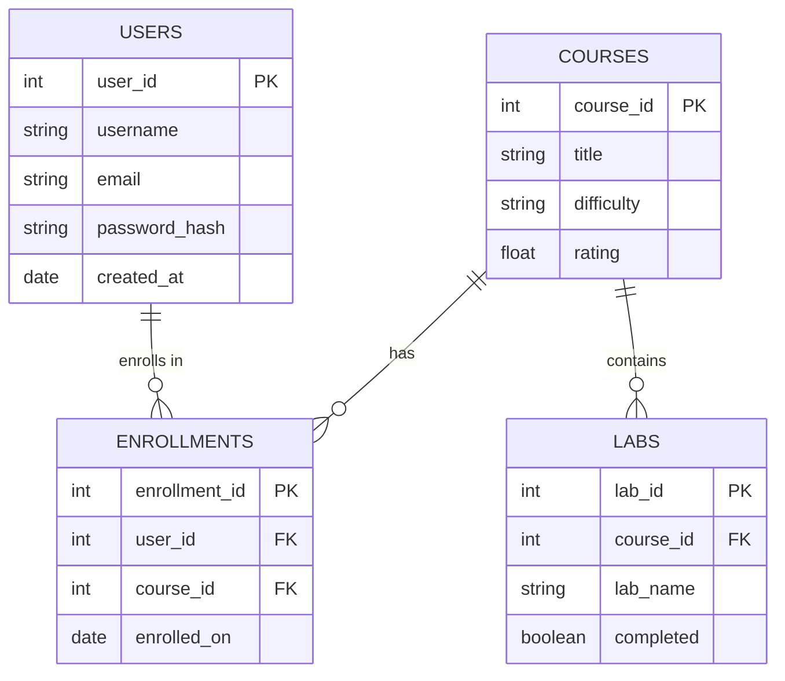
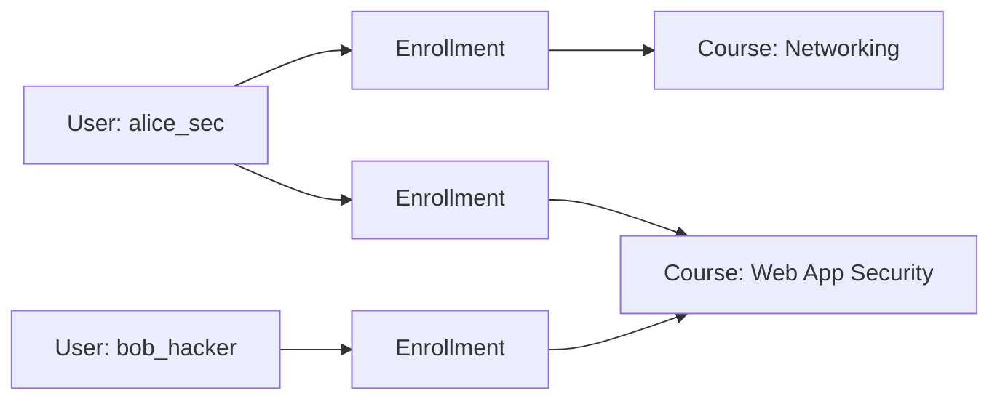
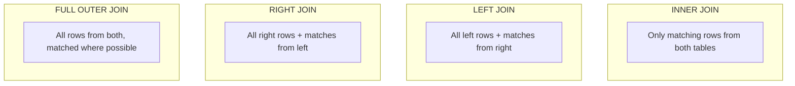
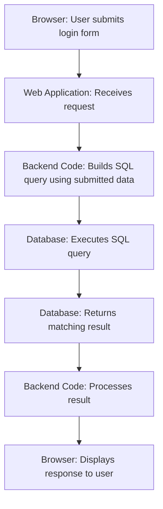
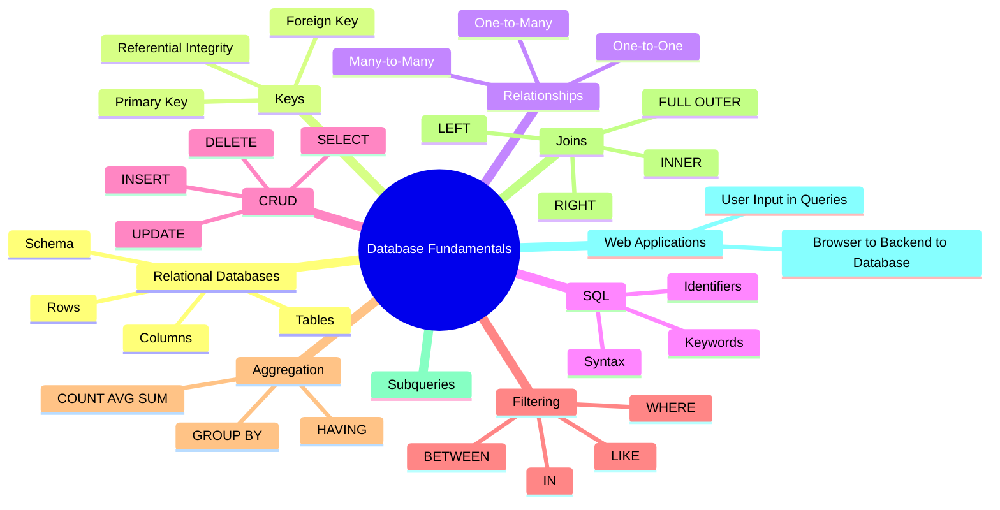

# SQL Injection Mastery

## Chapter 1 — SQL & Database Fundamentals

---

## Learning Objectives

By the end of this chapter, you should be able to:

- Explain what a database is and why applications need one.
- Explain what a Database Management System (DBMS) is and name common examples.
- Understand the relational model: tables, rows, and columns.
- Understand common SQL data types and why they matter.
- Understand primary keys, foreign keys, and referential integrity.
- Understand one-to-one, one-to-many, and many-to-many relationships.
- Read and write basic SQL: `SELECT`, `INSERT`, `UPDATE`, `DELETE`.
- Filter, sort, and limit query results.
- Use aggregate functions and `GROUP BY` / `HAVING`.
- Understand SQL joins and simple subqueries.
- Understand conceptually how a web application uses SQL to talk to a database.
- Build the solid SQL foundation required to study SQL Injection in later chapters.

---

## Section 1 — What Is a Database?

### What Is Data?

Data is simply information: a name, a price, a date, a photo, a password hash. On its own, a single piece of data isn't very useful. What makes data powerful is *organization* — being able to store it, find it again, and relate it to other data.

### What Is a Database?

A **database** is an organized collection of data that is stored electronically so it can be efficiently created, read, updated, and deleted. Think of it as a digital filing cabinet, except the filing cabinet can instantly find any document you ask for, even if you only remember part of its content.

### Why Applications Need Databases

Almost every modern application needs to remember things between visits. If you log into a website, close your browser, and come back tomorrow, the fact that your account still exists means something stored it. Applications use databases to:

- Remember user accounts and passwords (in hashed form).
- Store products, prices, and orders.
- Track relationships between people, posts, and messages.
- Keep historical records for auditing and reporting.

### Real-World Examples

| Platform Type | What It Stores in a Database |
|---|---|
| E-commerce website | Products, prices, orders, customer addresses, payment records |
| Social media platform | User profiles, posts, comments, likes, friend/follow relationships |
| Banking application | Account balances, transactions, customers, loan records |
| University system | Students, courses, grades, enrollments, professors |
| Cybersecurity platform | Users, training courses, lab environments, progress tracking |

### Text Files vs. Spreadsheets vs. Databases

Beginners often ask: "Why not just store everything in a text file or a spreadsheet?" The answer becomes clear once you compare them side by side.

| Feature | Text File | Spreadsheet | Database |
|---|---|---|---|
| Structure | None (just lines of text) | Rows and columns, but loosely enforced | Strictly defined tables, columns, and types |
| Searching large data | Very slow, manual | Slow for large data | Fast, uses indexes |
| Multiple users at once | Very difficult, conflicts likely | Difficult, prone to conflicts | Designed for many simultaneous users |
| Data integrity rules | None | Minimal | Strong (keys, constraints, types) |
| Relationships between data | Not supported | Manual, error-prone | Built-in (foreign keys) |
| Scale | Poor at scale | Poor at scale | Designed to scale to millions/billions of rows |

A spreadsheet might be fine for a small personal list, but as soon as an application needs to handle thousands of users, orders, or messages reliably and safely, a real database becomes necessary.

---

## Section 2 — Database Management Systems

### What Is a DBMS?

A **Database Management System (DBMS)** is software that creates, manages, and controls access to databases. When people say "MySQL" or "PostgreSQL," they are talking about a DBMS — the engine that actually stores your data on disk, enforces rules, and executes the SQL queries applications send to it.

The application itself (a website's backend code, for example) does not usually store data directly in files. Instead, it sends instructions, written in SQL, to a DBMS, which does the actual work of reading and writing data safely.

### Common Relational Database Management Systems

| DBMS | Typical Use Cases | License Type | Deployment | Notable Characteristics |
|---|---|---|---|---|
| MySQL | Web applications, content management systems | Open-source (with commercial editions) | Server-based | Extremely popular, widely supported by hosting providers |
| PostgreSQL | Complex applications, data-heavy systems | Open-source | Server-based | Known for strong standards compliance and advanced features |
| Microsoft SQL Server | Enterprise business applications | Commercial (free edition available) | Server-based | Deep integration with Windows and Microsoft tooling |
| Oracle Database | Large enterprise systems, banking, telecom | Commercial | Server-based | Known for scalability and enterprise support |
| SQLite | Mobile apps, small tools, embedded systems | Open-source | Embedded (no separate server) | Stores the entire database in a single file |

**Note:** Different DBMS products support slightly different SQL syntax and features. This chapter focuses on concepts and standard SQL that apply broadly across systems. Chapter 2 and later chapters will explore database-specific behavior, which becomes very important when studying SQL Injection.

---

## Section 3 — Relational Databases

### The Relational Model

A **relational database** organizes data into **tables**, where each table represents one type of "thing" (users, products, orders, etc.). Tables are made up of **rows** and **columns**.

- A **column** (also called a **field**) represents one attribute of the thing being stored — for example, a user's email address.
- A **row** (also called a **record**) represents one specific instance of that thing — for example, one particular user.
- A **schema** is the structure that defines what tables exist and what columns each table has, including their data types and rules.

### Our Running Example: A Cybersecurity Learning Platform

Throughout this chapter, we will use a fictional cybersecurity learning platform as our example database. It has four main tables:

**`users`** — people registered on the platform

| user_id | username | email | password_hash | created_at |
|---|---|---|---|---|
| 1 | alice_sec | alice@example.com | 5f4dcc3b5aa765d... | 2025-01-10 |
| 2 | bob_hacker | bob@example.com | e10adc3949ba59a... | 2025-02-14 |
| 3 | carol_ctf | carol@example.com | 25d55ad283aa400... | 2025-03-02 |

**`courses`** — training courses offered

| course_id | title | difficulty | rating |
|---|---|---|---|
| 101 | Introduction to Networking | Beginner | 4.5 |
| 102 | Web Application Security | Intermediate | 4.8 |
| 103 | Advanced Exploit Development | Advanced | 4.2 |

**`enrollments`** — which users are enrolled in which courses

| enrollment_id | user_id | course_id | enrolled_on |
|---|---|---|---|
| 1 | 1 | 101 | 2025-01-15 |
| 2 | 1 | 102 | 2025-02-01 |
| 3 | 2 | 102 | 2025-02-20 |
| 4 | 3 | 103 | 2025-03-05 |

**`labs`** — hands-on lab exercises tied to courses

| lab_id | course_id | lab_name | completed |
|---|---|---|---|
| 1 | 102 | SQL Basics Lab | TRUE |
| 2 | 102 | Input Validation Lab | FALSE |
| 3 | 103 | Buffer Overflow Lab | FALSE |

We will reuse these exact tables in every section, so the concepts build on each other naturally rather than feeling abstract.

---

## Section 4 — Data Types

Every column in a table has a **data type**, which tells the database what kind of value it can hold and how to interpret it. Data types matter because they determine what operations are valid, how much storage is used, and how values are compared and sorted.

| Data Type | Description | Example Value |
|---|---|---|
| `INT` | Whole numbers | `42` |
| `BIGINT` | Very large whole numbers | `9000000000` |
| `VARCHAR(n)` | Variable-length text, up to n characters | `'alice_sec'` |
| `TEXT` | Long-form text, often unlimited length | A full course description |
| `BOOLEAN` | True/false value | `TRUE`, `FALSE` |
| `DATE` | Calendar date | `'2025-03-02'` |
| `DATETIME` / `TIMESTAMP` | Date and time together | `'2025-03-02 14:30:00'` |
| `DECIMAL(p,s)` | Exact decimal number (good for money) | `19.99` |
| `FLOAT` | Approximate decimal number | `4.8` |
| `NULL` | Represents "no value" (not zero, not empty text) | `NULL` |

### Why Data Types Matter

If `rating` in the `courses` table is defined as a numeric type, the database will refuse to store the text `'excellent'` in that column. This might seem restrictive, but it protects data integrity — every value in that column is guaranteed to be a usable number, so calculations like averages work correctly.

### Strings vs. Numbers

In SQL, text values (called **strings**) are normally wrapped in single quotes: `'alice_sec'`. Numbers are written without quotes: `42`. This distinction becomes extremely important later when we study how SQL Injection exploits confusion between what is "data" and what is "code" — but for now, just remember: **quotes signal text, no quotes signals a number.**

### NULL vs. Empty String

`NULL` means "this value is unknown or missing." It is *not* the same as an empty string `''`, which is a real value that just happens to contain zero characters. For example, a user who has not yet set a profile bio might have `bio = NULL`, while a user who deliberately cleared their bio might have `bio = ''`. Databases treat these differently, especially when filtering data.

### Type Conversion (Conceptually)

Sometimes a database will automatically convert one type to another when needed — for example, comparing the number `5` to the text `'5'`. This automatic conversion is convenient but can sometimes produce unexpected results, and different DBMS products handle it differently. We mention this now because it becomes relevant again in later chapters.

---

## Section 5 — Primary Keys and Foreign Keys

### Primary Keys

A **primary key** is a column (or combination of columns) that uniquely identifies each row in a table. No two rows can share the same primary key value, and it cannot be `NULL`.

In our `users` table, `user_id` is the primary key. Even if two users happened to have the exact same username (which we'd normally prevent separately), their `user_id` values would always be different, so the database can always tell them apart.

### Foreign Keys

A **foreign key** is a column in one table that refers to the primary key of another table. It creates a link between two tables.

In the `enrollments` table:

- `user_id` is a foreign key pointing to `users.user_id`.
- `course_id` is a foreign key pointing to `courses.course_id`.

This means every row in `enrollments` must refer to a user and a course that actually exist. This rule is called **referential integrity** — the database won't let you create an enrollment for a `user_id` that doesn't exist in the `users` table.

### Entity-Relationship Diagram



**In plain English:** each user can have many enrollments, and each course can have many enrollments — the `enrollments` table sits between them and connects the two. Each course can also have many labs. The `PK` label means "primary key," and `FK` means "foreign key." This diagram is the blueprint of how our four tables relate to each other, and we'll refer back to it throughout the chapter.

---

## Section 6 — Database Relationships

Relational databases support three fundamental types of relationships between tables.

### One-to-One

A one-to-one relationship means one row in Table A relates to exactly one row in Table B. Example: a `users` table and a separate `user_profiles` table, where each user has exactly one profile record. This is often used to split rarely-used data (like a long biography) away from frequently-used data (like login credentials).

### One-to-Many

A one-to-many relationship means one row in Table A can relate to many rows in Table B, but each row in Table B relates back to only one row in Table A.

Example: one `course` can have many `labs`, but each `lab` belongs to exactly one `course`. This is exactly what we see between `courses` and `labs` in our example database.

### Many-to-Many

A many-to-many relationship means many rows in Table A can relate to many rows in Table B. This can't be represented directly with a simple foreign key — it requires a **junction table** (also called a linking or bridge table) in between.

In our example, a `user` can enroll in many `courses`, and a `course` can have many `users` enrolled in it. This is a many-to-many relationship, and the `enrollments` table is the junction table that makes it possible. It works by holding a foreign key pointing to `users` and another foreign key pointing to `courses` — each row in `enrollments` represents one specific link between one user and one course.



**In plain English:** Alice is connected to two courses through two separate enrollment records, and Bob is connected to one course through his own enrollment record. The junction table lets any number of users connect to any number of courses without duplicating data.

---

## Section 7 — Introduction to SQL

### What SQL Means

**SQL** stands for **Structured Query Language**. It is the standard language used to communicate with relational databases — to create tables, insert data, retrieve data, update data, and delete data.

### What SQL Is Used For

Whenever an application needs to work with stored data, somewhere in its backend code it constructs an SQL statement and sends it to the DBMS. The DBMS interprets that statement and performs the requested action, then sends a result back.

### How Applications Communicate with Databases

Applications don't usually "type" SQL manually while running. Instead, backend code (written in languages like PHP, Python, Java, JavaScript, etc.) builds SQL statements — often by combining fixed SQL text with values that come from user input, like a search box or login form — and sends the finished statement to the database.

**This detail matters enormously for cybersecurity.** How exactly user input gets combined into an SQL statement is the entire foundation of SQL Injection, which we will study in depth in a later chapter. For now, just note that **SQL statements are frequently built dynamically, using data that originates from users.**

### Anatomy of an SQL Statement

An SQL statement is made up of:

- **Keywords** — reserved words that tell the database what to do (`SELECT`, `FROM`, `WHERE`, `INSERT`, etc.). Keywords are traditionally written in uppercase by convention, though SQL itself is not case-sensitive for keywords.
- **Identifiers** — the names of things in the database, like table names (`users`) and column names (`email`).
- **Values** — actual data being compared, inserted, or updated, such as `'alice@example.com'` or `42`.
- **Strings** — text values, always wrapped in quotes.

### Why Cybersecurity Students Need SQL

You cannot understand how an attacker manipulates a database query without first understanding what a *correct* query looks like. Every SQL Injection vulnerability begins with a legitimate SQL statement that gets subtly (or not so subtly) altered by unexpected input. Mastery of normal SQL is therefore the prerequisite for understanding how it breaks.

---

## Section 8 — SELECT

The `SELECT` statement retrieves data from a table. It is the most commonly used SQL statement, and the one you will see most often in later chapters.

### Selecting All Columns

```sql
SELECT * FROM users;
```

1. `SELECT` tells the database we want to retrieve data.
2. `*` means "all columns."
3. `FROM users` tells the database which table to read from.

**Expected result:**

| user_id | username | email | password_hash | created_at |
|---|---|---|---|---|
| 1 | alice_sec | alice@example.com | 5f4dcc3b5aa765d... | 2025-01-10 |
| 2 | bob_hacker | bob@example.com | e10adc3949ba59a... | 2025-02-14 |
| 3 | carol_ctf | carol@example.com | 25d55ad283aa400... | 2025-03-02 |

**Why it's useful:** An admin dashboard might use this to display a full list of registered users.

### Selecting Individual Columns

```sql
SELECT username, email FROM users;
```

1. Instead of `*`, we list exactly which columns we want: `username` and `email`.
2. The database only returns those two columns, ignoring the rest.

**Expected result:**

| username | email |
|---|---|
| alice_sec | alice@example.com |
| bob_hacker | bob@example.com |
| carol_ctf | carol@example.com |

**Why it's useful:** Selecting only needed columns is more efficient and avoids exposing sensitive columns (like `password_hash`) that the application doesn't need to display.

### Using WHERE to Filter Rows

```sql
SELECT username, email FROM users WHERE user_id = 2;
```

1. `WHERE user_id = 2` restricts the result to only rows where `user_id` equals `2`.

**Expected result:**

| username | email |
|---|---|
| bob_hacker | bob@example.com |

**Why it's useful:** This is exactly the kind of query a login system might run — looking up one specific user by ID.

### DISTINCT

```sql
SELECT DISTINCT difficulty FROM courses;
```

1. `DISTINCT` removes duplicate values from the result.

**Expected result:**

| difficulty |
|---|
| Beginner |
| Intermediate |
| Advanced |

**Why it's useful:** Useful for populating a dropdown filter on a website, showing each difficulty level only once.

### Aliases with AS

```sql
SELECT username AS student_name FROM users;
```

1. `AS student_name` renames the `username` column in the output only — it doesn't change anything in the actual table.

**Expected result:**

| student_name |
|---|
| alice_sec |
| bob_hacker |
| carol_ctf |

**Why it's useful:** Aliases make results more readable, especially in reports or when combining data from multiple tables (which we'll cover in the Joins section).

---

## Section 9 — Filtering Data

### Logical Operators: AND, OR, NOT

```sql
SELECT * FROM courses WHERE difficulty = 'Beginner' OR difficulty = 'Advanced';
```

This returns courses that are either Beginner *or* Advanced.

```sql
SELECT * FROM courses WHERE difficulty = 'Intermediate' AND rating > 4.5;
```

This returns only courses that are *both* Intermediate difficulty *and* have a rating above 4.5 — both conditions must be true.

```sql
SELECT * FROM courses WHERE NOT difficulty = 'Advanced';
```

This returns every course except those marked Advanced.

> **Tip:** When mixing `AND` and `OR` in the same query, use parentheses to make the intended logic explicit, since `AND` is evaluated before `OR` by default. For example: `WHERE (difficulty = 'Beginner' OR difficulty = 'Advanced') AND rating > 4.0`.

### Comparison Operators

| Operator | Meaning |
|---|---|
| `=` | Equal to |
| `!=` or `<>` | Not equal to |
| `>` | Greater than |
| `<` | Less than |
| `>=` | Greater than or equal to |
| `<=` | Less than or equal to |

```sql
SELECT title FROM courses WHERE rating >= 4.5;
```

Returns titles of courses rated 4.5 or higher.

### LIKE and Wildcards

`LIKE` is used for pattern matching in text.

- `%` matches zero or more characters.
- `_` matches exactly one character.

```sql
SELECT username FROM users WHERE username LIKE 'a%';
```

Returns usernames starting with "a" — in our data, `alice_sec`.

```sql
SELECT username FROM users WHERE username LIKE '____hacker';
```

Returns usernames where exactly four characters come before "hacker" — matching `bob_hacker` if "bob_" is exactly four characters.

### IN

```sql
SELECT title FROM courses WHERE difficulty IN ('Beginner', 'Intermediate');
```

This is a shorter way of writing `difficulty = 'Beginner' OR difficulty = 'Intermediate'`.

### BETWEEN

```sql
SELECT title FROM courses WHERE rating BETWEEN 4.0 AND 4.6;
```

Returns courses with a rating from 4.0 to 4.6, inclusive.

### IS NULL and IS NOT NULL

```sql
SELECT username FROM users WHERE email IS NULL;
```

Returns users who have no email on file. Note: you cannot write `email = NULL` — because `NULL` represents "unknown," it can never be compared with `=`. You must always use `IS NULL` or `IS NOT NULL`.

---

## Section 10 — Sorting and Limiting Results

### ORDER BY

```sql
SELECT title, rating FROM courses ORDER BY rating DESC;
```

1. `ORDER BY rating` sorts the results by the `rating` column.
2. `DESC` means descending order (highest first). `ASC` (ascending, lowest first) is the default if omitted.

**Expected result:**

| title | rating |
|---|---|
| Web Application Security | 4.8 |
| Introduction to Networking | 4.5 |
| Advanced Exploit Development | 4.2 |

### LIMIT and OFFSET

```sql
SELECT username FROM users ORDER BY created_at DESC LIMIT 2;
```

Returns only the 2 most recently created users.

```sql
SELECT username FROM users ORDER BY created_at DESC LIMIT 10 OFFSET 10;
```

`OFFSET 10` skips the first 10 rows, then `LIMIT 10` returns the next 10. This combination is the basis of **pagination** — showing "page 2" of results on a website.

### Real Application Examples

- **Newest users:** `SELECT * FROM users ORDER BY created_at DESC LIMIT 5;`
- **Highest-rated courses:** `SELECT * FROM courses ORDER BY rating DESC LIMIT 3;`
- **First 10 results (page 1):** `... LIMIT 10 OFFSET 0;`
- **Next 10 results (page 2):** `... LIMIT 10 OFFSET 10;`

---

## Section 11 — INSERT

`INSERT` adds new rows to a table.

```sql
INSERT INTO users (username, email, password_hash, created_at)
VALUES ('dave_blue', 'dave@example.com', 'a1b2c3d4e5f6...', '2025-04-01');
```

1. `INSERT INTO users` specifies the target table.
2. `(username, email, password_hash, created_at)` lists which columns we're providing values for.
3. `VALUES (...)` provides the actual values, in the same order as the column list.

Note that `user_id` is not included — in most designs, the primary key is generated automatically by the database (this is often called auto-increment).

### Inserting Multiple Rows at Once

```sql
INSERT INTO courses (course_id, title, difficulty, rating)
VALUES
    (104, 'Cryptography Basics', 'Beginner', 4.3),
    (105, 'Malware Analysis', 'Advanced', 4.7);
```

This adds two new courses in a single statement, which is more efficient than running two separate `INSERT` statements.

---

## Section 12 — UPDATE

`UPDATE` modifies existing rows.

```sql
UPDATE courses
SET rating = 4.9
WHERE course_id = 102;
```

1. `UPDATE courses` specifies the table to modify.
2. `SET rating = 4.9` specifies the new value.
3. `WHERE course_id = 102` restricts the change to only the row with that ID.

> **⚠️ WARNING:** If you forget the `WHERE` clause, the `UPDATE` statement will apply to **every single row in the table**. Running `UPDATE courses SET rating = 4.9;` without a `WHERE` clause would set *every course's rating* to 4.9, silently destroying all the original values. Always double-check your `WHERE` clause before running an `UPDATE`, especially on a production database.

---

## Section 13 — DELETE

`DELETE` removes rows from a table.

```sql
DELETE FROM enrollments
WHERE enrollment_id = 3;
```

This removes only the enrollment record with ID 3.

> **⚠️ WARNING:** Just like `UPDATE`, forgetting the `WHERE` clause is dangerous. `DELETE FROM enrollments;` with no `WHERE` clause deletes **every row** in the `enrollments` table, not just one.

### DELETE vs. TRUNCATE vs. DROP

These three commands are often confused:

| Command | Effect |
|---|---|
| `DELETE FROM table WHERE ...` | Removes specific rows matching a condition; the table itself still exists |
| `TRUNCATE TABLE table` | Removes *all* rows from a table very quickly; the table structure remains |
| `DROP TABLE table` | Deletes the entire table, including its structure — the table no longer exists at all |

We won't go deeper into database administration here, but it's important to know these terms are not interchangeable.

---

## Section 14 — Aggregate Functions

Aggregate functions perform a calculation across many rows and return a single summary value.

| Function | Purpose |
|---|---|
| `COUNT()` | Counts rows |
| `SUM()` | Adds up numeric values |
| `AVG()` | Calculates the average |
| `MIN()` | Finds the smallest value |
| `MAX()` | Finds the largest value |

### Examples

```sql
SELECT COUNT(*) FROM users;
```

Returns the total number of registered users.

```sql
SELECT COUNT(*) FROM courses;
```

Returns the total number of courses offered.

```sql
SELECT AVG(rating) FROM courses;
```

Returns the average rating across all courses.

```sql
SELECT COUNT(*) FROM labs WHERE completed = TRUE;
```

Returns the number of labs that have been completed.

---

## Section 15 — GROUP BY and HAVING

`GROUP BY` groups rows that share a common value, so aggregate functions can be applied to each group separately rather than the whole table at once.

```sql
SELECT difficulty, COUNT(*) AS course_count
FROM courses
GROUP BY difficulty;
```

**Expected result:**

| difficulty | course_count |
|---|---|
| Beginner | 1 |
| Intermediate | 1 |
| Advanced | 1 |

This tells us how many courses fall into each difficulty level.

### HAVING vs. WHERE

`WHERE` filters individual rows *before* grouping happens. `HAVING` filters *groups*, after aggregation has occurred.

```sql
SELECT course_id, COUNT(*) AS enrollment_count
FROM enrollments
GROUP BY course_id
HAVING COUNT(*) > 1;
```

This returns only courses that have more than one enrollment — a condition on the aggregated count, which is exactly why `HAVING` (not `WHERE`) is required here. You cannot write `WHERE COUNT(*) > 1`, because `WHERE` runs before the counting happens.

---

## Section 16 — SQL Joins

Real applications frequently need information spread across multiple tables. **Joins** let you combine rows from two or more tables based on a related column, typically a foreign key.

### INNER JOIN

An `INNER JOIN` returns only rows where a match exists in *both* tables.

```sql
SELECT users.username, courses.title
FROM enrollments
INNER JOIN users ON enrollments.user_id = users.user_id
INNER JOIN courses ON enrollments.course_id = courses.course_id;
```

**Expected result:**

| username | title |
|---|---|
| alice_sec | Introduction to Networking |
| alice_sec | Web Application Security |
| bob_hacker | Web Application Security |
| carol_ctf | Advanced Exploit Development |

**Conceptually:** the database walks through `enrollments`, and for each row, looks up the matching user and matching course, stitching the three tables together into one combined result.

### LEFT JOIN

A `LEFT JOIN` returns *all* rows from the left table, plus matching rows from the right table. If there's no match, the right table's columns show as `NULL`.

```sql
SELECT users.username, enrollments.course_id
FROM users
LEFT JOIN enrollments ON users.user_id = enrollments.user_id;
```

This would show every user, even ones with zero enrollments — those rows would simply show `NULL` in the `course_id` column.

### RIGHT JOIN

A `RIGHT JOIN` is the mirror image of `LEFT JOIN`: it returns all rows from the right table, plus matching rows from the left table.

```sql
SELECT users.username, enrollments.course_id
FROM users
RIGHT JOIN enrollments ON users.user_id = enrollments.user_id;
```

This returns every enrollment, even in the rare case where a matching user record is missing.

### FULL OUTER JOIN

A `FULL OUTER JOIN` returns all rows from both tables, matching where possible and filling in `NULL` where there is no match on either side. (Note: not all DBMS products support `FULL OUTER JOIN` directly — this is one of the syntax differences mentioned in Section 2.)



**In plain English:** applications use joins constantly. A course catalog page, for example, might use a join to show each course alongside how many students are enrolled — data that lives in two separate tables until a join brings it together.

---

## Section 17 — Subqueries

A **subquery** is a `SELECT` statement nested inside another SQL statement. It lets you use the result of one query as input to another.

```sql
SELECT username
FROM users
WHERE user_id IN (
    SELECT user_id FROM enrollments WHERE course_id = 102
);
```

**How this works, step by step:**

1. The inner query, `SELECT user_id FROM enrollments WHERE course_id = 102`, runs first and produces a list of user IDs enrolled in course 102.
2. The outer query then finds usernames whose `user_id` appears in that list.

**Why subqueries are useful:** they let you answer questions that depend on the result of another question — "who is enrolled in course 102?" — without manually looking up the IDs yourself first.

---

## Section 18 — How Web Applications Use SQL

Understanding *where* SQL lives inside a real application is essential background for the cybersecurity chapters ahead.



### Walking Through a Login Example

Imagine a user types their email address into a login form and clicks submit.

1. The **browser** sends the entered email to the **web application's backend**.
2. The **backend code** needs to check whether a user with that email exists, so it constructs an SQL query conceptually similar to:

```sql
SELECT * FROM users WHERE email = 'alice@example.com';
```

3. This query is sent to the **database**, which searches the `users` table and returns any matching row.
4. The backend receives the result and decides what to do next — for example, checking whether the submitted password matches the stored password hash.
5. Finally, the backend sends a response back to the browser (either "login successful" or "invalid credentials").

Notice the key detail: **the email address the query searches for comes directly from what the user typed.** The backend code has to take that user-submitted value and combine it into the SQL statement shown above. Exactly *how* that combination happens — safely or unsafely — is the central question that later chapters on SQL Injection will explore in depth. For now, simply understand that this is a normal, everyday pattern in how web applications are built: **user input frequently ends up inside an SQL query.**

---

## Section 19 — Common Beginner Mistakes

### Mistake 1: Forgetting Quotes Around Strings

```sql
-- Incorrect
SELECT * FROM users WHERE username = alice_sec;

-- Corrected
SELECT * FROM users WHERE username = 'alice_sec';
```

Without quotes, the database thinks `alice_sec` is an identifier (like a column name), not a text value, and will produce an error.

### Mistake 2: Confusing NULL with an Empty String

```sql
-- Incorrect (will not match NULL values)
SELECT * FROM users WHERE email = NULL;

-- Corrected
SELECT * FROM users WHERE email IS NULL;
```

### Mistake 3: Forgetting WHERE

```sql
-- Dangerous: updates every row
UPDATE courses SET rating = 5.0;

-- Corrected
UPDATE courses SET rating = 5.0 WHERE course_id = 101;
```

### Mistake 4: Incorrect Column or Table Names

```sql
-- Incorrect (table is "users", not "user")
SELECT * FROM user;

-- Corrected
SELECT * FROM users;
```

### Mistake 5: Confusing AND / OR Logic

```sql
-- Might not return what you expect
SELECT * FROM courses WHERE difficulty = 'Beginner' AND difficulty = 'Advanced';
```

A single row's `difficulty` cannot be both "Beginner" and "Advanced" at once, so this always returns zero rows. The intended logic was probably `OR`.

### Mistake 6: Misunderstanding Joins

Forgetting the `ON` condition in a join can accidentally produce a "cross join," pairing every row in one table with every row in the other — often producing an enormous, meaningless result set.

### Mistake 7: Incorrect Data Types

```sql
-- Incorrect: comparing a number column to quoted text unnecessarily
SELECT * FROM courses WHERE course_id = '101abc';
```

Passing a value that doesn't cleanly match the expected type can cause errors or unexpected type conversion, depending on the DBMS.

---

## Section 20 — Hands-On Practice

Using the `users`, `courses`, `enrollments`, and `labs` tables described in Section 3, write SQL queries for each of the following. Try to solve them yourself before checking the Exercise Solutions section.

1. Select all columns from the `courses` table.
2. Select only the `title` and `difficulty` columns from `courses`.
3. Select all users whose `user_id` is 2.
4. Select all courses with a `difficulty` of `'Advanced'`.
5. Select all courses that are either `'Beginner'` or `'Advanced'` difficulty.
6. Select all users whose username starts with the letter "c".
7. Select all courses with a rating greater than 4.4, sorted from highest to lowest rating.
8. Select the first 2 users, ordered by `created_at` ascending.
9. Insert a new course called `'Network Forensics'`, difficulty `'Intermediate'`, rating `4.6`.
10. Update the rating of the course titled `'Advanced Exploit Development'` to `4.4`.
11. Delete the enrollment record with `enrollment_id` equal to `4`.
12. Count how many labs exist in total.
13. Group the `labs` table by `course_id` and count how many labs each course has.
14. Write an `INNER JOIN` query that lists each enrollment along with the enrolled user's username and the course title.
15. Write a subquery that finds the usernames of users enrolled in the course titled `'Web Application Security'` (hint: you will need a join or subquery involving `courses` and `enrollments`).

---

## Exercise Solutions

**1.**
```sql
SELECT * FROM courses;
```
Retrieves every column and every row from `courses`.

**2.**
```sql
SELECT title, difficulty FROM courses;
```
Limits the output to just the two requested columns.

**3.**
```sql
SELECT * FROM users WHERE user_id = 2;
```
`WHERE user_id = 2` filters to exactly one row, since `user_id` is a primary key and thus unique.

**4.**
```sql
SELECT * FROM courses WHERE difficulty = 'Advanced';
```
Text comparisons require quotes around the value.

**5.**
```sql
SELECT * FROM courses WHERE difficulty IN ('Beginner', 'Advanced');
```
`IN` is a cleaner alternative to writing two `OR` conditions.

**6.**
```sql
SELECT * FROM users WHERE username LIKE 'c%';
```
The `%` wildcard matches any number of characters after "c".

**7.**
```sql
SELECT * FROM courses WHERE rating > 4.4 ORDER BY rating DESC;
```
`WHERE` filters first, then `ORDER BY` sorts the filtered results.

**8.**
```sql
SELECT * FROM users ORDER BY created_at ASC LIMIT 2;
```
`ASC` (the default) sorts oldest first, and `LIMIT 2` keeps only the first two rows.

**9.**
```sql
INSERT INTO courses (title, difficulty, rating)
VALUES ('Network Forensics', 'Intermediate', 4.6);
```
`course_id` is omitted assuming it auto-generates.

**10.**
```sql
UPDATE courses SET rating = 4.4 WHERE title = 'Advanced Exploit Development';
```
The `WHERE` clause ensures only the matching course is changed.

**11.**
```sql
DELETE FROM enrollments WHERE enrollment_id = 4;
```
Targets exactly one row using the primary key.

**12.**
```sql
SELECT COUNT(*) FROM labs;
```
Returns a single number representing the total row count.

**13.**
```sql
SELECT course_id, COUNT(*) AS lab_count
FROM labs
GROUP BY course_id;
```
Groups rows by `course_id` first, then counts how many rows fall into each group.

**14.**
```sql
SELECT enrollments.enrollment_id, users.username, courses.title
FROM enrollments
INNER JOIN users ON enrollments.user_id = users.user_id
INNER JOIN courses ON enrollments.course_id = courses.course_id;
```
Two joins are needed because the enrollment record only stores IDs, not the human-readable username or course title.

**15.**
```sql
SELECT username
FROM users
WHERE user_id IN (
    SELECT user_id FROM enrollments
    WHERE course_id = (
        SELECT course_id FROM courses WHERE title = 'Web Application Security'
    )
);
```
The innermost subquery finds the `course_id` for the given title, the middle subquery finds the `user_id`s enrolled in that course, and the outer query resolves those IDs into usernames.

---

## Section 21 — Cybersecurity Connection

Why does a cybersecurity student need to deeply understand SQL before studying attacks against it?

- **Web application penetration testing:** Testers routinely encounter forms, search boxes, and URL parameters that ultimately feed into SQL queries on the backend. Recognizing *where* SQL might be involved — and what a normal, correctly-functioning query looks like — is the first step in identifying whether that query might be built unsafely.

- **Secure coding:** Developers who understand exactly how SQL statements are constructed are far better equipped to build them safely, using techniques covered in later chapters.

- **Code review:** Reviewing someone else's backend code for security issues requires reading SQL fluently enough to spot when user input is combined into a query in a risky way.

- **Vulnerability research:** Researchers who deeply understand SQL semantics can reason about edge cases — like how `NULL`, type conversion, or comments behave — that often become the basis of real vulnerabilities.

- **Bug bounty hunting:** Many bug bounty submissions involving database vulnerabilities require the researcher to demonstrate a clear understanding of what query was likely running behind the scenes.

- **Security engineering:** Engineers designing defenses (such as parameterized queries, input validation, or web application firewalls) need to understand normal SQL behavior to design protections that don't break legitimate functionality.

In the chapters ahead, we will examine what happens when an application builds an SQL query by directly combining user input into the query text, without proper safeguards. Understanding *why* that pattern is dangerous requires everything covered in this chapter — data types, quoting rules, query structure, and how applications construct queries dynamically. This chapter does not cover exploitation techniques; that begins in Chapter 2.

---

## Section 22 — Chapter Summary

This chapter built the foundation for everything to come. We learned that a **database** is an organized collection of data managed by a **DBMS**, and that **relational databases** organize data into **tables** made of **rows** and **columns**, each with defined **data types**. **Primary keys** uniquely identify rows, while **foreign keys** create links between tables, enforcing **referential integrity**. Tables can relate to each other as **one-to-one**, **one-to-many**, or **many-to-many** (using a **junction table**).

We then learned **SQL** itself: retrieving data with `SELECT`, filtering with `WHERE` and its many operators, sorting and paginating with `ORDER BY`/`LIMIT`/`OFFSET`, and modifying data with `INSERT`, `UPDATE`, and `DELETE` — along with the serious danger of forgetting a `WHERE` clause. We covered summarizing data with aggregate functions and `GROUP BY`/`HAVING`, combining tables with **joins**, and nesting queries with **subqueries**.

Finally, we connected all of this to the real world: web applications constantly build SQL queries using data submitted by users, and this exact pattern — user input flowing into an SQL statement — is the foundation on which SQL Injection vulnerabilities are built. With this chapter's foundation in place, you are now ready to study how that process can go wrong.

---

## Section 23 — Key Terms

| Term | Definition | Simple Example |
|---|---|---|
| Database | An organized collection of stored data | The entire cybersecurity platform's data |
| DBMS | Software that manages databases | MySQL, PostgreSQL |
| Table | A structured collection of related data | `users` table |
| Row / Record | A single entry in a table | One specific user |
| Column / Field | An attribute of the data in a table | `email` column |
| Schema | The structure defining tables and columns | The blueprint of the whole database |
| Data Type | The kind of value a column can hold | `INT`, `VARCHAR`, `DATE` |
| NULL | Represents an unknown or missing value | A user with no bio set |
| Primary Key | Uniquely identifies each row in a table | `user_id` in `users` |
| Foreign Key | Links a row to a row in another table | `user_id` in `enrollments` |
| Referential Integrity | Rule ensuring foreign keys point to valid rows | Can't enroll a nonexistent user |
| One-to-Many | One row relates to many rows elsewhere | One course, many labs |
| Many-to-Many | Many rows relate to many rows elsewhere | Users and courses via enrollments |
| Junction Table | A table connecting two others in a many-to-many relationship | `enrollments` |
| SQL | Structured Query Language, used to interact with databases | `SELECT * FROM users;` |
| SELECT | Retrieves data from a table | Viewing all courses |
| WHERE | Filters rows based on a condition | Only rows where `rating > 4.5` |
| JOIN | Combines rows from multiple tables | Users and their enrolled courses |
| Subquery | A query nested inside another query | Finding users enrolled in a specific course |
| Aggregate Function | Calculates a single value across many rows | `COUNT(*)`, `AVG(rating)` |
| GROUP BY | Groups rows sharing a value for aggregation | Grouping courses by difficulty |
| HAVING | Filters groups after aggregation | Groups with more than 1 enrollment |

---

## Section 24 — Knowledge Check

### Multiple-Choice Questions

1. What does DBMS stand for?
2. Which of the following is an example of a relational DBMS: MySQL, Microsoft Word, Google Chrome, Adobe Photoshop?
3. In a table, what does a row represent?
4. In a table, what does a column represent?
5. What is the purpose of a primary key?
6. What does a foreign key do?
7. Which relationship type requires a junction table?
8. What SQL keyword is used to retrieve data?
9. What SQL keyword filters rows based on a condition?
10. What does `ORDER BY ... DESC` do?
11. What does `LIMIT 10 OFFSET 10` retrieve?
12. What is the difference between `DELETE` and `TRUNCATE`?
13. Which aggregate function would you use to count rows?
14. What is the difference between `WHERE` and `HAVING`?
15. What does an `INNER JOIN` return?

### Short-Answer Questions

1. Explain the difference between a database and a spreadsheet.
2. Why is SQLite described as "embedded" rather than "server-based"?
3. Explain the difference between `NULL` and an empty string.
4. Why must string values be wrapped in quotes in SQL?
5. Explain referential integrity in your own words.
6. Describe a real-world example of a one-to-many relationship (not from this chapter).
7. Why is forgetting a `WHERE` clause in an `UPDATE` statement dangerous?
8. What is the purpose of a subquery?
9. Explain how a web application might use a `SELECT` query during login.
10. Why is understanding SQL important before studying SQL Injection?

### Scenario-Based Questions

1. A developer runs `DELETE FROM enrollments;` without a `WHERE` clause during testing. What happens, and why is this dangerous in a production environment?
2. An application needs to display the 10 most recently enrolled students on a course page. Which SQL clauses would be involved, and in what order would they logically apply?
3. A junior developer complains that their query `WHERE difficulty = 'Beginner' AND difficulty = 'Advanced'` never returns results. Explain why, and suggest the likely fix.
4. A report needs to show each course alongside the number of students enrolled in it, including courses with zero enrollments. Which type of join is most appropriate, and why?
5. A backend developer builds a login query by directly inserting the user's submitted email into an SQL string. Without describing any attack technique, explain conceptually why this pattern is worth close attention from a security perspective.

*(Answers to the Knowledge Check are intentionally left for self-testing. Review Sections 1–21 to verify your answers.)*

---

## Section 25 — Revision Cheat Sheet

### Core SQL Query Structure

```sql
SELECT column1, column2
FROM table_name
WHERE condition
GROUP BY column
HAVING group_condition
ORDER BY column ASC|DESC
LIMIT n OFFSET m;
```

### CRUD Commands

| Action | Command |
|---|---|
| Create | `INSERT INTO table (...) VALUES (...);` |
| Read | `SELECT ... FROM table WHERE ...;` |
| Update | `UPDATE table SET column = value WHERE ...;` |
| Delete | `DELETE FROM table WHERE ...;` |

### Common Operators

`=`  `!=` / `<>`  `>`  `<`  `>=`  `<=`  `LIKE`  `IN`  `BETWEEN`  `IS NULL`  `IS NOT NULL`  `AND`  `OR`  `NOT`

### Wildcards for LIKE

`%` = zero or more characters · `_` = exactly one character

### JOIN Summary

| Join Type | Returns |
|---|---|
| `INNER JOIN` | Only matching rows in both tables |
| `LEFT JOIN` | All left rows + matches from right |
| `RIGHT JOIN` | All right rows + matches from left |
| `FULL OUTER JOIN` | All rows from both, matched where possible |

### Aggregate Function Summary

| Function | Purpose |
|---|---|
| `COUNT()` | Number of rows |
| `SUM()` | Total of numeric values |
| `AVG()` | Average value |
| `MIN()` | Smallest value |
| `MAX()` | Largest value |

### Key Terminology at a Glance

- **Primary Key** → uniquely identifies a row
- **Foreign Key** → links to another table's primary key
- **Schema** → structure of the database
- **NULL** → unknown/missing value (not the same as `''`)
- **Junction Table** → resolves many-to-many relationships

---

## Section 26 — Chapter Mind Map



---

**End of Chapter 1**
