# Chapter 3 — Understanding How SQL Injection Works

Chapter 1 gave you the fundamentals of SQL and relational databases. Chapter 2 gave you the fundamentals of web applications, HTTP, and how backend code communicates with a database. This chapter brings those two threads together to answer the central question of this book: **why does SQL Injection happen, and what makes it possible?**

Everything in this chapter is conceptual. We are building a deep, correct mental model of the *root cause* of SQL Injection — not memorizing attack payloads. Later chapters, taught in the context of authorized penetration testing against intentionally vulnerable applications, will build hands-on exploitation skill on top of the foundation laid here.

> **Note:** All examples in this book are intended strictly for authorized security testing, educational labs (such as intentionally vulnerable applications built for training), and secure software development. Never test any system you do not own or have explicit written permission to test.

---

## Learning Objectives

By the end of this chapter, you should be able to:

* Explain why SQL Injection vulnerabilities exist.
* Understand how user input reaches the database.
* Explain dynamic SQL queries.
* Understand string concatenation and its role in this vulnerability class.
* Explain trust boundaries.
* Identify insecure coding patterns.
* Explain the lifecycle of a SQL Injection vulnerability.
* Understand the different categories of SQL Injection at a high level.
* Understand why parameterized queries prevent SQL Injection.

---

## Section 1 — Recap of the Request Lifecycle

Recall from Chapter 2 that every interaction with a web application follows the same basic path:

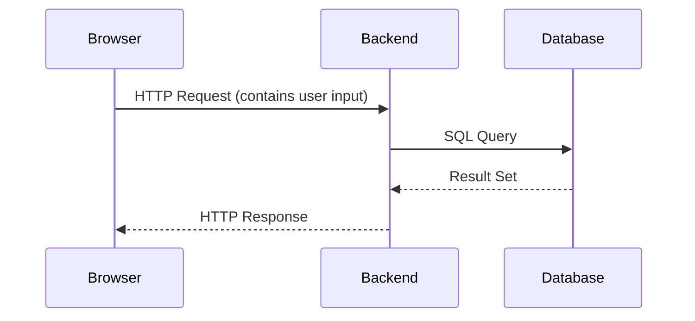

The detail that matters for this chapter is the middle step: **the backend takes something from the HTTP request and uses it to build a SQL query.** Everything from here forward is about examining *how* that step is implemented — and what goes wrong when it's implemented carelessly.

---

## Section 2 — What Is SQL Injection?

**SQL Injection (SQLi)** is a vulnerability that occurs when an application incorporates untrusted, user-supplied input into a SQL query in a way that allows the user to alter the query's intended logic, rather than only supplying a value the query expects.

In other words: the developer intended for user input to answer a question like *"which username should I search for?"* But because of how the query was constructed, the user is instead able to influence *the shape of the question itself* — turning a simple lookup into something the developer never intended.

### Why It's a Web Application Vulnerability

SQL Injection is classified as a **web application security vulnerability** because it typically arises at the intersection of two systems described across the last two chapters: an application that accepts input from untrusted users, and a database that executes whatever valid query it is given, without any inherent way to know whether that query's structure reflects the developer's original intent.

### OWASP Classification

The **Open Web Application Security Project (OWASP)** is a nonprofit foundation that publishes widely referenced, community-driven guidance on web application security, including the well-known **OWASP Top 10** — a regularly updated list of the most critical web application security risks. SQL Injection has historically been categorized within the **Injection** family of vulnerabilities in the OWASP Top 10, alongside related issues like command injection and LDAP injection, because they all share the same underlying pattern: untrusted input altering the structure of a command interpreted by another system.

> **Tip:** It's worth becoming familiar with OWASP's resources early in your cybersecurity education — the OWASP Top 10, the OWASP Testing Guide, and OWASP Cheat Sheets are referenced throughout the professional security industry.

### Real-World Impact

SQL Injection can affect all three pillars of information security, often summarized as the **CIA triad**:

* **Confidentiality** — An attacker may be able to retrieve data they should not have access to, such as other users' personal information, credentials, or proprietary business data.
* **Integrity** — An attacker may be able to modify or delete data, corrupting records or undermining trust in the data's accuracy.
* **Availability** — Poorly handled queries can, in some cases, degrade performance or disrupt database availability, affecting legitimate users.

SQL Injection has been involved in some of the most consequential data breaches in the history of the internet, precisely because databases so often store the most sensitive data an organization holds. We will examine several documented cases later in this chapter (Section 14).

---

## Section 3 — How User Input Flows Through an Application

Let's trace the complete conceptual path that user input takes, building on Chapter 2's backend discussion but now focusing specifically on where risk is introduced.

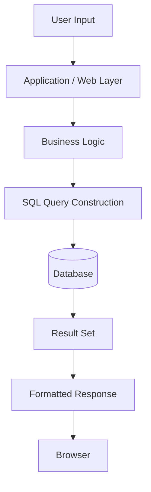

1. **User Input** — Data originates from a form field, URL parameter, cookie, or HTTP header. At this stage, it is entirely under the control of whoever is sending the request.
2. **Application / Web Layer** — The backend receives the HTTP request and extracts this input (e.g., `request.form['username']`).
3. **Business Logic** — The application may apply rules at this stage — for example, checking that a username field is not empty.
4. **SQL Query Construction** — Here, the input is combined with a SQL statement template to form the actual query that will be sent to the database. **This is the single most important step in this entire chapter.** How this step is implemented determines whether the application is vulnerable to SQL Injection.
5. **Database** — The database receives a completed SQL query and executes it exactly as written, with no awareness of where each part of the query text originally came from.
6. **Result Set** — The database returns whatever rows match the query's logic.
7. **Formatted Response** — The backend transforms the result set into HTML or JSON.
8. **Browser** — The response is rendered or processed for the user.

> **Warning:** Step 4 is the crux of SQL Injection. The database has no concept of "this part of the query came from the developer and this part came from an untrusted user." Once a query string is assembled, it is just a query — the database will parse and execute it according to SQL syntax rules alone, regardless of *how* that syntax came to exist. Preserving the distinction between developer-authored query structure and user-supplied data is entirely the *application's* responsibility.

---

## Section 4 — Dynamic SQL Queries

### Static SQL

A **static SQL** query is one whose text is completely fixed at development time and never changes based on runtime input. For example, a query that always retrieves the total number of registered SecuLearn courses:

```sql
SELECT COUNT(*) FROM courses;
```

This query is identical every single time it runs. There is no room for user input to affect it at all.

### Dynamic SQL

A **dynamic SQL** query is one whose final text is constructed at runtime, incorporating values that vary — often values derived from user input. For example, looking up a specific course by an ID the user provided:

```
Conceptually: SELECT * FROM courses WHERE id = <value supplied by user>
```

The actual text of this query differs depending on what the user requested. This is enormously useful — it's exactly what makes search bars, login forms, and personalized dashboards possible, as we saw throughout Chapter 2. Nearly every meaningful web application relies heavily on dynamic SQL.

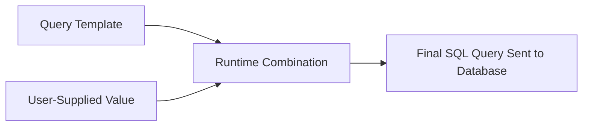

### Why Dynamic Queries Are So Common

Applications need to answer different questions for different users at different times: *"Show me course ID 42," "Find courses matching 'linux',"* or *"Log in the user named alice."* A fixed, static query cannot do this — the query's content must adapt based on what the user is asking for. Dynamic SQL is not inherently dangerous; it is a necessary and normal part of building interactive applications. **The danger lies entirely in *how* the dynamic portion is combined with the fixed portion** — which brings us to string concatenation.

---

## Section 5 — String Concatenation

To understand SQL Injection, you need to understand precisely *how* a dynamic query is assembled from a fixed template and a variable value — because there are two fundamentally different ways to do this, one safe and one unsafe.

### What Is Concatenation?

**Concatenation** simply means joining pieces of text together to form a single string. If you have the text `"Hello, "` and a variable holding the text `"Alice"`, concatenating them produces `"Hello, Alice"`.

### Insecure Pattern: Building SQL by Concatenating Raw Input

Some backend code builds SQL queries by directly joining a fixed query string with a variable containing user input, producing one combined string that is then sent to the database. Conceptually:

```
query_text = "SELECT * FROM users WHERE username = '" + username + "'"
```

Here, whatever value the `username` variable holds is inserted *directly into the middle of the SQL syntax*, between two single quotes. The database receives this fully-formed string and has no way to distinguish "the part the developer wrote" from "the part the user supplied" — to the database, it is simply one query.

Let's see this insecure pattern across four languages. We show these purely to illustrate the *structural weakness* — not to demonstrate exploitation.

**PHP (Insecure)**
```php
<?php
$username = $_GET['username'];
$query = "SELECT * FROM users WHERE username = '" . $username . "'";
$result = mysqli_query($connection, $query);
?>
```
*Line by line:* The username is read directly from the URL. It is then concatenated (`.` is PHP's concatenation operator) into the middle of a SQL string. That combined string is executed as-is.

**Python (Insecure)**
```python
username = request.args.get('username')
query = "SELECT * FROM users WHERE username = '" + username + "'"
cursor.execute(query)
```
*Line by line:* The username comes from a URL query parameter. It's joined with `+` into the query text, then executed verbatim.

**Node.js (Insecure)**
```javascript
const username = req.query.username;
const query = "SELECT * FROM users WHERE username = '" + username + "'";
connection.query(query, (err, results) => { /* ... */ });
```
*Line by line:* Same pattern — the username is pulled from the request, joined into the query string with `+`, and passed directly to the query execution function.

**Java (Insecure)**
```java
String username = request.getParameter("username");
String query = "SELECT * FROM users WHERE username = '" + username + "'";
Statement stmt = connection.createStatement();
ResultSet rs = stmt.executeQuery(query);
```
*Line by line:* The username is retrieved from the HTTP request, concatenated with `+` into a query string, and executed using a plain `Statement`.

### Why Insecure Concatenation Creates Risk

In each example above, the developer's *intent* was for the `username` variable to only ever occupy the position of a **value** — the thing being searched for. But because the value is spliced directly into the SQL text as a string, anything the user includes that has special meaning in SQL syntax (most notably, a single quote — the very character used to open and close the string in the query) can change how the database interprets the rest of the query text. We are not walking through exploitation techniques in this chapter — that begins in Chapter 4 — but you should now clearly see the structural problem: **input is trusted to only ever be data, with no verification or separation enforced.**

### Secure Pattern: Parameterized Queries

The secure alternative — introduced briefly in Chapter 2 and explained more fully in Section 12 of this chapter — keeps the query's structure completely fixed at development time and passes user input *separately*, as data, never as text merged into the query itself.

**PHP (Secure)**
```php
<?php
$username = $_GET['username'];
$stmt = $connection->prepare("SELECT * FROM users WHERE username = ?");
$stmt->bind_param("s", $username);
$stmt->execute();
?>
```

**Python (Secure)**
```python
username = request.args.get('username')
cursor.execute("SELECT * FROM users WHERE username = %s", (username,))
```

**Node.js (Secure)**
```javascript
const username = req.query.username;
connection.query("SELECT * FROM users WHERE username = ?", [username], (err, results) => { /* ... */ });
```

**Java (Secure)**
```java
String username = request.getParameter("username");
PreparedStatement stmt = connection.prepareStatement("SELECT * FROM users WHERE username = ?");
stmt.setString(1, username);
ResultSet rs = stmt.executeQuery();
```

Notice that in every secure version, the `?` (or `%s`) placeholder is sent to the database *as part of the fixed query template*, and the username value is sent *separately*, tagged explicitly as "this is a value, not query syntax." We'll unpack exactly why this distinction matters in Section 12.

---

## Section 6 — Trust Boundaries

A **trust boundary** is a conceptual line separating data or components that a system trusts from data or components it does not — or should not — trust automatically.

### Trusted vs. Untrusted Data

* **Trusted data** typically originates from within the system itself — a value the developer hard-coded, or data that has already been validated and constrained by the application.
* **Untrusted data** originates from outside the system's control — most importantly, anything supplied by a client over the network: form fields, URL parameters, cookies, and HTTP headers, as covered in Chapter 2.

### A Real-World Analogy

Think of a hotel front desk. Guests are allowed to hand over a form with their name and requested room preferences — that's expected, normal input. But if a guest handed over a sealed envelope marked "internal staff memo: please grant this guest master key access," a well-trained staff member would recognize that guests should never be a *source* of internal instructions, no matter how official the envelope looks. The front desk's trust boundary is: **guest-submitted material can specify preferences, never staff instructions.**

Applications must maintain an equivalent boundary: **user-submitted input may specify values, never query logic.**

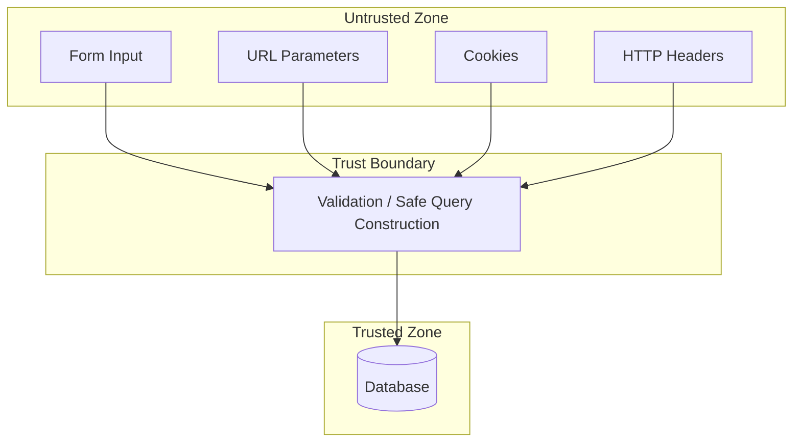

### Validation and Sanitization

* **Validation** means checking that input conforms to an expected format before using it — for example, confirming an "age" field contains only digits.
* **Sanitization** means modifying input to remove or neutralize potentially dangerous content.

> **Note:** Validation and sanitization are useful *defense-in-depth* practices (see Section 13), but neither one is a substitute for parameterized queries. A username field might legitimately need to allow a wide range of characters, including ones that also have SQL significance — validation alone cannot always anticipate every case. The only construct that reliably preserves the trust boundary at the database layer is separating query structure from data entirely, which is exactly what parameterized queries do.

### Why Developers Should Never Trust External Input

The core lesson of this section is simple but easy to underestimate: **any data that crosses from the client into the application must be treated as untrusted, regardless of how the application intends to use it, and regardless of whether the same client already authenticated successfully.** Authentication proves who a user is (Chapter 2, Section 11) — it does not certify that everything they subsequently submit is safe.

---

## Section 7 — What Happens Inside the Database?

To understand why SQL Injection works, it helps to understand — conceptually — what a database does once it receives a query string.

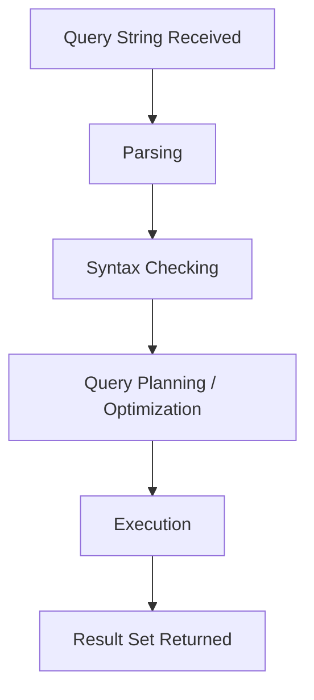

1. **Parsing** — The database's SQL interpreter reads the incoming query text and breaks it into recognizable components: keywords (`SELECT`, `WHERE`), identifiers (table and column names), operators, and literal values.
2. **Syntax Checking** — The interpreter verifies that the overall structure obeys SQL grammar rules. If the query is malformed, the database rejects it with an error (recall the discussion of backend errors in Chapter 2, Section 4).
3. **Query Planning** — For valid queries, the database determines an efficient way to retrieve the requested data (which indexes to use, which tables to scan, and so on).
4. **Execution** — The database carries out the plan, reading or modifying data as instructed.
5. **Returning Results** — Matching rows (for a `SELECT`) or a confirmation (for `INSERT`/`UPDATE`/`DELETE`) are sent back to whatever application issued the query.

The critical takeaway from this section: **the database's parser only ever sees the final, combined query text.** It has no memory of, and no mechanism for inspecting, where each character in that text originated. If the text spells out valid SQL syntax, the database will parse and execute it as such — full stop. This is precisely why the responsibility for maintaining the trust boundary described in Section 6 falls entirely on the application layer, before the query ever reaches the database.

---

## Section 8 — Why SQL Injection Happens

Having built the full conceptual picture, we can now state the root causes plainly.

### Dynamic Query Construction (Without Separation)

As discussed in Sections 4 and 5, applications frequently need to build queries dynamically. The vulnerability is not caused by dynamic queries themselves, but by constructing them through direct string concatenation of untrusted input, rather than through mechanisms that keep structure and data separate.

### Lack of Parameterized Queries

Many older codebases, tutorials, and even some professional applications simply do not use parameterized queries consistently — sometimes out of unfamiliarity, sometimes due to performance myths, and sometimes because a database driver or ORM (object-relational mapper) was misused in a way that reintroduced concatenation.

### Poor Input Handling

Applications that rely solely on client-side validation (form field restrictions enforced by JavaScript in the browser) provide no real protection, because — as discussed in Chapter 2 — a client can send any HTTP request it wants, regardless of what a browser's form UI restricts. Server-side handling is what actually matters.

### Unsafe Assumptions

Developers sometimes assume certain input sources are inherently safe — for instance, assuming a cookie value or an internal API parameter could never contain adversarial content because "a normal user would never type that there." This assumption ignores that HTTP requests (per Chapter 2) can be crafted freely by anyone, not just generated by a normal browser interaction.

### Legacy Code

Long-lived codebases sometimes contain SQL query logic written years earlier, before parameterized queries were as consistently taught or tooled, and that code may never have been revisited even as the surrounding application evolved.

### Developer Mistakes Under Time Pressure

Even well-trained developers can introduce a vulnerable pattern in a rush — for example, adding "just one more filter" to a query using string formatting because it was the fastest way to get a feature working, intending to "fix it properly later."

> **Tip:** Notice that none of these root causes are about attacker sophistication. SQL Injection exists because of *how queries are built*, not because attackers are unusually clever. This is precisely why it is so preventable — and why secure coding practices (Section 13) are so effective at eliminating it almost entirely.

---

## Section 9 — Vulnerable vs. Secure Code

Let's consolidate what we've learned into direct, side-by-side comparisons, now including a common alternate scenario: a search feature, which behaves slightly differently from the login example in Section 5.

### PHP

```php
// VULNERABLE
$term = $_GET['term'];
$query = "SELECT * FROM courses WHERE title LIKE '%" . $term . "%'";
$result = mysqli_query($connection, $query);
```
*Why unsafe:* The `term` variable is concatenated directly into the query text; the database cannot distinguish it from developer-authored syntax.

```php
// SECURE
$term = $_GET['term'];
$stmt = $connection->prepare("SELECT * FROM courses WHERE title LIKE ?");
$stmt->bind_param("s", $searchPattern);
$searchPattern = "%" . $term . "%";
$stmt->execute();
```
*Why safer:* The query template (`... LIKE ?`) is fixed and sent to the database independently of the value; `$searchPattern` is bound as data, never merged into the query text itself.

### Python

```python
# VULNERABLE
term = request.args.get('term')
query = "SELECT * FROM courses WHERE title LIKE '%" + term + "%'"
cursor.execute(query)
```
*Why unsafe:* Same concatenation pattern — user input becomes part of the literal SQL string.

```python
# SECURE
term = request.args.get('term')
cursor.execute("SELECT * FROM courses WHERE title LIKE %s", ('%' + term + '%',))
```
*Why safer:* The `%s` placeholder is part of the fixed query; the actual search pattern is passed as a separate parameter to `execute()`, which the database driver transmits using the database's native parameter-binding protocol rather than textual substitution.

### Java

```java
// VULNERABLE
String term = request.getParameter("term");
String query = "SELECT * FROM courses WHERE title LIKE '%" + term + "%'";
Statement stmt = connection.createStatement();
ResultSet rs = stmt.executeQuery(query);
```
*Why unsafe:* `Statement` executes whatever text it is given, with no separation between structure and data.

```java
// SECURE
String term = request.getParameter("term");
PreparedStatement stmt = connection.prepareStatement("SELECT * FROM courses WHERE title LIKE ?");
stmt.setString(1, "%" + term + "%");
ResultSet rs = stmt.executeQuery();
```
*Why safer:* `PreparedStatement` compiles the query template once, with the placeholder marking exactly where a value — and only a value — belongs.

### Node.js

```javascript
// VULNERABLE
const term = req.query.term;
const query = "SELECT * FROM courses WHERE title LIKE '%" + term + "%'";
connection.query(query, (err, results) => { /* ... */ });
```
*Why unsafe:* Identical concatenation pattern as the other languages.

```javascript
// SECURE
const term = req.query.term;
connection.query("SELECT * FROM courses WHERE title LIKE ?", ['%' + term + '%'], (err, results) => { /* ... */ });
```
*Why safer:* The `?` placeholder and the bound value are sent to the database driver as distinct arguments, letting the driver handle safe transmission.

### Comparison Table

| Aspect | Vulnerable Pattern | Secure Pattern |
|---|---|---|
| Query structure | Built fresh each time via concatenation | Fixed template, reused across calls |
| User input role | Merged directly into query text | Passed separately as bound data |
| Database's view of input | Cannot distinguish input from query syntax | Explicitly tagged as a value, never parsed as syntax |
| Consistency across calls | Query text varies per request | Query template is identical; only bound values vary |
| General mechanism name | String concatenation / dynamic string building | Prepared statement / parameterized query |

---

## Section 10 — Types of SQL Injection (High-Level Overview)

SQL Injection is not a single monolithic technique — it manifests in several recognizable categories, each suited to different circumstances an attacker (in an authorized testing context) might encounter. This section introduces each category at a conceptual level only. Detailed, hands-on methodology for each is reserved for dedicated future chapters.

### Error-Based

Occurs when an application returns detailed database error messages to the user. These messages can reveal information about the database's structure or contents as a side effect of a deliberately malformed or unusual query. It typically occurs in applications with verbose error handling and no generic error pages.

### UNION-Based

Occurs when a vulnerable query's results are directly displayed back to the user, allowing additional data to potentially be combined into the same result set using SQL's set-combining capabilities. It typically requires the attacker to understand the number and type of columns the original query returns.

### Boolean-Based Blind

Occurs when an application does not display query results or error messages directly, but its visible behavior (e.g., showing a "valid" versus "invalid" state) still differs depending on whether an injected condition evaluates to true or false. It typically requires inferring information indirectly, one true/false answer at a time.

### Time-Based Blind

Similar to Boolean-based blind, but used when the application's visible output doesn't change at all — instead, differences are inferred by observing how long the database takes to respond. It typically occurs when an application provides no visible signal whatsoever, not even a behavioral difference.

### Out-of-Band

Occurs when results cannot be retrieved through the direct response channel at all, so data is instead exfiltrated through an entirely separate communication channel (such as DNS or HTTP requests initiated by the database itself). It typically requires specific database features to be enabled and is less common than the categories above.

### Second-Order

Occurs when malicious input is safely stored by the application at one point in time, but is later retrieved and used — insecurely — to construct a different SQL query elsewhere in the application. It typically involves a delay between when the data was submitted and when the vulnerable query actually executes, making it harder to detect through simple, single-request testing.

> **Note:** These categories describe *how a vulnerability manifests and how it can be identified or confirmed*, not different underlying causes. Every category in this list traces back to the same root cause explained in Section 8: untrusted input being permitted to influence SQL query structure.

---

## Section 11 — Common Locations Where SQL Injection Can Occur

Recall from Chapter 2 that user input reaches an application through several channels. Each is worth examining specifically through a SQL Injection lens:

* **Login forms** — Username and password fields are classic targets because they are directly tied to authentication logic and database lookups.
* **Search boxes** — Search terms are almost always used to build dynamic `WHERE` or `LIKE` clauses, as shown throughout this chapter.
* **URL parameters** — As covered in Chapter 2, Section 6, query parameters are a direct, easily manipulated input channel, often used to filter or identify records (e.g., `?id=42`).
* **Registration forms** — Multiple fields (username, email, etc.) may each independently reach different queries.
* **Feedback/contact forms** — Free-text fields intended for storage can be especially risky if that stored data is later used insecurely in other queries (see Second-Order injection, Section 10).
* **API parameters** — As discussed in Chapter 2, Section 17, APIs accept structured input (often JSON) that flows into backend logic just as form data does.
* **Cookies** — Applications sometimes read values out of cookies (beyond just the session ID) and use them in queries, forgetting that cookies, like any HTTP header, are fully attacker-controllable.
* **HTTP headers** — Headers such as `User-Agent` or `X-Forwarded-For` are occasionally logged or used in application logic; if that logic ever touches a SQL query, they become a viable input vector too.

> **Warning:** A common misconception is that only "obvious" form fields need careful handling. In reality, *any* value that originates from the client — no matter how obscure the channel — must be treated as untrusted the moment it reaches backend code, per the trust boundary principle in Section 6.

---

## Section 12 — Why Prepared Statements Work

We've referenced prepared statements and parameterized queries throughout this chapter. Let's now explain precisely *why* they solve the problem.

### The Core Mechanism

A **parameterized query** (executed via a **prepared statement**) works in two distinct phases:

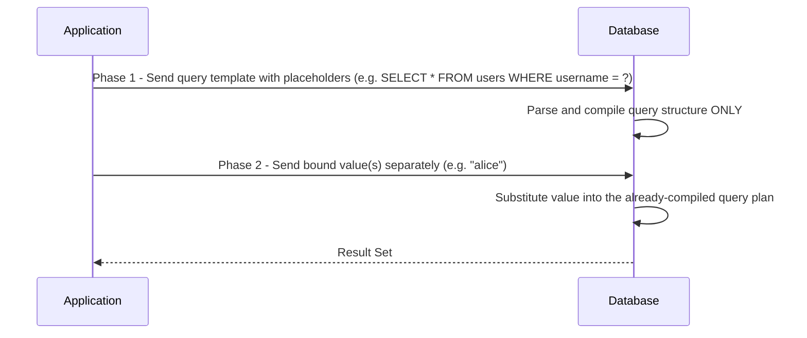

1. **Phase 1 — Prepare.** The application sends the database a query *template*, containing placeholders (`?` or named parameters) wherever a value will eventually go. The database parses and compiles this template's structure — and only its structure — at this point. No user data has been sent yet.
2. **Phase 2 — Execute with bound parameters.** The application then sends the actual value(s) separately, explicitly marked as data. The database substitutes these values into the already-compiled query plan.

### Why This Prevents SQL Injection

Because the query's structure is fully parsed and locked in during Phase 1 — *before* any user-supplied value is even transmitted — there is no remaining opportunity for a value to alter that structure. A value bound in Phase 2 is treated purely as a literal value to be matched or inserted, regardless of what characters it contains. Even if a submitted value happens to contain characters that would have special meaning if they appeared in raw query text, that no longer matters, because the value is never merged into query text in the first place — it travels to the database through a separate, dedicated channel.

This is the single most important defensive concept in this entire book. Every other practice discussed (validation, sanitization, least privilege, and so on — see Section 13) is valuable, but parameterized queries are what directly closes the door that SQL Injection walks through.

### Query Templates

A **query template** is simply the fixed portion of a parameterized query — the SQL text containing placeholders, decided entirely by the developer at coding time, never influenced by runtime input. This is the conceptual inverse of the vulnerable pattern from Section 5, where the "template" and the "value" were merged into a single piece of text before ever reaching the database.

---

## Section 13 — Defensive Programming Principles

Parameterized queries are the primary defense against SQL Injection specifically, but they exist within a broader set of secure coding principles worth understanding.

* **Least Privilege** — Database accounts used by an application should have only the permissions strictly necessary for that application's functionality. A web application's database account, for instance, may not need permission to drop tables. If a query-construction flaw is ever missed, least privilege limits the potential damage.
* **Input Validation** — Confirming that input conforms to an expected format (e.g., an email field looks like an email) reduces the range of unexpected data reaching later stages of processing, even though it is not a substitute for parameterized queries.
* **Output Encoding** — Ensuring data is properly encoded when displayed back to users protects against a *different* vulnerability class (Cross-Site Scripting), but reflects the same underlying principle: data crossing a trust boundary should be handled according to the context it's entering.
* **Error Handling** — Applications should present generic error messages to users while logging detailed errors privately, reducing the effectiveness of error-based techniques (Section 10) and limiting information disclosure generally.
* **Logging and Monitoring** — Recording application and database activity helps detect unusual query patterns or repeated failed attempts, supporting early detection of exploitation attempts.
* **Secure Coding Practices** — Adopting frameworks, libraries, and ORMs that default to parameterized queries reduces the chance of a developer accidentally reintroducing concatenation-based query building.
* **Defense in Depth** — No single control should be relied upon exclusively. Layering multiple defenses (parameterized queries *and* least privilege *and* input validation *and* monitoring) means that a gap in one layer does not automatically lead to compromise.

> **Tip:** If you remember only one relationship from this section, remember this: parameterized queries prevent SQL Injection from occurring; the other principles listed here reduce the *impact* if a vulnerability is nonetheless present, or catch attempts to exploit one. Both layers matter.

---

## Section 14 — Case Studies

The following cases are widely documented in security industry reporting and are discussed here for educational analysis of *what went wrong at a process and design level* — not for technical exploitation detail.

### Case Study 1: Heartland Payment Systems (2008)

**Background:** Heartland Payment Systems, a major payment processor, suffered what was at the time one of the largest data breaches in U.S. history.
**What went wrong:** Attackers gained a foothold in the network and were able to access systems processing large volumes of payment card transactions, with SQL Injection cited among the techniques used during the broader intrusion.
**Impact:** Estimates suggest well over one hundred million payment card numbers were exposed, along with significant financial and reputational damage to the company.
**Lessons learned:** The incident became a widely cited example driving stronger industry adoption of the Payment Card Industry Data Security Standard (PCI DSS) and reinforced the importance of network segmentation combined with secure application coding practices, not just perimeter defenses.

### Case Study 2: Sony Pictures (2011)

**Background:** A group calling itself LulzSec publicly claimed responsibility for compromising Sony Pictures' website.
**What went wrong:** The group stated that a SQL Injection vulnerability in Sony's web application allowed access to a database containing user information.
**Impact:** The incident reportedly exposed personal information associated with a large number of user accounts and generated significant public attention regarding Sony's security practices at the time.
**Lessons learned:** The case is frequently cited in the security community as an example of how a single unaddressed application-layer vulnerability can lead to large-scale data exposure, regardless of an organization's overall size or resources.

### Case Study 3: TalkTalk (2015)

**Background:** TalkTalk, a UK telecommunications provider, experienced a significant customer data breach.
**What went wrong:** Investigators and subsequent regulatory findings identified a SQL Injection vulnerability in a legacy web page, connected to an older, inherited codebase, as the entry point.
**Impact:** Personal data belonging to hundreds of thousands of customers was accessed, and the company faced a substantial regulatory fine along with lasting reputational harm.
**Lessons learned:** The case is often referenced to illustrate the risk described in Section 8 under "legacy code" — vulnerabilities can persist for years in older application components that are not regularly reassessed as security practices evolve.

### Case Study 4: A Cautionary Tale — Generic CTF/Training Scenario

**Background:** Beyond named corporate breaches, countless Capture-the-Flag (CTF) competitions and intentionally vulnerable training applications (the kind you will work with in later chapters of this book) are deliberately built around SQL Injection flaws precisely because the vulnerability remains so common and so instructive.
**What went wrong (by design):** These training applications typically construct a query by concatenating a login form's username field directly into SQL text, mirroring the exact insecure pattern shown in Section 5.
**Impact:** In a training context, the "impact" is pedagogical — learners gain hands-on understanding of the exact mechanism this chapter has described conceptually.
**Lessons learned:** This is precisely why the remainder of this book uses authorized, intentionally vulnerable applications for hands-on exercises: they let you study the mechanism you've now learned conceptually, safely and legally, without any risk to real systems or real user data.

> **Note:** Public breach reporting for real-world incidents varies in technical detail and is sometimes based on investigator or company statements rather than fully released forensic reports. Treat exact technical specifics of any named incident as reported by credible security journalism and official disclosures, and focus your learning on the recurring *patterns* — legacy code, verbose errors, missing parameterization — rather than any single incident's precise mechanics.

---

## Section 15 — Visual Summary

### Safe Request Flow

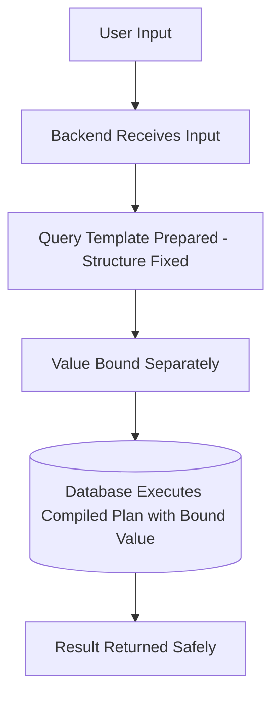
In the safe flow, the query's structure is locked in before the user's value is ever combined with it. The database always executes exactly the logic the developer intended.

### Unsafe Request Flow

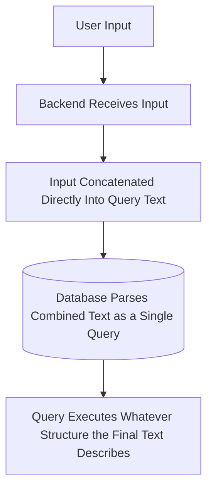
In the unsafe flow, the value and the structure become indistinguishable before the database ever sees the query — the database has no way to recover the developer's original intent.

### Application Architecture (Recap)

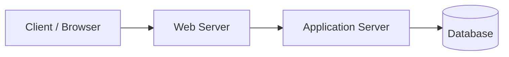
This is the same architecture introduced in Chapter 2 — SQL Injection is a vulnerability that lives specifically at the boundary between the Application Server and the Database.

### Database Interaction (Recap)

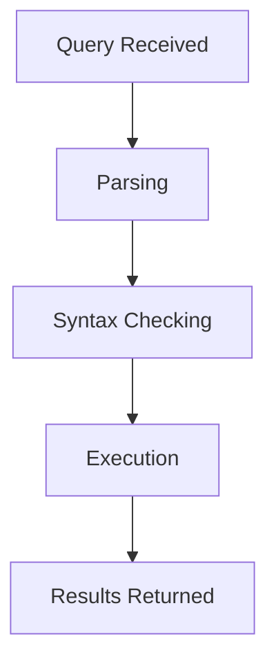
As established in Section 7, the database treats any syntactically valid query the same way, regardless of its origin — reinforcing why prevention must happen before the query ever reaches this stage.

---

## Section 16 — Practice Exercises

### Conceptual Questions (15)

1. In your own words, define SQL Injection without referencing any specific programming language.
2. Why is SQL Injection classified under the "Injection" category of vulnerabilities by OWASP?
3. Explain the difference between static and dynamic SQL.
4. Why are dynamic SQL queries necessary in most real-world applications?
5. What does it mean for a database to have "no awareness" of where a query's text originated?
6. Define "trust boundary" and explain why it matters for backend developers.
7. What is the difference between validation and sanitization?
8. Why is client-side validation alone insufficient to prevent SQL Injection?
9. Explain, step by step, what happens inside a database after it receives a query string.
10. What is a query template, and how does it differ from a fully-built query string?
11. Why does binding a value in a separate phase prevent it from altering query structure?
12. Name three root causes of SQL Injection discussed in this chapter.
13. Why might "legacy code" be more likely to contain SQL Injection vulnerabilities?
14. Explain the difference between error-based and blind SQL Injection at a conceptual level.
15. Why is least privilege considered a "damage limitation" control rather than a prevention control for SQL Injection specifically?

### Scenario-Based Exercises (10)

1. A developer builds a query by inserting a URL parameter directly into SQL text using string concatenation. Identify which trust boundary principle from Section 6 has been violated.
2. An application displays a detailed database error message, including table names, when a malformed request is submitted. Which SQL Injection category from Section 10 does this most directly enable?
3. A cookie value is read by backend code and used, unmodified, inside a SQL query. Explain why this is risky even though users don't typically edit cookies through a browser UI.
4. An application stores a user's profile bio field safely using parameterized queries, but a separate internal reporting tool later reads that bio field and inserts it into a report-generation query using string concatenation. Which category from Section 10 does this describe?
5. A penetration tester, working under an authorized contract, notices that a login form's response time increases noticeably for certain crafted inputs, even though the page's visible content never changes. Which SQL Injection category does this observation suggest, conceptually?
6. A company's database account used by its web application has full administrative privileges, including the ability to drop tables. Which defensive principle from Section 13 has been violated, and what risk does this create?
7. A junior developer says, "We validate input on the frontend with JavaScript, so we don't need to worry about the backend query." Explain what is incorrect about this reasoning, referencing Chapter 2 concepts as needed.
8. An application uses an ORM (object-relational mapper) that, by default, generates parameterized queries — but a developer bypasses the ORM for a "quick fix" using raw string concatenation for one specific report. Explain the risk this reintroduces.
9. Two applications both accept a `search` parameter. One uses `LIKE '%" + term + "%'` via concatenation; the other uses a bound parameter for the same pattern. Explain why both accomplish the same search functionality but differ significantly in safety.
10. A security team reviewing an older, legacy module discovers string-concatenated SQL queries that have existed unnoticed for years. Referencing Section 8, explain plausible reasons this might have gone unnoticed for so long.

### Secure Coding Review Exercises (5)

For each snippet, identify whether it is vulnerable or secure, and explain why.

1.
```python
cursor.execute("SELECT * FROM orders WHERE order_id = %s", (order_id,))
```

2.
```php
$query = "SELECT * FROM orders WHERE order_id = " . $order_id;
$result = mysqli_query($connection, $query);
```

3.
```java
PreparedStatement stmt = connection.prepareStatement("SELECT * FROM feedback WHERE id = ?");
stmt.setInt(1, feedbackId);
```

4.
```javascript
const query = `SELECT * FROM comments WHERE post_id = ${postId}`;
connection.query(query, callback);
```

5.
```python
query = "SELECT * FROM users WHERE username = '%s'" % username
cursor.execute(query)
```

---

### Solutions

**Conceptual Questions — Answers**

1. SQL Injection occurs when untrusted input is incorporated into a database query in a way that allows the input to alter the query's intended structure rather than only supplying an expected value.
2. Because, like other injection vulnerabilities (e.g., command injection), it involves untrusted input altering the structure of a command interpreted by another system — the shared pattern OWASP groups under "Injection."
3. Static SQL has fixed text determined entirely at development time; dynamic SQL is assembled or parameterized at runtime, often incorporating values that vary per request.
4. Because applications must answer different questions for different users and requests (e.g., different search terms, different record IDs) — a single fixed query cannot serve every possible request.
5. It means the database's parser only processes the final text it receives; it has no metadata distinguishing which characters were written by the developer versus supplied by a user.
6. A trust boundary separates trusted internal data from untrusted external input; it matters because developers must apply extra care (like parameterized queries) whenever untrusted data crosses into sensitive operations like query construction.
7. Validation checks that input matches an expected format; sanitization modifies input to remove or neutralize potentially dangerous content.
8. Because client-side validation runs in the browser and can be bypassed entirely by crafting HTTP requests directly, as covered in Chapter 2 — the server must independently enforce safety regardless of what the browser's form allowed.
9. The database parses the query text, checks its syntax, plans an efficient execution strategy, executes the plan, and returns matching results or a confirmation.
10. A query template is the fixed structural portion of a query containing placeholders; a fully-built query string has already merged both structure and values into one piece of text.
11. Because the query's structure is compiled before the value is even transmitted, so there is no remaining stage at which the value could influence that structure — it can only ever be treated as data.
12. Any three of: dynamic query construction without separation, lack of parameterized queries, poor input handling, unsafe assumptions about input sources, legacy code, developer mistakes under time pressure.
13. Legacy code may predate widespread adoption of secure coding standards or tooling, and may not be regularly revisited as newer practices emerge, allowing outdated patterns to persist unnoticed.
14. Error-based injection relies on the application returning detailed database error messages that leak information; blind injection relies on inferring information indirectly through visible behavioral differences (Boolean-based) or timing differences (time-based), without any direct error output.
15. Because least privilege limits what damage a compromised or exploited database connection can cause, but it does not prevent the underlying query manipulation from occurring in the first place — only parameterized queries address the root cause directly.

**Scenario-Based Exercises — Answers**

1. The trust boundary between untrusted user input and query construction has been violated — the input was allowed to become part of the query's structure rather than remaining confined to a data value.
2. Error-based SQL Injection, since detailed error messages revealing database structure are the defining enabler of that category.
3. Because cookies, like any HTTP header, are fully controlled by whoever sends the request — an attacker can set arbitrary cookie values directly, bypassing any browser UI entirely.
4. Second-order SQL Injection — the data was safely stored initially, but insecurely used in a different query later.
5. Time-based blind SQL Injection, since the only observable signal is a difference in response timing, not visible content or errors.
6. The principle of least privilege has been violated; this creates the risk that if a query-construction flaw is exploited, the attacker's database access is not meaningfully constrained, increasing potential impact.
7. Client-side JavaScript validation can be bypassed because, as covered in Chapter 2, an HTTP request can be crafted and sent directly, without ever going through the browser's form UI or its validation logic — server-side enforcement is required.
8. Bypassing the ORM's default safe query-building behavior reintroduces the exact concatenation-based risk the ORM was otherwise preventing, for that one code path.
9. Both retrieve matching records using the same logical search pattern, but the concatenation-based version merges the search term into the query text (vulnerable), while the bound-parameter version keeps the term as separate data throughout (safe) — same functional outcome, very different safety.
10. Plausible reasons include: the module was written before secure coding standards were adopted at the organization, it was not covered by later code review processes, it had low visible traffic and was deprioritized, or the team lacked awareness of the risk at the time it was written (see Section 8's discussion of legacy code and developer mistakes).

**Secure Coding Review Exercises — Answers**

1. **Secure.** Uses a parameterized query with `%s` as a placeholder and `order_id` passed separately as a bound parameter.
2. **Vulnerable.** `$order_id` is concatenated directly into the query text using string concatenation.
3. **Secure.** Uses a `PreparedStatement` with a `?` placeholder and `setInt()` to bind the value separately.
4. **Vulnerable.** Despite using modern JavaScript template literal syntax, `${postId}` still directly embeds the value into the query text — this is concatenation with different syntax, not parameterization.
5. **Vulnerable.** Although it looks similar to a parameterized query, Python's `%` string formatting operator performs the substitution *before* `execute()` is ever called, meaning the value is merged into the query text just like direct concatenation — this is a common and easy-to-miss mistake, since it superficially resembles the secure `%s` placeholder pattern from a real parameterized call, but is fundamentally different because the substitution happens in application code rather than being passed to the database driver as a separate bound value.

---

## Section 17 — Chapter Summary

This chapter connected the database concepts from Chapter 1 and the web application concepts from Chapter 2 to explain, in depth, *why* SQL Injection occurs. We defined SQL Injection as a vulnerability arising when untrusted input is allowed to influence a query's structure rather than remaining confined to a data value, and situated it within OWASP's Injection category and its potential impact on confidentiality, integrity, and availability. We traced how user input flows from the client through business logic into query construction, distinguished static from dynamic SQL, and examined exactly how insecure string concatenation merges data and structure into one indistinguishable piece of text. We introduced trust boundaries as the conceptual principle developers must uphold, looked inside the database to understand why it cannot itself distinguish trusted from untrusted query content, and enumerated the root causes that lead to SQL Injection in practice. We compared vulnerable and secure code across four languages, surveyed the high-level categories of SQL Injection, identified common vulnerable input channels, and explained precisely why parameterized queries work: by compiling query structure before any value is transmitted. Finally, we placed this knowledge in a broader defensive context — least privilege, validation, error handling, and defense in depth — and examined real-world case studies illustrating the consequences of these principles being neglected.

You now have a complete conceptual understanding of the mechanism behind SQL Injection. Future chapters will build directly on this foundation to explore each injection category's methodology in a safe, authorized, hands-on lab environment.

---

## Section 18 — Key Terms

| Term | Definition |
|---|---|
| SQL Injection (SQLi) | A vulnerability allowing untrusted input to alter the structure of a SQL query |
| OWASP | Open Web Application Security Project; publisher of widely used web security guidance including the OWASP Top 10 |
| CIA Triad | Confidentiality, Integrity, and Availability — the three core properties of information security |
| Static SQL | A SQL query whose text is fixed and never changes at runtime |
| Dynamic SQL | A SQL query whose final text or bound values are determined at runtime |
| String Concatenation | Joining pieces of text together to form a single combined string |
| Trust Boundary | The conceptual line separating trusted data/components from untrusted ones |
| Untrusted Input | Data originating from outside the application's control, such as client-supplied HTTP data |
| Validation | Checking that input conforms to an expected format |
| Sanitization | Modifying input to remove or neutralize potentially dangerous content |
| Query Parsing | The process by which a database interprets the structure of a received query |
| Query Template | The fixed, structural portion of a parameterized query, containing placeholders |
| Parameterized Query | A query built from a fixed template with values bound separately, rather than merged into the query text |
| Prepared Statement | The mechanism by which a database compiles a query template before receiving bound values |
| Bound Parameter | A value transmitted separately from a query template and substituted into the compiled query plan |
| Error-Based SQL Injection | A category relying on detailed database error messages being exposed to the user |
| UNION-Based SQL Injection | A category relying on combining additional data into a displayed result set |
| Boolean-Based Blind SQL Injection | A category relying on visible true/false behavioral differences, without direct error output |
| Time-Based Blind SQL Injection | A category relying on measurable differences in response timing |
| Out-of-Band SQL Injection | A category relying on a separate communication channel to retrieve data |
| Second-Order SQL Injection | A category where stored input is later used insecurely in a different query |
| Least Privilege | A principle limiting accounts/components to only the permissions they strictly require |
| Defense in Depth | Layering multiple independent security controls rather than relying on a single control |

---

## Section 19 — Knowledge Check

### Multiple Choice Questions (15)

1. SQL Injection is classified by OWASP under which general category?
   a) Cryptographic Failures b) Injection c) Broken Access Control d) Security Misconfiguration

2. Which of the following best describes dynamic SQL?
   a) A query whose text never changes b) A query assembled or parameterized at runtime c) A query that only runs once d) A query with no variables

3. What is the primary risk introduced by string concatenation in query building?
   a) Slower performance b) Merging user input directly into query structure c) Increased memory usage d) Browser incompatibility

4. Which of the following is considered untrusted data?
   a) A hard-coded configuration value b) A value from a URL parameter c) A constant defined in source code d) A database schema name

5. What does a prepared statement's "Phase 1" accomplish?
   a) Sends the user's data b) Compiles the query's structure using placeholders c) Executes the full query d) Encrypts the database

6. Which SQL Injection category relies on response timing differences?
   a) Error-based b) UNION-based c) Time-based blind d) Out-of-band

7. Which SQL Injection category involves data stored safely at one point but misused later?
   a) Second-order b) Boolean-based blind c) Error-based d) UNION-based

8. Why is client-side validation insufficient on its own?
   a) It's too slow b) It can be bypassed by directly crafting HTTP requests c) It doesn't support Unicode d) It requires a database connection

9. What does "least privilege" primarily limit?
   a) The number of users on a system b) The permissions available to an account or component c) The number of database tables d) The length of SQL queries

10. Which of the following is NOT one of the CIA triad?
    a) Confidentiality b) Integrity c) Availability d) Authentication

11. What is a query template?
    a) A pre-written report b) The fixed structural portion of a parameterized query c) A type of database index d) A cached result set

12. Which case study involved a legacy web page as the entry point?
    a) Heartland Payment Systems b) Sony Pictures c) TalkTalk d) None of the above

13. What does the database's query parser check for?
    a) Grammatical spelling in comments b) Syntax correctness of the query text c) The user's IP address d) Browser compatibility

14. Which of the following is a defense-in-depth control, rather than a direct prevention mechanism for SQL Injection?
    a) Parameterized queries b) Least privilege c) Prepared statements d) Query templates

15. Why can't a database distinguish trusted query text from untrusted, concatenated user input?
    a) Databases lack sufficient processing power b) The final query is just one string with no origin metadata c) Databases don't support strings d) Only NoSQL databases have this limitation

### Short Answer Questions (10)

1. Explain, in a few sentences, why dynamic SQL is necessary for most real applications.
2. What distinguishes a parameterized query from a concatenated query, mechanically?
3. Why is a cookie considered untrusted input, even though users rarely edit cookies manually?
4. Describe the two phases of a prepared statement's execution.
5. Why might an older, legacy codebase be more prone to SQL Injection vulnerabilities?
6. Explain the difference between validation and parameterized queries as defensive measures.
7. What role does OWASP play in the web application security community?
8. Why is error-based SQL Injection more likely in applications with verbose error handling?
9. Explain what "defense in depth" means using at least two different controls as examples.
10. Why is authentication not sufficient to guarantee that a user's subsequent input is safe?

### Scenario Questions (5)

1. A penetration tester, under an authorized engagement, is testing a web application and notices that submitting unusual characters into a form field sometimes causes a generic error page, and other times causes the page to load with a noticeable delay. Which two SQL Injection categories might this hint at, and why would the tester want to investigate further under proper authorization?
2. A company's application uses an ORM that generates parameterized queries by default for all standard operations. Explain why this significantly reduces (but does not entirely eliminate) SQL Injection risk across the codebase.
3. A developer argues that because their application only accepts numeric IDs in a certain field, SQL Injection isn't a concern there. Explain what additional context would be needed to evaluate that claim.
4. A security review finds that a database account used by a public-facing web application has permission to read every table in the database, including tables belonging to unrelated internal systems. Which defensive principle is most relevant here, and why?
5. Referencing the case studies in Section 14, explain what pattern is common across more than one of the incidents discussed, and why that pattern matters for organizations today.

---

### Answer Key

**Multiple Choice:** 1-b, 2-b, 3-b, 4-b, 5-b, 6-c, 7-a, 8-b, 9-b, 10-d, 11-b, 12-c, 13-b, 14-b, 15-b

**Short Answer — Sample Answers**

1. Applications must respond differently based on varying user requests (different search terms, different record lookups), which a fixed, unchanging query cannot support.
2. A parameterized query keeps the query's structure fixed and transmits values separately, bound to placeholders; a concatenated query merges the value directly into the query text before it is ever sent to the database.
3. Because cookies are HTTP headers under full control of whoever sends the request — they can be set to arbitrary values through means entirely outside the browser's normal UI, such as crafted requests or intercepting proxies.
4. Phase 1 sends and compiles the query template (structure only, with placeholders); Phase 2 sends the actual value(s) separately, which are substituted into the already-compiled plan.
5. Legacy code may predate widespread adoption of secure coding standards, may not be covered by modern code review processes, and is often deprioritized for revisiting since it "already works."
6. Validation checks that input matches an expected format but does not, by itself, guarantee safe query construction; parameterized queries directly prevent the value from ever being interpreted as query syntax, regardless of its content.
7. OWASP publishes widely referenced, community-driven security guidance, including the OWASP Top 10, helping standardize how the industry identifies and categorizes web application risks.
8. Because verbose error handling exposes internal details (such as table or column names) directly to the user as a side effect of malformed or unusual queries, giving attackers information they could otherwise not observe.
9. Defense in depth means layering multiple independent controls — for example, using parameterized queries (preventing the vulnerability) alongside least privilege (limiting damage if a flaw is nonetheless present) so that a single missed control doesn't lead directly to compromise.
10. Authentication verifies identity at login, but does not certify that every subsequent piece of data an authenticated user submits is safe — any data crossing the client-server trust boundary must still be handled carefully regardless of who submitted it.

**Scenario Questions — Sample Answers**

1. The generic error page could hint at error-based injection being blocked or partially handled, while the noticeable delay could hint at time-based blind injection; investigating further under proper authorization would help confirm whether either behavior stems from a genuine query-construction flaw versus unrelated application behavior.
2. It significantly reduces risk because the default, most commonly used code paths avoid concatenation entirely; however, it does not eliminate risk because developers can still bypass the ORM for custom or "raw" queries, reintroducing the vulnerable pattern in specific code paths.
3. It would be important to confirm that the field is validated and used as a numeric type consistently on the server side (not just assumed), and that no other code path ever treats that same field as a string that gets concatenated into a query — since a chain of otherwise-safe assumptions can still create risk elsewhere.
4. Least privilege is most relevant — the account holds far more access than the application functionally requires, meaning any exploited flaw could expose far more data than necessary.
5. A recurring pattern across the case studies is the presence of application-layer flaws (including legacy or overlooked code) leading to large-scale exposure, underscoring that organizational scale or resources do not automatically prevent this vulnerability — consistent secure coding practices and ongoing review matter regardless of company size.

---

## Section 20 — Revision Cheat Sheet

**Dynamic vs. Static SQL**
Static: fixed text, never changes. Dynamic: assembled or parameterized at runtime — necessary for real applications, but must be done safely.

**Trust Boundaries**
Untrusted: anything from the client (forms, URLs, cookies, headers). Trusted: developer-authored code and query structure. Rule: user input may supply values, never query logic.

**Insecure Pattern**
Concatenating user input directly into query text → database cannot distinguish structure from data → structure can be altered.

**Secure Pattern — Prepared Statements / Parameterized Queries**
Phase 1: send fixed query template with placeholders → compiled by database. Phase 2: send value(s) separately → bound into the compiled plan. Structure is locked in before data arrives — this is why it works.

**Common Root Causes**
Dynamic query construction without separation · Lack of parameterized queries · Poor server-side input handling · Unsafe assumptions about input sources · Legacy code · Developer mistakes under time pressure.

**SQL Injection Categories (Overview Only)**
Error-Based (leaks via verbose errors) · UNION-Based (combines extra data into displayed results) · Boolean-Based Blind (inferred via true/false behavior) · Time-Based Blind (inferred via response timing) · Out-of-Band (data exfiltrated via a separate channel) · Second-Order (safely stored input misused later elsewhere).

**Defense in Depth Layers**
Parameterized queries (prevention) + Least privilege, validation, error handling, logging (impact reduction & detection).

---

## Section 21 — Mind Map

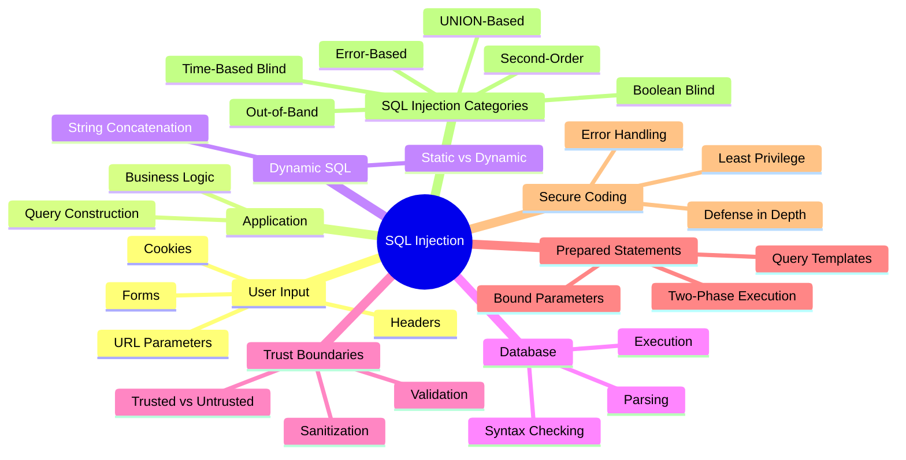

This mind map captures the full causal chain built throughout this chapter: user input enters an application, flows through business logic into dynamic SQL construction, and either crosses the trust boundary safely — via prepared statements — or unsafely, via concatenation, ultimately determining whether the resulting application is exposed to the categories of SQL Injection introduced in Section 10. The next chapter will take each of these categories and build genuine, hands-on testing methodology on top of the conceptual foundation established here.

**End of Chapter 3**
