# Chapter 4 — How SQL Injection Happens

---

## SECTION 1 — Introduction

Every meaningful web application exists to do one thing: move information between a human being and a data store in a way that is useful, timely, and correct. A social network stores posts and friendships. A banking portal stores balances and transaction histories. An online store stores products, prices, and orders. In nearly every case, that data does not live inside the application code itself — it lives in a **database**, a separate system optimized for storing, indexing, and querying structured information reliably and efficiently.

This separation is not an accident of history; it is a deliberate architectural decision. Databases give applications:

- **Persistence** — data survives even when the application process restarts.
- **Concurrency control** — many users can read and write data at the same time without corrupting it.
- **Structured querying** — complex questions ("find all orders placed by this user in the last 30 days") can be answered efficiently.
- **Data integrity guarantees** — constraints, transactions, and relationships keep data consistent.

Because the application and the database are separate systems, they must communicate. The application does not reach into the database's internal files and read raw bytes; instead, it sends the database a *request written in a language the database understands* — Structured Query Language, or SQL. The database interprets that SQL, executes it, and sends a response back.

This is the essential fact that this entire chapter builds upon: **every time an application needs data, it must construct a SQL statement and hand it to the database engine.** The database engine's job is to execute whatever valid SQL statement it receives, as faithfully and efficiently as possible. The database does not know, and cannot know on its own, whether the SQL statement it received represents exactly what the *legitimate user* intended, or whether it has been subtly altered by someone with malicious intent. The database trusts the statement it is given. It is the application's responsibility to make sure that statement is safe and correct before it ever reaches the database.

### Why User Input Exists

Applications are interactive by nature. A login page needs a username and password from the person trying to log in. A search box needs a search term. A product filter needs a price range or category selection. Without user input, most applications would be static and nearly useless — they would show the same content to everyone, all the time, with no personalization, no search, no login, and no transactions.

User input is therefore not an edge case or an unfortunate necessity — it is the *core mechanism* by which humans interact with software. Every form field, every URL parameter, every uploaded file, and every API request body exists because the application needs information from outside itself to do its job.

This is precisely why SQL Injection exists at all: **applications must take information from the outside world and use it to construct instructions for a highly powerful, trusted internal system — the database.** The moment external information influences an internal instruction without sufficient safeguards, the application has created an opportunity for that external information to *become* part of the instruction rather than remain merely *data* within it.

### SQL Injection Is a Software Engineering Problem

It is tempting to think of SQL Injection purely as a "hacking technique" — something an attacker does. But this framing is incomplete and, from a defender's point of view, unhelpful. SQL Injection is not a flaw in SQL itself, nor a flaw in databases, nor even fundamentally a flaw in any particular programming language. SQL Injection is a **consequence of how a specific piece of application code was written** — specifically, how that code combined trusted instructions with untrusted data.

> **Key Idea:** SQL Injection is not something that is "done to" a secure application. It is something that becomes *possible* the moment a developer writes code that builds SQL queries by blending code and data together without separation.

This reframing matters enormously for how you, as a future secure software engineer or penetration tester, should think about the vulnerability. You are not studying a clever trick performed against innocent software. You are studying a **predictable outcome of an identifiable engineering mistake** — one that can be understood, recognized, and eliminated with disciplined coding practices. That is the entire purpose of this chapter: to help you see *exactly* where and why that mistake happens, before later chapters teach you how attackers exploit it.

### The CIA Triad and Why Insecure Queries Threaten It

Information security professionals evaluate risk using the **CIA triad**: Confidentiality, Integrity, and Availability. Understanding how SQL Injection threatens each of these three properties helps explain why this vulnerability class has remained so consistently dangerous for decades.

| CIA Principle | Definition | How Insecure Query Construction Threatens It |
|---|---|---|
| **Confidentiality** | Ensuring that information is only accessible to those authorized to see it. | If an attacker can influence how a query is constructed, they may be able to cause the database to return data the application never intended to expose — other users' records, password hashes, internal configuration, or entire tables. |
| **Integrity** | Ensuring that information is accurate and has not been altered without authorization. | If an attacker can influence a query's structure, they may be able to cause the database to insert, update, or delete data in unintended ways, corrupting records or planting false information. |
| **Availability** | Ensuring that systems and data are accessible to legitimate users when needed. | Maliciously altered queries can be constructed to consume excessive resources, lock tables, or in extreme cases delete critical data structures, denying service to legitimate users. |

A single vulnerable query — one line of insecurely written code — can therefore threaten all three pillars of the CIA triad simultaneously. This is part of why SQL Injection has remained on the OWASP Top 10 list of critical web application risks for so long: the *potential blast radius* of a single mistake is enormous, because databases sit at the trusted core of nearly every meaningful application.

By the end of this chapter, you will understand precisely *why* this mistake is so easy to make, why it has been made repeatedly across nearly every programming language and framework in existence, and what fundamental principle eliminates it. We will not yet discuss *how attackers exploit* a vulnerable query — that is the subject of later chapters. Our task here is to understand the mechanism that makes exploitation possible in the first place.

---

## SECTION 2 — The Complete Request Lifecycle

To understand where SQL queries are actually created, we need to trace the complete journey of a single request from a human being sitting at a keyboard, all the way down into the database engine, and back again. We will use a running example throughout this chapter: a fictional web application called **NorthGate Portal**, an internal employee login and records system used by a mid-sized logistics company.

### The Login Scenario

Imagine an employee, Priya, opens her browser and navigates to `https://portal.northgate.example/login`. She types her username and password into a form and clicks "Sign In."

Here is the conceptual path that request takes:

```
User (Priya)
   ↓  types credentials, clicks "Sign In"
Browser
   ↓  packages input into an HTTP request
HTTP Request
   ↓  travels over the network to the server
Backend (Web/Application Server)
   ↓  routes the request to the login handler
Application Logic
   ↓  builds a SQL statement using the submitted values
SQL Query
   ↓  sent to the database engine
Database
   ↓  executes the query, retrieves matching rows
Database Response
   ↓  returned to the application
Application
   ↓  application decides whether login succeeds
Browser
   ↓  Priya sees her dashboard or an error message
```

### Sequence Diagram

The diagram below models the same lifecycle as a formal sequence diagram, which is a standard way to represent the order of communication between components.

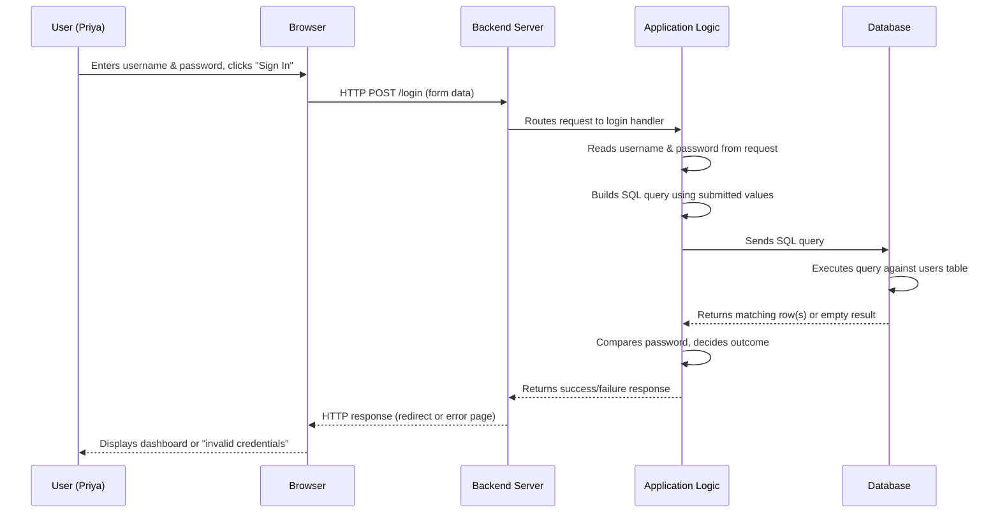

### Explaining Every Step

**1. User.** Priya is a human being interacting with a form. From a security standpoint, she represents the *origin* of untrusted input — not because she is necessarily malicious, but because *anyone* could be sitting at that keyboard, typing *anything* into that field. The application has no way to verify, at the moment of typing, what will actually be submitted.

**2. Browser.** The browser's job is to render the login form and package whatever Priya typed into a structured HTTP request. Critically, the browser does **not** validate whether the input "makes sense" for a database query — it has no awareness of SQL at all. It simply transmits the characters exactly as entered (with standard HTTP/URL encoding applied for transport).

**3. HTTP Request.** This is the actual message sent across the network — typically an HTTP `POST` request containing a body with fields like `username=priya` and `password=hunter2`. This request travels over the internet or internal network to reach the server. At this stage, the data is nothing more than text sitting inside a network packet.

**4. Backend (Web/Application Server).** The server software (such as Apache, Nginx, IIS, or a framework's built-in server) receives the raw HTTP request and routes it to the correct piece of application code responsible for handling `/login` requests.

**5. Application Logic.** This is where the real work happens, and it is the most important stage for this chapter. The application code reads the `username` and `password` values out of the HTTP request. These values are, at this point, ordinary strings sitting in program variables — nothing more. The application logic must now decide *what to do* with them. In our login example, it needs to check whether a user with that username and password exists in the database. To do that, it must **construct a SQL query**.

**6. SQL Query.** This is the statement that will be sent to the database — something conceptually like: *"select the user record where the username column equals this value and the password column equals that value."* Exactly *how* that statement is built — safely or unsafely — is the central subject of this entire chapter, and we will return to it in enormous detail in Sections 3 and 4.

**7. Database.** The database engine receives the SQL statement as a string (or, in the secure case, as a statement template plus separate parameters — more on this later) and executes it. The database does not know anything about browsers, HTTP, or Priya. It only knows SQL. It faithfully executes whatever valid statement it is handed.

**8. Database Response.** The database returns a result set — perhaps a single row representing Priya's account, or zero rows if no match was found.

**9. Application.** The application logic inspects the result. If a matching row was found, it typically also needs to compare the submitted password against the stored password (ideally a securely hashed password, not the SQL query alone) and, if everything matches, create an authenticated session for Priya.

**10. Browser.** Finally, the application sends a response back down through the server to Priya's browser — either a redirect to her dashboard, or an error message.

> **Note:** Notice that the SQL query is created *entirely within Application Logic (Step 5)*, using values that originated from the *User (Step 1)*. This is the single most important structural fact in this chapter. The distance between "attacker-controlled text" and "database instruction" can be as short as a single line of code.

This lifecycle repeats, in some form, for nearly every feature of nearly every data-driven application: search boxes, registration forms, comment sections, product filters, password resets, and so on. Understanding this lifecycle precisely is essential, because SQL Injection is fundamentally about *what happens between Steps 5 and 6* — how user-submitted text becomes part of a SQL instruction.

---

## SECTION 3 — What Is a Dynamic SQL Query?

### Static SQL

A **static SQL query** is one whose full text is fixed at the time the program is written, and does not change based on external input. Consider this example:

```sql
SELECT COUNT(*) FROM employees;
```

No matter who runs this, no matter what request triggered it, this exact statement is always sent to the database. There is nothing to fill in, nothing contributed by a user, nothing that varies at runtime. It is, in a sense, "baked into" the program.

Static queries are common for reporting, dashboards, and administrative tasks where the question being asked never changes — only the answer does.

### Dynamic SQL

A **dynamic SQL query** is one whose final text is assembled, in whole or in part, *while the program is running*, typically incorporating values that were not known when the code was written — such as values submitted by a user.

Consider the login example from Section 2. The developer cannot write a static query like:

```sql
SELECT * FROM users WHERE username = 'priya' AND password = 'hunter2';
```

...because the developer does not know, at the time they write the code, *which* username and password will be submitted. It could be Priya today, and someone else entirely tomorrow. The query's *shape* is fixed (find a user by username and password), but its *content* (the actual username and password values) must be filled in at runtime, based on whatever the current request contains.

This is the essence of dynamic SQL: **the structure of the statement is written once by the developer, but the specific values are supplied later, while the program is executing, based on external input.**

### Compile-Time vs. Runtime

It's helpful to distinguish two different moments in a program's life:

- **Compile-time (or "write-time")** — when the developer is writing and preparing the source code. Anything the developer types directly into the source file is fixed at this stage.
- **Runtime** — when the program is actually executing, handling real requests, with real data flowing through its variables.

A static query is entirely a compile-time artifact. A dynamic query is a compile-time *template* combined with runtime *values*. The critical engineering question — the one this entire chapter revolves around — is: ***how*** *does the program combine the compile-time template with the runtime values?* As we will see in Section 4, the *unsafe* answer is naive string concatenation, and the *safe* answer is parameterization.

### Why Dynamic SQL Is Everywhere

Nearly every interactive feature of a modern web application requires dynamic SQL, because nearly every feature needs to answer a *different* question depending on what the user is doing. Consider a few examples from our NorthGate Portal application:

- **Login page:** "Find the user whose username is ___ and password is ___." (blanks filled at runtime)
- **Search box:** "Find all shipment records whose tracking number contains ___."
- **Product filter:** "Find all products whose category is ___ and price is less than ___."
- **User profile page:** "Find the profile belonging to user ID ___."

In every case, the *shape* of the question is fixed by the developer, but the *specific values* depend entirely on what the current user is doing right now. This is not a design flaw — dynamic queries are a completely normal, necessary, and expected part of building interactive applications. **Dynamic SQL itself is not the problem.** The problem, as we will see, lies entirely in *how* the dynamic portions are combined with the fixed portions.

> **Tip:** Keep this distinction firmly in mind as you read the rest of this chapter: *dynamic SQL is necessary and safe when done correctly.* SQL Injection does not occur because an application uses dynamic SQL — it occurs because of *how* that dynamic SQL is assembled.

---

## SECTION 4 — String Concatenation

This section is the mechanical heart of the chapter. Everything before it has been building context; everything after it depends on understanding this section deeply.

### An Analogy Before Code

Imagine you are a legal secretary tasked with preparing a form letter. The letterhead and body text are already written and printed: *"Dear ______, your appointment is scheduled for ______ at our office."* Your job is simply to fill in the blanks with the client's name and appointment time, using a typewriter, directly onto the pre-printed page.

Now imagine, instead, that you are *not* given a pre-printed form. Instead, you are handed a blank sheet of paper and told: *"Just retype the entire letter yourself each time, including the client's name and appointment details, wherever they should go."*

In the second scenario, you — the secretary — are now responsible for making sure the client's name doesn't accidentally get typed in a way that changes the *meaning* of the letter. If a "client" told you their name was actually *"— actually, disregard this appointment, and also, please wire me the entire client trust fund. Sincerely, the Firm"* — and you dutifully retyped that entire block of text into the body of the letter because you were just following the instruction to "insert whatever they told you" — you would have created a document that *reads as a legitimate instruction from the firm*, purely because you failed to distinguish between "text I was told to display" and "text I was told to obey."

This is, at its core, exactly what happens when an application builds a SQL query through unsafe string concatenation: **it retypes user-submitted text directly into the body of an instruction, trusting that the text will only ever behave as inert data — when in fact, nothing is enforcing that boundary.**

### Strings, Variables, and Concatenation

In nearly every programming language, a **string** is simply a sequence of characters — `"priya"`, `"hunter2"`, `"laptop"`. A **variable** is a named storage location that can hold a value, including a string, and that value can change while the program runs.

**Concatenation** is the operation of joining two or more strings together end-to-end to form one longer string. For example, in many languages:

```
"Hello, " + "Priya" + "!"
```

produces the single string `"Hello, Priya!"`. This is an entirely ordinary, common, and useful operation — used constantly for building messages, file paths, log entries, and yes, SQL statements.

### From Strings to SQL Statements

Here is the critical insight: **to the database, a SQL query is nothing more than a string of text.** The database engine receives a sequence of characters and parses them according to SQL grammar rules. It does not receive "a query object" with pre-labeled "instruction parts" and "data parts" unless the application explicitly tells it which is which (which is exactly what parameterization does, discussed in Section 9 and 11). If the application simply hands the database engine one big string, the database engine must interpret *the entire string* as SQL syntax, from beginning to end.

This means that if a developer builds a query like this (shown here in pseudocode, independent of any specific language):

```
query = "SELECT * FROM users WHERE username = '" + userInput + "' AND password = '" + passInput + "'"
```

...then whatever characters happen to be inside `userInput` and `passInput` at runtime become **literally, structurally part of the SQL text** that gets sent to the database. The database has absolutely no way of knowing that `userInput` "was supposed to be just a value the user typed into a form." All it sees is a finished string of SQL syntax.

### Diagram: How Strings Become SQL

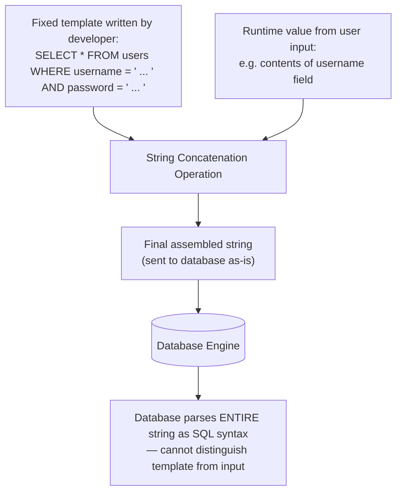

### Hard-Coded SQL vs. Runtime-Generated SQL

To make the distinction completely concrete, compare these two statements conceptually:

**Hard-coded (static) SQL** — the entire text is fixed by the developer and never changes:

```sql
SELECT * FROM users WHERE username = 'admin';
```

**Runtime-generated (dynamic, concatenated) SQL** — part of the text is fixed, part is inserted from a variable at execution time:

```sql
-- Template portion is fixed:
SELECT * FROM users WHERE username = '<INSERTED HERE>';

-- At runtime, becomes, e.g.:
SELECT * FROM users WHERE username = 'priya';

-- But could just as easily become, if the input is different:
SELECT * FROM users WHERE username = 'SomeOtherValueEntirely';
```

In the hard-coded example, there is no risk at all — the text never changes, so there is nothing to manipulate. In the runtime-generated example, the *final shape* of the SQL statement literally depends on what the caller supplied. This is the mechanical foundation of the entire vulnerability class: **when a program constructs an instruction by splicing untrusted text directly into the instruction's own syntax, the boundary between "instruction" and "data" can be broken by whoever controls that text.**

We are still not yet demonstrating *how* an attacker exploits this — that belongs to later chapters. Right now, the goal is simply to understand, at the level of strings and characters, *how a SQL statement is physically built*, so that you can recognize exactly where the risk is introduced.

---

## SECTION 5 — User Input

### Trusted vs. Untrusted Input

**Trusted input** is data that originates from a source the application has strong reason to believe is accurate, unaltered, and non-adversarial — for example, a constant written directly into the source code by the developer, or a value generated internally by the server itself (such as a freshly generated internal ID) that never passed through anything the end user could influence.

**Untrusted input** is any data that originates outside the application's own trust boundary — most importantly, *anything that arrived from the client* (the browser, a mobile app, or any external caller), because the application cannot control or verify what that external party actually sent.

> **Warning:** A secure engineering mindset treats **every single piece of data that arrives from outside the server** as untrusted by default — not because users are assumed to be malicious, but because the application has no reliable way to guarantee what was actually sent, by whom, or using what tool. A completely well-meaning user's browser could be compromised by malware; an API caller could be a script instead of a human; a field that "should" only ever contain a number could, technically, contain anything at all unless the server itself enforces that constraint.

### Why "The Browser Already Validates It" Is a Dangerous Assumption

Many web forms include client-side validation — JavaScript that checks whether a field "looks like" an email address, or restricts a dropdown to certain options, before the form is submitted. This is useful for *user experience* (catching typos early, providing instant feedback) but it provides **zero security guarantee**, because client-side code runs entirely under the control of whoever is operating the browser. An attacker can simply bypass the browser's form entirely and send a hand-crafted HTTP request directly to the server, skipping any JavaScript validation altogether. The server-side application must treat every incoming request as if the client-side validation never happened at all — because, from an attacker's perspective, it usually hasn't.

### Common Sources of Input

Untrusted input arrives from far more places than just visible form fields. In our NorthGate Portal application, consider the following sources:

| Source | Example |
|---|---|
| Login forms | Username, password fields |
| Search fields | Free-text search terms |
| Contact / support forms | Message body, subject line |
| Registration forms | Name, email, employee ID |
| API requests | JSON payloads sent by other systems or mobile apps |
| Cookies | Session identifiers, saved preferences |
| HTTP headers | `User-Agent`, `Referer`, custom headers |
| URL parameters | `?userId=1042`, `?sort=name` |
| JSON / XML bodies | Structured data submitted to an API endpoint |

Every one of these is, from the server's perspective, just text that arrived over the network. None of them come with a built-in guarantee of safety. A developer who only thinks to "sanitize the login form" while ignoring the search box, the API layer, or a custom HTTP header has left the door open just as wide as if no input were handled carefully at all — because SQL Injection can occur at *any* point where untrusted data influences a SQL statement, not merely at the most obviously interactive form on the page.

### Why Developers Should Never Assume Input Is Safe

There is a persistent temptation, especially under project deadlines, to think: *"This particular field will only ever contain a number, so I don't need to worry about it,"* or *"Only trusted employees can access this internal tool, so validation isn't critical here."* Both of these assumptions are dangerous:

1. **Client-side or "expected" constraints are not enforced by the server.** Nothing stops an attacker from submitting a request that violates the form's expectations, regardless of dropdowns, `maxlength` attributes, or input types declared in HTML.
2. **"Internal" and "trusted" users are not always trustworthy, and their sessions and devices are not always secure.** Internal tools frequently become high-value targets precisely *because* they are assumed to be low-risk and are therefore built with fewer safeguards.
3. **Automated tools, scripts, and other systems** submit requests to the same endpoints that humans use, and they do not "know" what the developer intended a field to contain.

The only dependable engineering posture is this: **the server-side application is the last line of defense, and it must independently ensure that every value flowing into a SQL statement is handled safely — regardless of where that value came from or what the developer expected it to look like.**

---

## SECTION 6 — Trust Boundaries

### What Is a Trust Boundary?

A **trust boundary** is a conceptual line that separates parts of a system that operate under different levels of trust or control. On one side of the boundary, the system fully controls and vouches for the data (it is trusted). On the other side, the system does not control the data's origin and cannot vouch for its integrity (it is untrusted). **Any time data moves from a lower-trust zone into a higher-trust zone, it must cross a trust boundary — and it is precisely at this crossing point that validation, sanitization, and safe handling must occur.**

### Internal vs. External Systems

In NorthGate Portal's architecture, we can identify several zones of differing trust:

- **The public internet / the user's browser** — completely outside NorthGate's control. Anyone, using any tool, can send requests here. This is the *lowest*-trust zone.
- **The web/application server** — controlled by NorthGate, but it directly receives and processes data from the lowest-trust zone. It must treat everything it receives from the browser as untrusted until proven otherwise.
- **The database server** — typically an internal system, often not directly reachable from the public internet at all, and generally considered highly trusted *in terms of who can talk to it directly*. However — and this is the crucial point — **the database trusts whatever SQL statements are sent to it by the application.** The database's trust boundary sits at the edge of "who can send it queries," not at "whether the content within those queries is safe." If the application relays attacker-influenced text straight into a query, the database has no independent way to detect that anything is wrong.

### Diagram: Trust Boundaries in NorthGate Portal

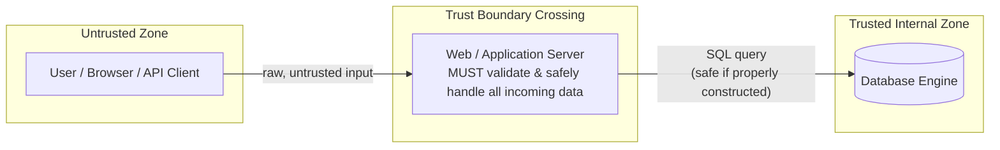

### Validation, Sanitization, and Verification

These three related-but-distinct concepts describe different ways of handling data as it crosses a trust boundary:

- **Validation** — checking that incoming data conforms to expected rules *before* using it (e.g., confirming that a submitted "age" field actually contains a number within a reasonable range, or that an email field matches a valid email format). Validation answers the question: *"Is this data shaped the way I expect?"*
- **Sanitization** — modifying or filtering data to remove or neutralize potentially dangerous characters or content before it is used. Sanitization answers the question: *"Can I make this data safer to use, even if I can't fully control its shape?"*
- **Verification** — confirming that data (or a request) genuinely comes from where it claims to come from, and has not been altered in transit — for example, verifying a cryptographic signature or an authentication token.

> **Note:** Later in this chapter (Section 12), we will directly address a common and important misconception: that *validation or sanitization alone* is a sufficient defense against SQL Injection. It is an important *layer* of defense, but — as we will see — it is not, by itself, a complete structural solution. The complete structural solution is discussed in Sections 9 and 11.

### Why SQL Injection Fundamentally Occurs at a Trust Boundary Failure

Here is the connecting insight that ties Sections 2 through 6 together: **SQL Injection happens because data crosses a trust boundary — from the untrusted browser, into the trusted application, and ultimately into a trusted instruction sent to the database — without the application enforcing a hard structural separation between "this is an instruction" and "this is merely a value."**

The trust boundary between the user and the application is well understood and widely defended (login screens, HTTPS, authentication checks). But the *internal* boundary — between "text that came from the outside world" and "text that is about to become part of a command executed by an extremely powerful trusted system" — is far easier to overlook, precisely because it exists entirely within the application's own source code, often on a single line, and is easy to write correctly by accident *or* incorrectly by accident, depending on which method the developer reaches for.

---

## SECTION 7 — Authentication Logic

Let us now walk through the *normal, intended* behavior of a login system — with no attack, no manipulation, simply the expected workflow — so that later chapters (which *will* discuss attacks) build on a clear understanding of how the process is supposed to work.

### The Login Workflow, Conceptually

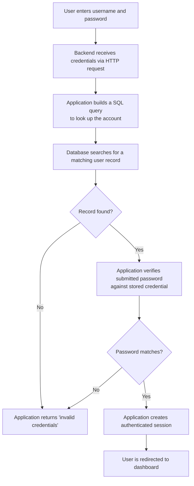

### Step-by-Step Explanation

1. **User enters username and password.** Priya provides two pieces of information that, together, are intended to prove her identity.
2. **Backend receives credentials.** The server-side application extracts these two values from the incoming HTTP request and stores them in program variables — let's call them `username` and `password`.
3. **Application builds a SQL query.** The application needs to determine whether an account matching this username exists at all, and — depending on the design — either retrieve the stored (hashed) password for comparison, or ask the database to check the match directly. This is the dynamic SQL step described in Section 3.
4. **Database searches for a matching user.** The database engine executes the query and returns either a matching row or no rows at all.
5. **Application verifies the password.** In a properly designed system, passwords are never stored as plain text — they are stored as the output of a strong, salted cryptographic hashing function (a topic covered in later chapters on authentication security). The application recomputes the hash of the submitted password and compares it to the stored hash.
6. **Session created.** If the identity is confirmed, the application creates an authenticated session — typically by issuing a session identifier stored in a cookie — allowing Priya to be recognized as "logged in" on subsequent requests without re-entering her credentials each time.

### Why This Matters for This Chapter

Notice that **Step 3 is exactly the moment where user-controlled data (the username, and possibly the password) becomes part of a SQL statement.** Authentication systems are one of the most historically significant targets for SQL Injection precisely *because* they sit at this exact intersection: they are almost always public-facing (anyone can reach a login page, even without an account), and they almost always involve constructing a query directly from user-submitted credentials. This combination — public accessibility plus direct dynamic query construction — is what has made login forms one of the most studied and most frequently vulnerable features in the history of web application security.

We are, again, deliberately *not* demonstrating how this workflow can be abused. That is the task of later chapters, once you thoroughly understand the mechanics established here.

---

## SECTION 8 — Vulnerable Code Examples

The following examples are simplified for teaching purposes and use our fictional NorthGate Portal login feature as a consistent example across four languages. In each case, we first examine an **insecure** version, explaining exactly how the SQL string is assembled and why this is unsafe, and then a **secure** version, explaining why it eliminates the risk.

> **Warning:** These insecure examples are provided strictly for educational analysis. They illustrate a *pattern to recognize and avoid*, not a technique to be used for exploitation. No attack methodology is demonstrated in this chapter.

### PHP

**Insecure Example:**

```php
<?php
// Read submitted credentials directly from the HTTP request
$username = $_POST['username'];
$password = $_POST['password'];

// Build the SQL query by concatenating variables directly into the string
$query = "SELECT * FROM users WHERE username = '" . $username . "' AND password = '" . $password . "'";

// Send the assembled string directly to the database
$result = mysqli_query($connection, $query);
?>
```

**Line-by-line explanation:**

- `$_POST['username']` and `$_POST['password']` read raw values submitted in the HTTP request body. At this point they are plain strings, entirely under the control of whoever sent the request.
- The `$query` line performs **string concatenation** (the `.` operator in PHP), splicing the fixed SQL template text together with the two runtime variables to produce one final string.
- `mysqli_query($connection, $query)` hands that finished string directly to the database driver, which forwards it to the database engine to be parsed and executed *as SQL syntax, in its entirety.*
- **Why this is unsafe:** The database has no way to know that `$username` and `$password` were "supposed to" represent only literal data values. It only sees the final text of `$query`. Whatever characters those variables contain become structurally part of the SQL statement itself.

**Secure Example (Prepared Statement):**

```php
<?php
$username = $_POST['username'];
$password = $_POST['password'];

// Prepare a query template with placeholders — no user data is in this string
$stmt = $connection->prepare("SELECT * FROM users WHERE username = ? AND password = ?");

// Bind the actual values separately, as pure data
$stmt->bind_param("ss", $username, $password);

// Execute — the database receives the template and the values through separate channels
$stmt->execute();
$result = $stmt->get_result();
?>
```

**Why this is safer:** The SQL text sent to the database — `SELECT * FROM users WHERE username = ? AND password = ?` — contains no user data whatsoever; it is fixed and identical on every execution. The actual values are transmitted to the database through an entirely separate channel (`bind_param`), explicitly tagged as *data*, never as *SQL syntax*. We will explore exactly why this separation is decisive in Section 9.

---

### Python (Flask + SQLite)

**Insecure Example:**

```python
@app.route('/login', methods=['POST'])
def login():
    username = request.form['username']
    password = request.form['password']

    # String formatting builds the query with user data embedded directly
    query = f"SELECT * FROM users WHERE username = '{username}' AND password = '{password}'"

    cursor = db.execute(query)
    user = cursor.fetchone()
    return handle_login_result(user)
```

**Line-by-line explanation:**

- `request.form['username']` and `request.form['password']` extract the submitted values as plain Python strings.
- The `f"..."` f-string performs the same fundamental operation as PHP's `.` concatenation: it substitutes the variables' current values directly into the surrounding SQL text, producing one finished string.
- `db.execute(query)` sends that finished string to the SQLite engine to be parsed and run as SQL, exactly as written.
- **Why this is unsafe:** Identical reasoning to the PHP example — the database engine parses the entire string as SQL syntax and has no mechanism to distinguish "developer-authored instruction" from "user-supplied value."

**Secure Example (Parameterized Query):**

```python
@app.route('/login', methods=['POST'])
def login():
    username = request.form['username']
    password = request.form['password']

    # Fixed query template with placeholders; values passed separately as a tuple
    query = "SELECT * FROM users WHERE username = ? AND password = ?"
    cursor = db.execute(query, (username, password))
    user = cursor.fetchone()
    return handle_login_result(user)
```

**Why this is safer:** The `?` placeholders mark exactly where values belong within the fixed query template. The `(username, password)` tuple is passed to `db.execute` as a **separate argument**, not merged into the query text itself. The database driver transmits the template and the values independently, and the database engine treats the values strictly as data throughout execution.

---

### Node.js (Express + a SQL driver)

**Insecure Example:**

```javascript
app.post('/login', (req, res) => {
  const username = req.body.username;
  const password = req.body.password;

  // Template literal splices values directly into the SQL text
  const query = `SELECT * FROM users WHERE username = '${username}' AND password = '${password}'`;

  connection.query(query, (err, results) => {
    handleLoginResult(results, res);
  });
});
```

**Line-by-line explanation:**

- `req.body.username` and `req.body.password` read the submitted JSON or form-encoded fields from the request body.
- The backtick template literal (`` `...${username}...` ``) again performs string interpolation — mechanically identical in effect to PHP concatenation or Python f-strings: the runtime value is inserted directly into the surrounding SQL text.
- `connection.query(query, ...)` sends the finished string to the database driver for execution.
- **Why this is unsafe:** Same fundamental issue — the final string handed to the database mixes fixed instruction text and variable data with no boundary between them.

**Secure Example (Parameterized Query):**

```javascript
app.post('/login', (req, res) => {
  const username = req.body.username;
  const password = req.body.password;

  // Placeholders (?) mark where values belong; values passed as a separate array
  const query = 'SELECT * FROM users WHERE username = ? AND password = ?';
  connection.query(query, [username, password], (err, results) => {
    handleLoginResult(results, res);
  });
});
```

**Why this is safer:** The query string itself never changes based on input — it is always the exact same fixed template. The `[username, password]` array is passed as a distinct parameter to `connection.query`, and the underlying driver ensures these values are transmitted to the database as pure data, never as part of the parsed SQL syntax.

---

### Java (JDBC)

**Insecure Example:**

```java
String username = request.getParameter("username");
String password = request.getParameter("password");

String query = "SELECT * FROM users WHERE username = '" + username + "' AND password = '" + password + "'";

Statement stmt = connection.createStatement();
ResultSet rs = stmt.executeQuery(query);
```

**Line-by-line explanation:**

- `request.getParameter(...)` retrieves the submitted values from the HTTP request as Java `String` objects.
- The `+` operator performs string concatenation, building one combined `query` string from the fixed SQL text and the two variables — mechanically identical to every previous language example.
- `Statement.executeQuery(query)` sends this finished string to the JDBC driver, which forwards it to the database to be parsed and executed as-is.
- **Why this is unsafe:** Java's plain `Statement` interface is designed to execute whatever complete SQL string it is given, with no separation between instruction and data — the exact same structural weakness present in every language shown above.

**Secure Example (PreparedStatement):**

```java
String username = request.getParameter("username");
String password = request.getParameter("password");

String query = "SELECT * FROM users WHERE username = ? AND password = ?";
PreparedStatement pstmt = connection.prepareStatement(query);
pstmt.setString(1, username);
pstmt.setString(2, password);
ResultSet rs = pstmt.executeQuery();
```

**Why this is safer:** `connection.prepareStatement(query)` sends the *fixed template* to the database **first**, before any user data is involved at all — the database engine parses and plans the query's structure at this stage. Only afterward does `setString(1, username)` and `setString(2, password)` supply the actual values, bound explicitly to specific positions as pure data. The SQL structure has already been finalized by the time any user-controlled value enters the picture.

---

## SECTION 9 — Why These Examples Are Vulnerable

This is the most important section in the chapter, because it explains the vulnerability at the level of *mechanism*, not merely vocabulary. It is not enough to say "they use string concatenation" — we need to understand precisely *what that means* for how the database processes the resulting text.

### What Happens in Memory

When any of the insecure examples in Section 8 executes, the following sequence occurs inside the running program:

1. The program allocates memory to hold the incoming `username` and `password` values as ordinary string data — indistinguishable, at the memory level, from any other string the program might handle.
2. The concatenation or interpolation operation allocates a *new* block of memory large enough to hold the combined result, and copies the characters of the fixed template and the runtime values into it, one after another, in sequence.
3. The result of this operation is a **single, undifferentiated string** — from the perspective of the memory holding it, there is no marker, tag, or boundary indicating "these characters came from the developer" versus "these characters came from the network." It is simply one unbroken sequence of characters.
4. This single string is passed to the database driver's "execute this raw SQL" function.

### How Variables Become SQL

The database driver takes this string and transmits it — largely as-is — to the database engine over the database's own network protocol. The database engine's SQL parser then reads the string from beginning to end, applying the grammar rules of the SQL language to determine what the statement means: which clauses it contains, which values are string literals, which are column names, which are operators, and so on.

Crucially, **the SQL parser does not know or care where any particular character came from.** It only cares whether the overall sequence of characters is syntactically valid SQL, and if so, what that SQL means according to the language's grammar. If the characters supplied by the user happen to form text that — when combined with the surrounding template — is *still syntactically valid SQL*, the parser will happily interpret the entire thing as a single, coherent instruction, exactly as it is written, with no distinction between "template" and "input."

### Why the Database Cannot Distinguish Instructions from Data

This is the crux of the entire chapter, stated as plainly as possible:

> **When SQL is built through direct string concatenation, the database engine receives one flat sequence of text and must interpret ALL of it as SQL grammar. There is no structural signal within that text indicating which portions the developer intended as fixed commands and which portions were merely meant to be inert data values supplied by a user. The "intent" existed only in the developer's mind and in the source code that assembled the string — by the time the string reaches the database, that intent has been lost.**

This is analogous to handing someone a single sheet of paper containing both a legal contract's boilerplate clauses *and* a client's freeform notes, with no quotation marks, formatting, or separation between them, and asking them to "read it as one continuous legal document." The reader has no way to tell where the boilerplate ends and the freeform notes begin — they can only read the characters in order and interpret them according to the grammar of legal documents. If the freeform notes happen to *look like* valid contract clauses, they will be read and treated as such.

### How Prepared Statements Separate Code From Data

Now contrast this with the secure examples in Section 8. In every secure version, the process is fundamentally different:

1. The application first sends the database engine **only the fixed template** — `SELECT * FROM users WHERE username = ? AND password = ?` — with no user data present at all.
2. The database engine parses this template *on its own*, determining its complete grammatical structure, including exactly where the two placeholder positions sit within that structure. This is sometimes called "compiling" or "preparing" the statement.
3. **Only after** this structure has been fixed does the application send the actual `username` and `password` values — through a distinct channel, tagged explicitly as data values bound to specific placeholder positions, never as raw text to be merged into the statement.
4. The database engine inserts these values directly into the already-determined placeholder slots as literal data, without ever re-parsing or re-interpreting them as SQL syntax. No matter what characters the values contain, they are treated purely as the *content* of a username or password field — never as instructions.

### Diagram: Concatenation vs. Parameterization

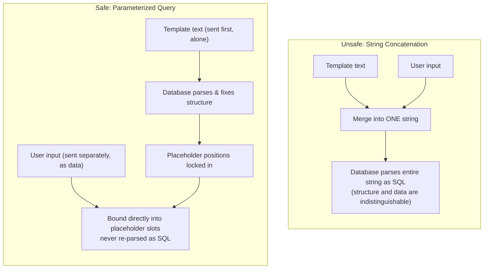

This is why parameterized queries and prepared statements are considered a *structural* fix rather than merely a *precaution*: they don't try to inspect user input for "dangerous-looking" content — instead, they redesign the communication between the application and the database so that **user input is never given the opportunity to be interpreted as SQL syntax in the first place**, regardless of what characters it contains.

---

## SECTION 10 — The Root Cause

Having walked through the full mechanism, we can now state the root causes of SQL Injection precisely and individually.

### 1. Mixing Instructions With Data

At the most fundamental level, SQL Injection exists because a single communication channel (a plain SQL string) is used to carry **both** the fixed instructions the developer intends to execute **and** the variable data supplied by an external party — with nothing in that channel distinguishing one from the other. Any system that blends control information and payload information into one undifferentiated stream creates the possibility that payload content will be misinterpreted as control information. This is not unique to SQL — the same underlying flaw pattern appears in other injection vulnerability classes (command injection, LDAP injection, XML injection) covered in later security topics — but this chapter focuses specifically on its SQL manifestation.

### 2. Dynamic Query Generation

Because so many application features legitimately require dynamic SQL (Section 3), developers are constantly placed in situations where they must combine fixed logic with variable runtime values. This need is unavoidable — but *how* it is satisfied determines whether the result is safe.

### 3. Missing Parameterization

The specific engineering choice that turns dynamic SQL into a vulnerability is the *absence* of parameterization — that is, choosing string concatenation/interpolation instead of prepared statements, placeholders, or an equivalent mechanism that keeps structure and data separate at the driver and database level.

### 4. Poor Software Design

Beyond any single line of code, SQL Injection is often enabled by broader design decisions: application layers that don't consistently enforce parameterization across the whole codebase, database access code duplicated ad hoc in many places rather than centralized through a safe data-access layer, or a general lack of secure-coding standards and code review practices that would catch unsafe patterns before deployment.

### 5. Unsafe Assumptions About User Input

Finally, as discussed in Section 5, SQL Injection is enabled by the assumption — explicit or implicit — that certain input "doesn't need to be worried about," whether because it comes from an "internal" system, a dropdown menu, a numeric field, or a source the developer simply didn't consider when reasoning about security.

> **Key Idea:** None of these five causes exist in isolation. SQL Injection typically emerges from their combination: a legitimate need for dynamic SQL, satisfied through concatenation instead of parameterization, embedded in a design that lacks consistent safeguards, applied to input the developer assumed (incorrectly) was safe.

---

## SECTION 11 — Secure Design Principles

Understanding the root cause naturally points toward the defenses. Later chapters will go into significant depth on each of these; here we establish the foundational principles.

### Parameterized Queries / Prepared Statements

As demonstrated extensively in Sections 8 and 9, parameterized queries structurally separate SQL instructions from user-supplied data at the driver and database level. This is considered the **primary, most reliable defense** against SQL Injection, because it does not depend on correctly anticipating every possible dangerous input — it eliminates the *mechanism* of the vulnerability entirely, for the queries where it is properly applied.

### Input Validation

Checking that submitted data conforms to expected formats (correct data type, expected length, expected character set, expected range) before it is used anywhere in the application. Input validation is a valuable defense-in-depth layer and helps catch malformed or unexpected data early, but — as Section 12 will explain — it is not sufficient on its own as the *only* defense against SQL Injection.

### Allow-List Validation

Where possible, restrict accepted input to an explicit **allow-list** of known-good values (for example, only accepting `"asc"` or `"desc"` for a sort-direction parameter) rather than trying to enumerate and block every possible *bad* value (a "block-list" or "deny-list" approach). Allow-listing is generally far more reliable, because it is much easier to define "everything that is definitely acceptable" than to anticipate "everything that could possibly be dangerous."

### Least Privilege

The database account used by the application should be granted only the minimum permissions it actually needs to function — for example, a web application's database user might need `SELECT`, `INSERT`, and `UPDATE` on specific tables, but should generally not have permission to `DROP` tables, access unrelated schemas, or perform administrative operations. Applying least privilege does not prevent SQL Injection from occurring, but it substantially limits the potential damage if a vulnerability is ever exploited.

### Secure Error Handling

Applications should avoid displaying raw database error messages, stack traces, or internal query details directly to end users. Detailed error output can reveal information about the database's structure that is useful to an attacker attempting to understand or refine an attack. Errors should be logged internally for developers while presenting generic, non-revealing messages to end users.

### Defense in Depth

No single control should be relied upon exclusively. A well-designed system layers multiple independent defenses — parameterized queries as the primary structural fix, input validation as an early filter, least-privilege database accounts to limit blast radius, secure error handling to reduce information leakage, monitoring and logging to detect anomalies, and web application firewalls as an additional network-level layer. If any single layer fails or is misapplied somewhere in a large codebase, the remaining layers still provide meaningful protection.

---

## SECTION 12 — Common Misconceptions

### "Escaping alone solves SQL Injection."

**Escaping** refers to modifying special characters (such as a single quote) so that they are treated as literal characters rather than syntactically significant ones. Escaping *can* reduce risk in certain narrow contexts, but it is inconsistent across different databases, different data types, and different contexts within a query (a value inside a string literal is escaped differently than a value used as a column name, for instance). Relying on manual escaping requires the developer to correctly anticipate every relevant special character and context, in every single place a query is built, forever — a much larger and more error-prone burden than simply using parameterized queries, which sidestep the need for escaping altogether by never merging the value into the SQL text in the first place.

### "Input validation alone is enough."

Input validation is valuable, but it answers the question "does this data look reasonable?" — not "is this data safe to insert directly into SQL syntax?" A value can be perfectly valid as data (a legitimate product name, a legitimate person's name containing an apostrophe, such as *O'Brien*) while still containing characters that are syntactically significant in SQL. Validation cannot substitute for structurally separating instructions from data.

### "Only login pages are vulnerable."

As Section 5 emphasized, *any* feature that constructs SQL using external input is potentially at risk — search functionality, filtering, sorting parameters, comment submission, file uploads that record metadata, API endpoints, and administrative back-office tools are all equally capable of containing this vulnerability if they are built using unsafe query construction.

### "SQL Injection only affects PHP."

Section 8 deliberately demonstrated the identical underlying pattern in PHP, Python, Node.js, and Java — because the vulnerability is not a property of any single language. It is a property of *how a query is constructed*, and unsafe string-concatenation patterns are available (and have historically been used) in essentially every language capable of interacting with a SQL database.

### "Modern frameworks automatically eliminate all SQL Injection risks."

Many modern frameworks and Object-Relational Mapping (ORM) tools default to safe, parameterized query construction for standard operations, which meaningfully reduces risk. However, most frameworks also provide "escape hatches" for writing raw SQL or building dynamic queries for advanced cases (dynamic sorting, complex reporting queries, raw query builders) — and if a developer uses those escape hatches carelessly, the same fundamental vulnerability can reappear even within a modern, well-regarded framework. Frameworks reduce risk; they do not guarantee its complete absence.

---

## SECTION 13 — Case Studies

The following are widely documented, publicly reported incidents involving SQL Injection. They are presented here for their software-engineering and defensive lessons, not as technical walkthroughs of exploitation.

### Case Study 1: Heartland Payment Systems (2008)

**Background:** Heartland Payment Systems, a major U.S. payment processor, suffered one of the largest data breaches in history at the time, exposing an estimated hundreds of millions of payment card records.

**Development mistake:** Investigations and industry reporting attributed initial access, in significant part, to SQL Injection vulnerabilities that allowed attackers to gain a foothold within the network, which was then leveraged to install malware and capture card data in transit.

**Root cause:** Insufficiently secured web-facing applications that constructed database queries in ways that allowed external, untrusted input to influence query execution.

**Security impact:** Massive confidentiality breach affecting cardholder data across numerous financial institutions; substantial financial, legal, and regulatory consequences for the company.

**Lessons learned:** Public-facing applications — even those that seem peripheral to core sensitive systems — can become an entry point into much larger and more sensitive infrastructure if input handling is not rigorously secured throughout the environment, not just on the most obviously "important" systems.

### Case Study 2: Sony Pictures (2011)

**Background:** A high-profile attack against Sony Pictures' web properties resulted in the public disclosure of large volumes of customer data, including plaintext passwords and personal information.

**Development mistake:** Publicly reported analysis indicated that SQL Injection vulnerabilities in Sony's web applications allowed attackers to extract data directly from backend databases.

**Root cause:** Web application code that assembled SQL queries using unsafely handled input, combined with the storage of sensitive data (such as passwords) in the database without adequate protection such as strong hashing.

**Security impact:** Significant confidentiality breach, reputational damage, and erosion of customer trust; the incident became a widely cited example in security industry discussions of the importance of basic secure coding hygiene.

**Lessons learned:** Secure query construction and secure data storage (such as proper password hashing) are complementary, not substitutes for one another — a breach of one control is often compounded by weaknesses in another.

### Case Study 3: TalkTalk (2015)

**Background:** The UK telecommunications provider TalkTalk experienced a significant breach affecting customer personal and financial data.

**Development mistake:** Regulatory investigation findings indicated that a SQL Injection vulnerability, present in web infrastructure the company had inherited through a prior acquisition, was exploited to access customer databases.

**Root cause:** Insufficient security review and testing of web applications, including legacy systems, and unsafely constructed database queries.

**Security impact:** Substantial regulatory penalties, reflecting growing legal and financial consequences for organizations that fail to secure customer data, along with significant reputational and customer-trust damage.

**Lessons learned:** Security responsibility extends to inherited, legacy, and third-party-originated code, not only newly written application code — an organization's overall risk includes every system it operates, regardless of where that code originated.

> **Note:** These case studies are described at a conceptual, lessons-oriented level appropriate for a foundational chapter. Later chapters focused on specific exploitation techniques may reference additional documented incidents in more technical detail.

---

## SECTION 14 — Visual Summary

### Safe Query Construction

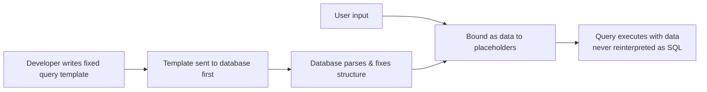

*This diagram shows that in safe construction, the SQL structure is finalized before user data ever enters the picture, and data is bound separately rather than merged into the SQL text.*

### Unsafe Query Construction

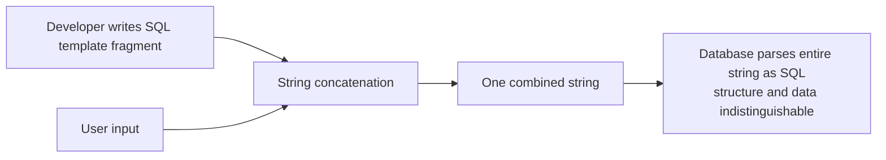

*This diagram shows that in unsafe construction, structure and data are merged into a single string before the database ever sees it — losing any distinction between the two.*

### Request Lifecycle (Recap)

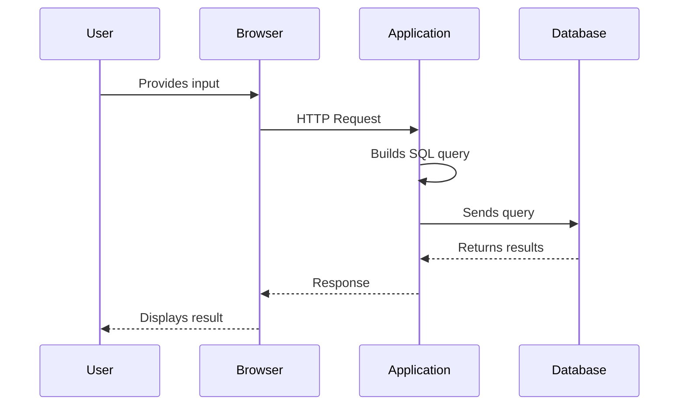

### Trust Boundaries (Recap)

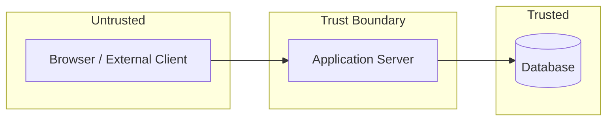

### Authentication Flow (Recap)

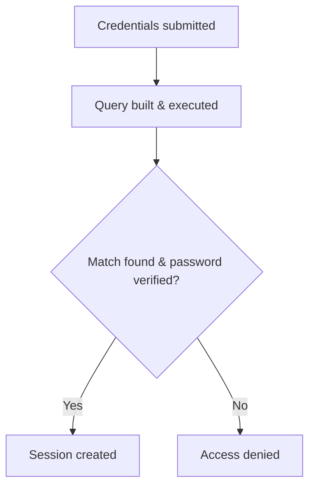

Each of these diagrams reflects a concept developed in detail earlier in the chapter. Reviewing them together reinforces how the request lifecycle, trust boundaries, authentication logic, and safe/unsafe query construction all connect into a single coherent picture of *why* SQL Injection is possible in vulnerable systems and *how* it is structurally prevented in secure ones.

---

## SECTION 15 — Hands-On Review

### Conceptual Exercises (15)

1. Explain, in your own words, why applications need databases rather than storing all data directly in application code.
2. Describe the complete journey of a single piece of user input, from the moment it is typed to the moment it might influence a SQL query.
3. Define "dynamic SQL" and explain why it is necessary for most interactive applications.
4. Explain the difference between compile-time and runtime in the context of SQL query construction.
5. Describe, at the level of strings and memory, what string concatenation does when building a SQL query.
6. Explain why a database engine cannot inherently distinguish between "instruction" and "data" within a concatenated SQL string.
7. Define "trust boundary" and give an example specific to the NorthGate Portal application.
8. Explain why client-side validation does not provide a security guarantee.
9. List at least five different sources of user input beyond a standard login form.
10. Explain why "internal" or "trusted" systems should still treat input carefully.
11. Describe the normal, non-malicious authentication workflow from credential submission to session creation.
12. Explain why prepared statements are considered a "structural" fix rather than merely a precaution.
13. Identify the five root causes of SQL Injection discussed in Section 10, and briefly explain each.
14. Explain why escaping alone is not considered a complete solution to SQL Injection.
15. Explain why modern frameworks reduce, but do not eliminate, SQL Injection risk.

### Secure Code Review Exercises (10)

For each snippet below, determine whether the query construction is **safe** or **unsafe**, and explain your reasoning.

1. 
```python
query = "SELECT * FROM products WHERE category = '" + category + "'"
cursor.execute(query)
```

2. 
```python
cursor.execute("SELECT * FROM products WHERE category = ?", (category,))
```

3. 
```java
String sql = "SELECT * FROM orders WHERE order_id = " + orderId;
Statement s = conn.createStatement();
s.executeQuery(sql);
```

4. 
```java
PreparedStatement p = conn.prepareStatement("SELECT * FROM orders WHERE order_id = ?");
p.setInt(1, orderId);
p.executeQuery();
```

5. 
```javascript
const q = `SELECT * FROM comments WHERE post_id = ${postId}`;
db.query(q);
```

6. 
```javascript
db.query('SELECT * FROM comments WHERE post_id = ?', [postId]);
```

7. 
```php
$q = "SELECT * FROM users WHERE email = '$email'";
mysqli_query($conn, $q);
```

8. 
```php
$stmt = $conn->prepare("SELECT * FROM users WHERE email = ?");
$stmt->bind_param("s", $email);
$stmt->execute();
```

9. 
```python
sort_column = request.args.get('sort')
query = f"SELECT * FROM employees ORDER BY {sort_column}"
cursor.execute(query)
```

10. 
```python
allowed_columns = {"name", "date_hired", "department"}
sort_column = request.args.get('sort')
if sort_column in allowed_columns:
    query = f"SELECT * FROM employees ORDER BY {sort_column}"
    cursor.execute(query)
else:
    raise ValueError("Invalid sort column")
```

### Solutions

**Conceptual Exercises 1–15:** Answers should reference the corresponding concepts from Sections 1–12: (1) persistence, concurrency, structured querying, integrity — Section 1; (2) the full lifecycle from Section 2; (3) Section 3's discussion of runtime-filled templates; (4) compile-time vs. runtime distinction, Section 3; (5) memory-level concatenation, Section 9; (6) lack of structural markers in a flat string, Section 9; (7) Section 6's definition, applied to NorthGate's browser/server/database zones; (8) client-side code is attacker-controllable, Section 5; (9) forms, search, cookies, headers, URL parameters, JSON, API requests — Section 5; (10) internal systems can still be reached by compromised accounts, scripts, or misconfigured trust assumptions, Section 5; (11) Section 7's six-step workflow; (12) parameterization removes the *mechanism*, not just risky-looking patterns, Section 9; (13) mixing instructions/data, dynamic generation, missing parameterization, poor design, unsafe input assumptions — Section 10; (14) escaping is inconsistent and context-dependent, Section 12; (15) frameworks provide raw-query escape hatches, Section 12.

**Secure Code Review 1–10:**

1. **Unsafe.** Direct string concatenation of `category` into the query text.
2. **Safe.** Parameterized placeholder with value passed separately.
3. **Unsafe.** `orderId` concatenated directly into a plain `Statement` query.
4. **Safe.** `PreparedStatement` with `setInt` binding.
5. **Unsafe.** Template literal interpolation merges `postId` directly into the SQL text.
6. **Safe.** Placeholder with parameter array.
7. **Unsafe.** PHP string interpolation embeds `$email` directly into the query.
8. **Safe.** Prepared statement with `bind_param`.
9. **Unsafe.** Even though this is a column name (not a typical "value"), it is taken directly from user input and concatenated into SQL syntax with no restriction — most database drivers cannot parameterize identifiers like column names, making unchecked interpolation especially risky here.
10. **Safer.** This uses **allow-list validation** (Section 11) to restrict `sort_column` to a fixed set of known-safe values before it is ever used in the query — an appropriate pattern for the specific case of dynamic identifiers (like column names), which typically cannot be parameterized the way literal values can.

---

## SECTION 16 — Chapter Summary

This chapter established the foundational "why" behind SQL Injection, deliberately without yet teaching any specific exploitation technique. We traced a request's complete journey from a user's browser through the application and into the database, identifying the exact point — inside application logic — where SQL queries are constructed. We distinguished static SQL from dynamic SQL, and showed that dynamic SQL itself is a normal, necessary part of interactive applications.

We then examined string concatenation in mechanical detail, establishing that a database engine receives SQL as a single, undifferentiated sequence of characters, and that when user-controlled text is spliced directly into that sequence, the database has no structural way to distinguish "developer-authored instruction" from "user-supplied data." We connected this to the broader concept of trust boundaries, explaining that SQL Injection occurs precisely because untrusted data crosses into a highly trusted execution context without a hard structural separation being enforced.

Working through a login authentication example and vulnerable/secure code samples in PHP, Python, Node.js, and Java, we saw that this exact pattern — concatenation versus parameterization — recurs identically across languages and frameworks, because it is a property of *how queries are built*, not a property of any single technology. We identified five interrelated root causes, introduced the core secure design principles (parameterized queries, input validation, allow-listing, least privilege, secure error handling, and defense in depth), corrected common misconceptions, and reviewed real-world incidents illustrating the consequences of these engineering mistakes at scale.

The central takeaway of this chapter is this: **SQL Injection is not primarily a hacking technique — it is the predictable consequence of building SQL statements by merging trusted instructions with untrusted data in a single, undifferentiated string.** Understanding this mechanism thoroughly is the necessary foundation for everything that follows in this book, including the specific exploitation techniques covered in upcoming chapters.

---

## SECTION 17 — Key Terms

| Term | Definition | Simple Example |
|---|---|---|
| **SQL (Structured Query Language)** | The language used to communicate instructions to a relational database. | `SELECT * FROM users;` |
| **Static SQL** | A SQL statement whose full text is fixed and does not change at runtime. | `SELECT COUNT(*) FROM employees;` |
| **Dynamic SQL** | A SQL statement assembled at runtime, incorporating values not known when the code was written. | Building a query using a submitted username. |
| **String Concatenation** | Joining multiple strings together to form one combined string. | `"Hello, " + name` |
| **User Input** | Any data supplied by an external party, such as a browser or API caller. | Text typed into a login form. |
| **Trust Boundary** | A conceptual line separating zones of differing trust within a system. | The line between the public internet and an internal server. |
| **Validation** | Checking that data conforms to expected rules before use. | Confirming an "age" field contains a number. |
| **Sanitization** | Modifying or filtering data to reduce potential danger before use. | Removing unexpected characters from a filename. |
| **Parameterized Query** | A query built from a fixed template with values supplied separately as data. | `SELECT * FROM users WHERE id = ?` with a bound value. |
| **Prepared Statement** | A database feature that pre-parses a query template before data is bound to it. | JDBC's `PreparedStatement`. |
| **Least Privilege** | Granting only the minimum permissions necessary for a task. | A web app's DB account cannot run `DROP TABLE`. |
| **Allow-list Validation** | Restricting input to an explicit set of known-acceptable values. | Only accepting `"asc"` or `"desc"` for sort order. |
| **CIA Triad** | The security model of Confidentiality, Integrity, and Availability. | A breach exposing passwords violates confidentiality. |

---

## SECTION 18 — Knowledge Check

### Multiple Choice Questions (20)

1. What is the primary purpose of a database in a web application?
   a) To render HTML  b) To store and retrieve structured data reliably  c) To encrypt HTTP traffic  d) To compile source code

2. Which of the following best describes "dynamic SQL"?
   a) SQL that never changes  b) SQL assembled at runtime using variable values  c) SQL that only runs on weekends  d) SQL written exclusively in stored procedures

3. At what stage of the request lifecycle is a SQL query typically constructed?
   a) In the browser  b) In the HTTP request itself  c) In the application logic  d) Inside the database engine before the request arrives

4. What does string concatenation do?
   a) Encrypts a string  b) Joins multiple strings into one  c) Deletes a string  d) Validates a string's format

5. Why can't a database distinguish instructions from data in a concatenated SQL string?
   a) Databases don't support strings  b) The final string has no structural marker separating the two  c) Databases refuse to run dynamic SQL  d) Concatenation is not supported in SQL

6. What is a "trust boundary"?
   a) A firewall rule  b) A line separating zones of differing trust and control  c) A type of SQL clause  d) A password policy

7. Why is client-side validation insufficient as a security control?
   a) It runs too slowly  b) It can be bypassed since it runs under the user's control  c) It is not supported by modern browsers  d) It always fails

8. Which of these is NOT a typical source of untrusted input?
   a) URL parameters  b) HTTP headers  c) A constant hard-coded in the source file  d) Cookies

9. What is the main structural difference between a prepared statement and a concatenated query?
   a) Prepared statements run faster on all systems  b) Prepared statements separate the fixed template from the data  c) Prepared statements don't use SQL  d) There is no difference

10. In the NorthGate Portal login example, where does the SQL query first get created?
    a) In the browser  b) In the database  c) In the application logic layer  d) In the HTTP header

11. Which of the following is a root cause of SQL Injection discussed in this chapter?
    a) Using HTTPS  b) Mixing instructions and data in one string  c) Using a firewall  d) Hashing passwords

12. What does "least privilege" mean in database security?
    a) Giving the application account only the permissions it needs  b) Giving every account full admin rights  c) Disabling all database accounts  d) Using the root database account for all applications

13. Why is escaping alone not considered a complete solution?
    a) It's illegal in most countries  b) It is inconsistent across contexts and databases and easy to miss  c) It slows down queries excessively  d) It's not supported by any language

14. Which languages were shown in this chapter to be capable of both vulnerable and secure query construction?
    a) Only PHP  b) Only Python  c) PHP, Python, Node.js, and Java  d) None — this is language-specific

15. What is "allow-list validation"?
    a) Blocking known-bad values  b) Restricting input to an explicit set of known-good values  c) Allowing all input unconditionally  d) A type of encryption

16. According to this chapter, is SQL Injection primarily a hacking technique or an engineering issue?
    a) Purely a hacking technique  b) A predictable consequence of an identifiable engineering mistake  c) A hardware failure  d) A network protocol flaw

17. Which part of the CIA triad is threatened if an attacker can alter data via unsafe queries?
    a) Confidentiality only  b) Availability only  c) Integrity  d) None of the above

18. Why might a "column name" input (like a sort parameter) be harder to protect using standard parameterization?
    a) Column names cannot be strings  b) Most parameterization mechanisms bind literal values, not identifiers  c) Column names are never user-controlled  d) Databases don't support column names

19. What did the case studies in Section 13 primarily emphasize?
    a) Step-by-step exploitation methods  b) Software engineering and defensive lessons  c) How to write malware  d) Marketing strategies

20. What is the central takeaway of this chapter?
    a) SQL Injection is unavoidable  b) SQL Injection results from merging trusted instructions with untrusted data in one string  c) Only login pages need protection  d) Frameworks eliminate all risk automatically

### Short Answer Questions (10)

1. Explain why databases are separated from application code rather than being built into it.
2. Describe, step by step, how a login request travels from the browser to the database and back.
3. What is the difference between static and dynamic SQL?
4. Explain, using the memory-level explanation from Section 9, why concatenated SQL is risky.
5. What is a trust boundary, and why does it matter for SQL Injection specifically?
6. List three common sources of user input beyond login forms.
7. Explain the difference between validation, sanitization, and verification.
8. Why do prepared statements prevent user data from being interpreted as SQL syntax?
9. Name and briefly explain two of the five root causes from Section 10.
10. Why can modern frameworks still be vulnerable to SQL Injection despite built-in protections?

### Scenario-Based Questions (5)

1. A developer builds a search feature for NorthGate Portal that lets employees search shipments by tracking number, using string concatenation to build the query. Explain what risk this introduces and why, referencing the mechanism from Section 9.

2. A new intern argues that because NorthGate Portal is only used internally by employees, input validation isn't necessary. Explain, using concepts from Sections 5 and 6, why this reasoning is flawed.

3. A code reviewer sees a query built with a `PreparedStatement` in Java but notices the table name itself is built using string concatenation from a configuration value that is ultimately sourced from a URL parameter. Explain why this could still be risky despite the use of a `PreparedStatement`.

4. A manager insists that because the application uses a popular modern framework, SQL Injection is "not something we need to worry about anymore." Using Section 12, explain why this statement is inaccurate.

5. During an incident review, engineers discover that an internal reporting tool — not the main customer-facing site — was the entry point for a data breach. Using the case studies in Section 13 and the concept of trust boundaries, explain why this is a plausible and important lesson.

### Answers

**Multiple Choice:** 1-b, 2-b, 3-c, 4-b, 5-b, 6-b, 7-b, 8-c, 9-b, 10-c, 11-b, 12-a, 13-b, 14-c, 15-b, 16-b, 17-c, 18-b, 19-b, 20-b

**Short Answer (summary guidance):** (1) Persistence, concurrency, integrity, structured querying — Section 1. (2) Reference the full ten-step lifecycle in Section 2. (3) Static text never changes; dynamic text incorporates runtime values — Section 3. (4) Concatenation produces one undifferentiated string with no marker separating template from input — Section 9. (5) A trust boundary separates zones of differing control; SQL Injection occurs when untrusted data crosses into a trusted execution context without structural separation — Section 6. (6) Search fields, cookies, HTTP headers, API requests, URL parameters — Section 5. (7) Validation checks shape/format; sanitization modifies/filters; verification confirms origin/integrity — Section 6. (8) Because the template's structure is fixed and parsed *before* data is bound, and data is never re-parsed as SQL — Section 9. (9) Any two of: mixing instructions/data, dynamic generation, missing parameterization, poor design, unsafe assumptions — Section 10. (10) Frameworks provide raw-query escape hatches that developers can misuse — Section 12.

**Scenario-Based (guidance):** (1) The tracking number is concatenated directly into SQL text, so the database cannot distinguish it from instruction text — identical mechanism to the login examples. (2) Internal-only status does not guarantee trustworthy input; compromised accounts, scripts, and mistaken assumptions still apply — Sections 5–6. (3) Table/column identifiers typically cannot be parameterized like literal values, so if that identifier still originates from unchecked user input via concatenation, the same fundamental risk remains — Exercise 9/10 pattern. (4) Frameworks reduce but do not eliminate risk because raw-query capabilities still exist and can be misused — Section 12. (5) This mirrors the case study lessons: any system that constructs SQL from external input is a potential entry point, regardless of its perceived importance or its position relative to the "main" public-facing trust boundary — Sections 6 and 13.

---

## SECTION 19 — Revision Cheat Sheet

**Static vs. Dynamic SQL**
- Static: fixed text, never changes.
- Dynamic: fixed template + runtime values; necessary for interactive features.

**String Concatenation**
- Merges template text and user input into one undifferentiated string.
- Database parses the *entire* result as SQL — no structural separation exists.

**User Input**
- Treat *everything* from outside the server as untrusted: forms, search boxes, cookies, headers, URL params, JSON, API calls.
- Client-side validation ≠ security control.

**Trust Boundaries**
- Line between zones of differing trust (browser → server → database).
- SQL Injection = untrusted data crossing into a trusted execution context without structural separation.

**Authentication Flow**
- Credentials submitted → query built → database searched → password verified → session created.
- Query construction (Step 2) is where user input meets SQL.

**Prepared Statements / Parameterized Queries**
- Template sent and parsed *first*, alone.
- Data bound *afterward*, separately, as pure data — never re-parsed as SQL.
- The primary structural defense against SQL Injection.

**Secure Coding Principles**
- Parameterized queries (primary defense)
- Input validation (defense-in-depth layer)
- Allow-list validation (especially for identifiers like column names)
- Least privilege database accounts
- Secure, non-revealing error handling
- Defense in depth — layer multiple independent controls

**Common Misconceptions to Avoid**
- Escaping alone ≠ sufficient.
- Validation alone ≠ sufficient.
- Not just login pages.
- Not just PHP.
- Frameworks reduce, don't eliminate, risk.

---

## SECTION 20 — Mind Map

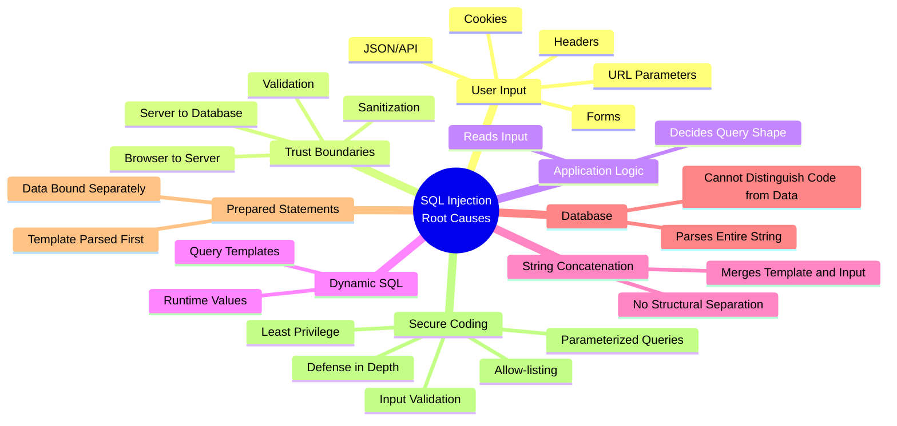

---

**End of Chapter 4**
