# Chapter 5 — Types of SQL Injection

> **Fictional Application Used Throughout This Chapter**
> To keep our discussion grounded, this chapter uses a single fictional (and intentionally vulnerable, lab-only) web application called **BrightCart** — a small online bookstore with a login page, a product search page, a customer review form, and a customer-support ticket system. BrightCart does not exist outside this book. It appears here purely as a teaching device to illustrate *how* different categories of SQL Injection manifest in typical application behavior, never as a target for real-world testing.

---

## LEARNING OBJECTIVES

By the end of this chapter, you should be able to:

- Explain why SQL Injection is divided into categories rather than treated as a single monolithic vulnerability.
- Differentiate between the major SQL Injection types: In-Band (Error-Based and UNION-Based), Blind (Boolean-Based and Time-Based), Out-of-Band, and Second-Order.
- Understand the typical circumstances under which each type is encountered.
- Compare the strengths and limitations of each category at a conceptual level.
- Explain how application behavior — not just database behavior — shapes which SQL Injection techniques are relevant.
- Explain why different databases, frameworks, and API styles influence the SQL Injection behaviors testers and developers should anticipate.

---

## SECTION 1 — Introduction

In Chapter 3, we established *how* SQL Injection happens: untrusted input reaches a SQL statement without adequate separation between code and data. In Chapter 4, we examined how dynamic query construction and authentication logic create the trust-boundary failures that make injection possible. What we have not yet addressed is a critical practical question: **once a trust boundary has failed, how does that failure actually surface to an attacker or a defender testing the system?**

This is the question that gives rise to SQL Injection *classification*. Not every vulnerable query behaves the same way when probed. Some applications display raw database errors on screen. Others display nothing unusual at all, no matter what is submitted. Some return a single row of data; others silently merge attacker-supplied input into a stored table, only to have it processed hours later by a completely different part of the system. The underlying root cause — a broken trust boundary between code and data — may be identical in all these cases, but the *observable behavior*, and therefore the *testing and defensive approach*, differs enormously.

### Why One Technique Does Not Work Everywhere

Consider two applications that both contain the exact same underlying flaw: a search field concatenated directly into a `WHERE` clause. In Application A, any database error is printed directly to the browser, complete with a stack trace. In Application B, database errors are caught, logged internally, and the user is shown a generic "Something went wrong" page regardless of what happened. Both applications are vulnerable to SQL Injection. But a tester relying purely on visible error messages will find useful signal in Application A and complete silence in Application B.

This is the core reason SQL Injection cannot be taught, tested, or defended against as a single technique. **The application's behavior around errors, output, and timing determines which category of technique is observable — and therefore relevant.**

### The Relationship Between Application Behavior and SQL Injection Categories

A useful way to think about this relationship is that **SQL Injection categories are not really about the database — they are about the communication channel between the vulnerable query and the person examining its behavior.** The database engine executes attacker-influenced SQL in fundamentally the same way regardless of category. What changes is how — or whether — the *result* of that execution becomes visible.

| Application Behavior | Resulting Feedback Channel |
|---|---|
| Displays raw database errors | Error-Based feedback |
| Displays query results directly in the page | UNION-Based feedback (data returned in-band) |
| Displays no errors, but page content changes based on query truth value | Boolean-Based Blind feedback |
| Displays no errors and no visible content change | Time-Based Blind feedback (timing becomes the signal) |
| Displays nothing at all, even with timing manipulated | Out-of-Band feedback may be attempted (a separate channel, such as DNS, is used) |
| Processes the input only later, in a different context | Second-Order behavior (the *timing of execution*, not just feedback, is delayed) |

This table is the conceptual foundation for the entire chapter. We will build on it throughout.

### A Brief Evolution of SQL Injection Techniques

Understanding *why* today's classification exists is easier with a short historical view. The timeline below is simplified for teaching purposes and focuses on the evolution of *technique categories*, not specific incidents (case studies with real-world grounding appear later in Section 14).

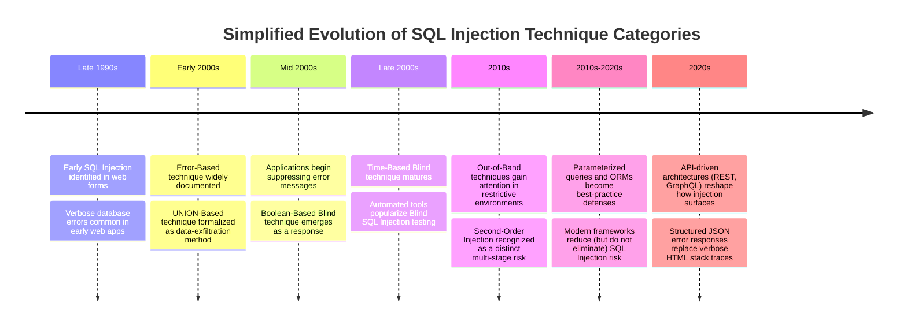

Notice the pattern: **each new category of SQL Injection technique emerged largely as a response to defenders closing off the previous feedback channel.** As developers stopped printing raw database errors, testers and attackers adapted toward Boolean logic. As applications began suppressing even subtle content differences, timing-based approaches matured. As environments became more restrictive still, out-of-band channels were explored. This is an important lesson for the secure developer: **closing one feedback channel does not eliminate the underlying vulnerability — it only forces the observable behavior into a different category.** True remediation addresses the root cause (the broken trust boundary from Chapter 4), not merely the symptom (which category of feedback is available).

> **Note**
> This chapter deliberately does not walk through how to construct payloads for each category. Future chapters cover each type in dedicated depth, including detection methodology in authorized, lab-based environments. Here, our goal is purely conceptual classification.

---

## SECTION 2 — SQL Injection Classification

SQL Injection is generally organized into three top-level categories based on **how feedback is obtained**, with several of those categories further divided into sub-types.

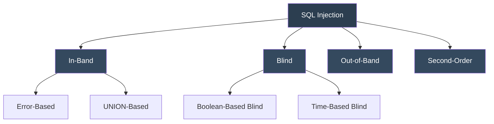

### Understanding the Hierarchy

- **In-Band SQL Injection** describes cases where the attacker uses the *same communication channel* (the HTTP response) both to inject the malicious input and to retrieve the results. This is the most straightforward category to understand and is further split into **Error-Based** and **UNION-Based** sub-types, depending on *how* the data becomes visible in that response.
- **Blind SQL Injection** describes cases where the application gives no direct data back, forcing reliance on indirect signals — either differences in application behavior (**Boolean-Based**) or differences in response timing (**Time-Based**).
- **Out-of-Band SQL Injection** describes cases where neither the direct response nor timing provides a usable channel, and a completely separate communication mechanism must be considered instead.
- **Second-Order SQL Injection** is somewhat different in nature — it is not primarily about *how feedback is observed*, but about *when the vulnerable query actually executes*. It cuts across the other categories because a second-order flaw could, in principle, ultimately surface as In-Band, Blind, or Out-of-Band once the stored input is finally processed.

> **Tip**
> A helpful mental model: **In-Band, Blind, and Out-of-Band answer the question "how do I observe the result?"** while **Second-Order answers the question "when does the vulnerable query actually run?"** These are two different axes of classification, which is why Second-Order is often presented separately rather than as a sibling of the other three.

---

## SECTION 3 — In-Band SQL Injection

### Definition

**In-Band SQL Injection** refers to any case where the attacker submits malicious input and observes the result of that input through the *same channel* used to deliver it — typically, the same HTTP response returned by the web application.

### Why It Is Called "In-Band"

The term "band" here refers to the communication channel between the client and the server. In telecommunications, "in-band" signaling means control information travels over the same channel as the primary data. Applied to SQL Injection, it means the attacker does not need to establish any secondary channel (such as DNS lookups or external logging) to see what happened — the application's own response *is* the channel.

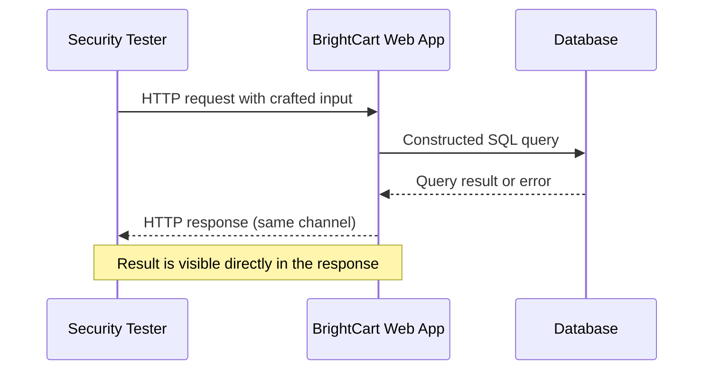

### Typical Characteristics

- Feedback is immediate and visible within a single request/response cycle.
- No secondary infrastructure (such as a listener server) is required to observe outcomes.
- Commonly associated with applications that either display database errors or reflect query results into the page.

### Advantages (From a Testing Perspective)

- Fast to confirm — behavior is visible without waiting for indirect signals.
- Easier to document and communicate in a report, since the evidence is directly visible.

### Limitations

- Depends entirely on the application being willing to expose either errors or data. Many modern applications, by design or by accident of their framework's defaults, suppress this feedback.
- Not effective against applications with strict, generic error handling and no reflected query output.

### Common Scenarios

In-Band techniques are most often encountered in:

- Legacy applications with verbose debugging left enabled in production.
- Internal or administrative tools where developers assumed a trusted user base and did not prioritize output sanitization.
- Search or "reflected data" features (e.g., BrightCart's book search page, which echoes matched titles directly into the results table).

In-Band SQL Injection is further divided into **Error-Based** and **UNION-Based**, which we examine next.

---

## SECTION 4 — Error-Based SQL Injection

### Concept

**Error-Based SQL Injection** occurs when the application surfaces the database's own error messages back to the user, and those error messages contain information about the database structure, query logic, or even data values.

### Why Database Errors Occur

When a submitted query is syntactically malformed, or attempts an operation the database cannot fulfill (a type mismatch, a reference to a nonexistent column, division by zero, and so on), the database engine raises an error describing the problem. This error is meant for developers during debugging — it is diagnostic information, not user-facing content. The security issue arises not from the database producing the error (that is normal, expected behavior) but from the **application choosing to display that diagnostic detail to an untrusted end user.**

### Information Leakage Through Verbose Errors

A verbose error message can reveal:

- The name of the database management system in use.
- Table and column names referenced in the failing query.
- Fragments of the query's structure, which can hint at the surrounding application logic.
- In some cases, actual data values, if the error message is constructed to embed a query result within its text.

### Developer Mistakes That Enable This

Error-Based leakage is almost always the result of a **configuration or handling decision**, not an inherent database flaw:

- Leaving framework "debug mode" enabled in a production environment.
- Wrapping database calls in a `try/catch` block but printing the raw exception message directly to the response instead of a generic message.
- Assuming that internal tools "don't need" the same error-handling discipline as public-facing ones.

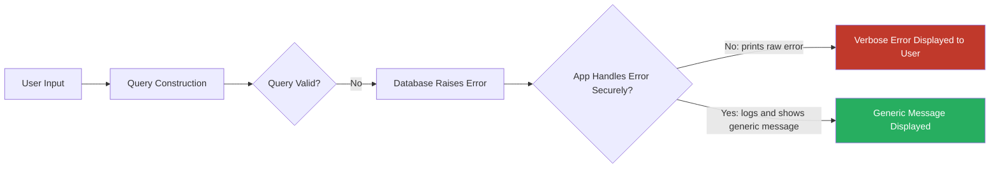

### A Simplified Educational Example

Imagine BrightCart's book search feature builds a query by directly inserting the search term into a `WHERE` clause. If a tester (in an authorized lab environment) enters a single unescaped quotation mark as the search term, and BrightCart is configured with verbose error handling, the response might display a database error naming the exact table involved in the search — for example, revealing that the underlying table is called `books` and that the query expected a string literal to be closed. That single piece of information — the real table name — is far more useful to further authorized testing than the error message might appear at first glance, because it removes a layer of guesswork about the schema.

We are not demonstrating the payload itself here, only the *concept*: a малformed input reveals structural information because the application chose to expose diagnostic detail.

### How Secure Error Handling Prevents This

- Catch database exceptions at the application layer and log full detail *internally only* (see Chapter 15's discussion of logging and monitoring, expanded later in this book).
- Return a generic, non-descriptive message to the end user (e.g., "An unexpected error occurred. Please try again.").
- Disable framework debug/verbose modes before deploying to any environment reachable by untrusted users.
- Treat internal tools with the same error-handling discipline as public-facing ones, since insider threat and lateral movement scenarios make "internal only" a weak boundary.

> **Warning**
> Suppressing errors is a *necessary* control, but it is not sufficient on its own. Suppressing error messages removes one feedback channel (Error-Based) but, as our historical timeline in Section 1 illustrated, it typically pushes a tester or attacker toward Blind techniques instead. The underlying vulnerable query is still there. Only parameterization and proper input handling (Chapter 4, and revisited in Section 15 of this chapter) address the root cause.

---

## SECTION 5 — UNION-Based SQL Injection

### What SQL `UNION` Is

The `UNION` operator, introduced in Chapter 1, allows the results of two separate `SELECT` statements to be combined into a single result set. It exists for entirely legitimate purposes — for instance, combining "current products" and "archived products" into one report.

### Why Combining Query Results Becomes Relevant

If an application is vulnerable to injection *and* also reflects query results directly into the page (for example, a search results table that lists whatever rows the underlying query returns), then the `UNION` operator becomes conceptually significant. If a tester can influence the query well enough to append an additional `SELECT` statement joined by `UNION`, the *results of that second statement* may be displayed in the same location the application normally uses to show legitimate search results.

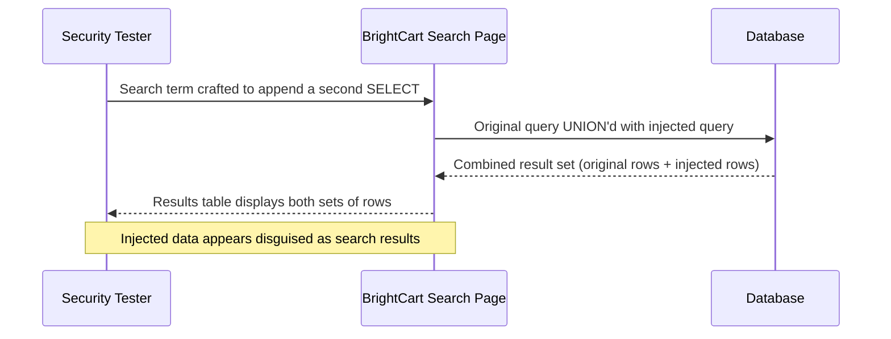

### Why Column Compatibility Matters Conceptually

`UNION` requires that both combined queries return the **same number of columns**, and that corresponding columns be of **compatible data types**. This is a structural requirement of SQL itself, not a security feature. Conceptually, this means that before a UNION-style approach could even be *attempted*, a tester would first need to understand the shape of the original query's output — how many columns it returns and what general type of data occupies each position. This is why, in real methodology (covered in depth in a later chapter), testers spend considerable effort simply mapping structure *before* attempting to combine result sets — trial-and-error against column counts is a normal part of that structural mapping process, not the goal itself.

### Common Limitations

- Only relevant when the application actually reflects raw query output into the response — this is the same "In-Band" requirement discussed in Section 3.
- Column count and type compatibility constraints can make this technique more fragile against complex queries with many joins.
- Some frameworks restrict how much of a query result the front end will ever render, limiting how much can be surfaced.

### A Simplified Educational Illustration

Picture BrightCart's search page, which normally displays two columns per result: a book title and its price. If BrightCart were vulnerable and reflected UNION results directly, an appended query designed to return two compatible columns could, conceptually, cause additional information to appear in the same title/price columns the page already displays — disguised as if it were simply another search result. We are describing the *mechanism*, not a working payload; how such a query might be structured is left to later, hands-on chapters that operate exclusively in authorized lab environments.

> **Tip**
> UNION-Based injection is a powerful illustration of why **output handling matters as much as input handling.** Even a perfectly parameterized query elsewhere in the application does not protect a *different*, unparameterized query whose results happen to be rendered on the same page.

---

## SECTION 6 — Blind SQL Injection

### Why Applications Sometimes Hide Errors

As Section 4 discussed, many modern applications intentionally suppress database error messages as a security best practice. Many also do not reflect raw query results back into the page at all — they might only display a summary, a count, or a simple "success/failure" indicator. When both of these feedback channels are unavailable, **In-Band techniques (Sections 3–5) simply do not apply**, even though the underlying vulnerability may still exist.

### Why Testers Must Rely on Indirect Observations

This is the situation that gives rise to **Blind SQL Injection**: a category of technique that does not depend on the database's output being visible at all. Instead, the tester relies on *indirect* signals — something about the application's observable behavior that changes depending on whether an injected condition evaluates to true or false.

### Application Behavior as the Primary Feedback Mechanism

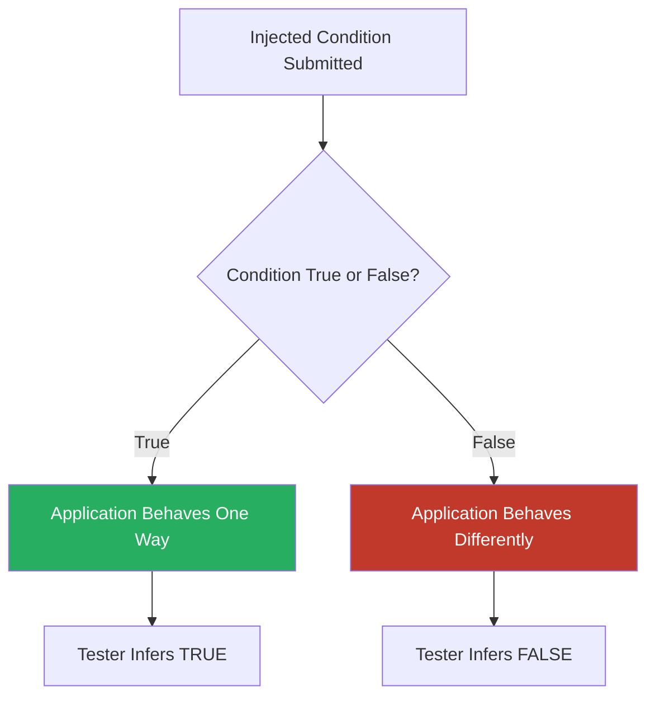

Note what is *not* present in this diagram: no error text, no reflected data. The only thing being observed is a **behavioral difference** — and this difference is precisely what the two Blind sub-types (Boolean-Based and Time-Based) each exploit, in different ways.

> **Note**
> Blind techniques generally require far more requests to extract equivalent information compared to In-Band techniques, since each request typically yields only a single bit of information (true/false) rather than an entire data value. This is an important conceptual trade-off: **less visible feedback per request, but broader applicability across defensively-hardened applications.**

---

## SECTION 7 — Boolean-Based Blind SQL Injection

### The Core Idea: True and False Responses

In Boolean-Based Blind SQL Injection, a tester submits input designed to make an underlying query's condition evaluate to either true or false, and observes whether the application's *response content* changes as a result — even if no error and no extracted data are ever shown.

### Content Differences as Signal

Consider BrightCart's login form. Suppose that a correct username produces a page reading "Welcome back!" while an incorrect one produces "Invalid credentials." Now imagine the query behind that check were vulnerable, and a tester could append a condition to the query that always evaluates to true or always evaluates to false, independent of whether the "real" username was correct. If the *true* condition consistently produces the "Welcome back!" page and the *false* condition consistently produces "Invalid credentials," that content difference — however small — becomes a working signal channel, entirely separate from whether the actual login attempt succeeds.

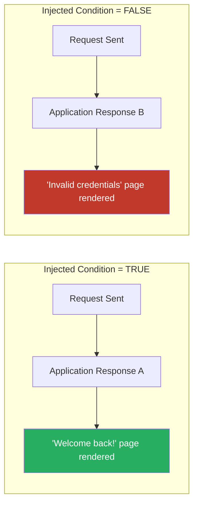

### Response Comparison in Practice

The content difference does not need to be dramatic. It might be:

- A different page title.
- The presence or absence of a specific HTML element.
- A different HTTP status code (e.g., `200 OK` versus `404 Not Found`).
- Subtly different wording in an otherwise similar message.

The methodology (covered in depth in a later chapter) revolves around systematically comparing responses for true and false conditions and building up knowledge one true/false answer at a time. That process is deliberately not detailed here — our purpose in this chapter is solely to help you recognize *why* this category exists and *when* it applies, not to walk through its mechanics.

---

## SECTION 8 — Time-Based Blind SQL Injection

### Why Response Timing Matters

Sometimes an application's response content is *identical* regardless of whether an injected condition is true or false — no visible difference exists anywhere in the page. In such cases, even Boolean-Based Blind techniques provide no signal. Time-Based Blind SQL Injection addresses this by using something outside the response content entirely: **how long the server takes to respond.**

### Delayed Database Responses as a Signal

Most database engines support a way to deliberately introduce a measurable delay during query execution (again, mechanics deferred to later chapters). If a tester can cause that delay to occur *only* when an injected condition is true, then the elapsed time of the HTTP response itself becomes the signal — regardless of what the response actually displays.

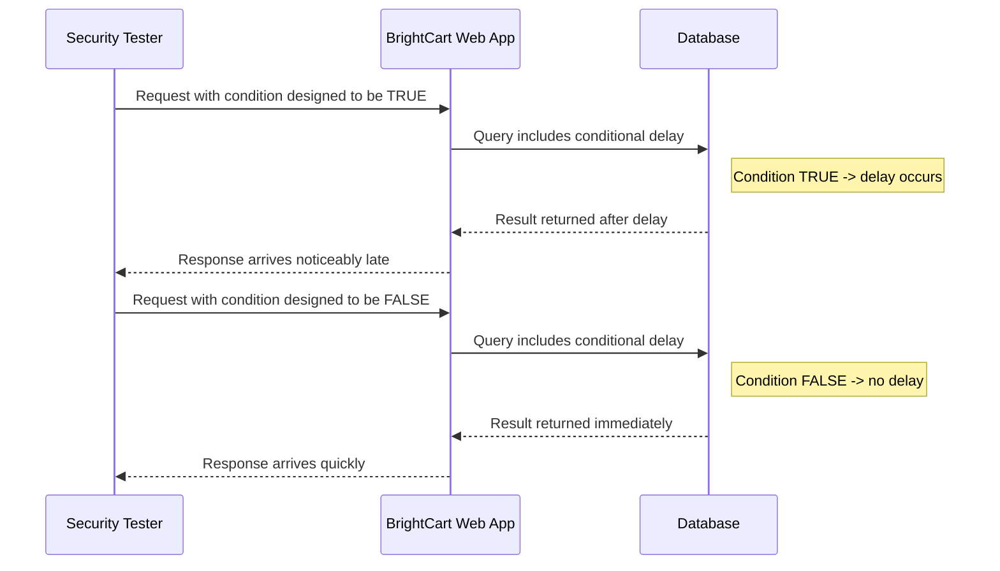

### Measuring Application Behavior, Not Content

The critical conceptual distinction from Boolean-Based Blind injection is this: **the response body may be completely blank, generic, or identical in both cases.** Only the *clock* differs. This makes Time-Based techniques the most broadly applicable of the Blind sub-types — but also, generally, the slowest, since each individual bit of information may require waiting out a deliberate delay, and network/server jitter can introduce noise that must be accounted for through careful methodology.

> **Warning**
> Time-Based techniques are especially easy to describe in a way that inadvertently teaches misuse, since they hinge on a specific delay mechanism. This book deliberately withholds those specifics until a dedicated, lab-only chapter with proper authorization framing. For now, understand the *principle*: **timing itself can be a communication channel**, a concept with a much broader relevance in security than SQL Injection alone (see also *timing side-channel attacks*, a topic outside the scope of this book).

---

## SECTION 9 — Out-of-Band SQL Injection

### Why Traditional Response-Based Feedback May Not Work

Some environments are hardened enough that neither In-Band nor Blind techniques yield reliable results. Perhaps the application enforces a strict timeout on all queries (defeating Time-Based approaches), returns byte-for-byte identical responses regardless of query outcome, and never reflects data. In these constrained situations, testers sometimes consider whether the *database itself* has the ability to initiate outbound communication independent of the HTTP response entirely.

### Alternative Communication Channels, Conceptually

Certain database engines include built-in functions capable of triggering network requests — for example, a DNS lookup or an outbound connection to a specified address — as a side effect of executing a query. If such functionality exists and is reachable, a tester could, in principle, cause the database to "phone home" to an external listener under their control, using the *content* of that outbound request to carry information, entirely independent of what the original HTTP response shows.

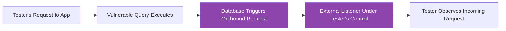

### When Out-of-Band Methods Become Relevant

Out-of-Band techniques are relatively rare in practice, generally reserved for situations where:

- The target database engine happens to support outbound-triggering functions.
- The tester has legitimate authorization to monitor an external listener, and the target environment's network configuration permits outbound traffic to reach it (an assumption that does not hold in tightly firewalled environments).
- Both In-Band and Blind approaches have been exhausted or are impractically slow.

> **Note**
> Because this technique depends on database-specific functionality and network reachability that vary enormously by environment, it is the least universally applicable of the categories covered in this chapter — and, for that same reason, the one most likely to only be relevant in specific, well-scoped, authorized engagements with a properly configured out-of-band listening infrastructure.

---

## SECTION 10 — Second-Order SQL Injection

### Stored User Input and Delayed Execution

Every category discussed so far assumes the injected input is used in a query *during the same request* in which it was submitted. **Second-Order SQL Injection** breaks that assumption. Here, input is submitted, safely stored (perhaps even properly escaped or parameterized *at the point of storage*), and only becomes dangerous later, when it is retrieved and used — unsafely — inside a *different* query, often in a completely different part of the application.

### A Real-World Analogy

Imagine writing a note on a piece of paper and handing it to a librarian, who files it safely in a locked cabinet — no problem there. Weeks later, a different employee retrieves that note and, without checking its contents, reads it aloud into a public announcement system, verbatim, whatever it says. The danger was never in the filing; it was always in the unsafe *later use*. Second-Order SQL Injection follows this exact pattern: the initial storage step is often not the vulnerable step at all — the later, unsafe *retrieval-and-use* step is.

### Multi-Stage Applications

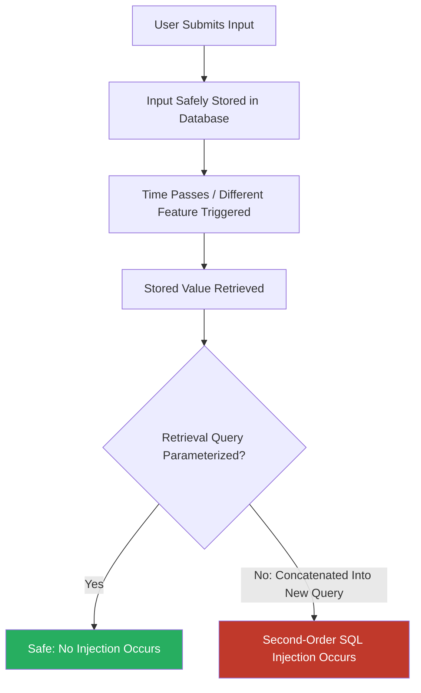

### Why These Vulnerabilities Sometimes Appear Later

Consider BrightCart's account "display name" field. Suppose a customer registers with a display name that is properly parameterized when first saved — no injection occurs at signup. Months later, a customer-support employee views a report listing all display names from customers who filed a support ticket that week, but this reporting feature was built separately, by a different developer, who concatenated the stored display name directly into a reporting query without parameterization. The vulnerability lives in the *reporting* feature, but the *injectable data* originated from an entirely different, seemingly safe, registration feature.

This is precisely why Second-Order SQL Injection is so easy to miss during testing: **scanning the registration form in isolation reveals nothing wrong, because the registration form genuinely is safe.** The flaw only becomes observable once the stored value reaches the second, vulnerable query — which may be triggered by an entirely different user, an internal employee, or an automated batch job, potentially long after the original submission.

> **Tip**
> Second-Order SQL Injection is a strong illustration of why secure coding practices must be applied **consistently across every query in an application**, not just the ones that directly handle "obviously untrusted" input like login forms. Once data has entered a database, *every subsequent query that uses it* must still treat it as untrusted, because its origin does not change how dangerous it can be.

---

## SECTION 11 — Comparison Table

| SQL Injection Type | Communication Method | Typical Feedback | Typical Difficulty | Common Causes | Typical Defenses |
|---|---|---|---|---|---|
| **Error-Based** (In-Band) | Same HTTP response | Verbose database error text | Low (when errors are exposed) | Debug mode left enabled; unhandled exceptions printed to user | Generic error messages; centralized secure error handling; disabling debug output in production |
| **UNION-Based** (In-Band) | Same HTTP response | Reflected data appears within existing page output | Moderate (requires structural mapping of columns) | Query results rendered directly into the page without sanitization of the *output* path | Parameterized queries; strict output encoding; not reflecting raw query structure into responses |
| **Boolean-Based Blind** | Same HTTP response, indirect | Content/behavior differs between true/false conditions | Higher (many requests needed; content differences may be subtle) | Errors suppressed but responses still vary based on query logic | Consistent response structure regardless of query outcome; parameterized queries |
| **Time-Based Blind** | Same HTTP response, indirect via timing | Response delay differs between true/false conditions | Higher still (timing noise, slower extraction) | No content difference exists between outcomes; only timing varies | Query timeouts; parameterized queries; monitoring for anomalous query durations |
| **Out-of-Band** | Separate channel (e.g., DNS/network) | External listener receives triggered communication | High (environment-dependent; requires reachable outbound channel) | Database supports outbound-triggering functions; network egress permitted | Restricting database outbound network access; disabling unnecessary database functions; parameterized queries |
| **Second-Order** | Any of the above, delayed | Feedback appears only once stored input is later (unsafely) reused | Variable (depends on where and when reuse occurs) | Safe storage but unsafe *later* use of stored data in a different query | Treating all data as untrusted regardless of source; parameterizing every query, not just "obviously external" input paths |

> **Note**
> Read this table alongside the feedback-channel table in Section 1. Together they reinforce the central theme of this chapter: **the category of SQL Injection observed is a function of application behavior around output, errors, and timing — not a function of the underlying flaw itself, which is fundamentally the same broken trust boundary in every row of this table.**

---

## SECTION 12 — Which Type Appears When?

Understanding *where* each category tends to appear helps a security professional prioritize testing effort and helps a developer understand which defensive controls matter most for their specific architecture.

### Applications With Verbose Errors

Older applications, poorly configured staging environments accidentally exposed to the internet, or applications still running in a framework's default "development mode" are the most likely places to encounter **Error-Based** feedback. This is increasingly rare in well-maintained production systems but remains common in internal tools, proof-of-concept deployments that were never hardened before going live, and smaller organizations without mature deployment pipelines.

### Applications That Suppress Errors

Most contemporary, professionally maintained web applications suppress detailed error output by policy. In these environments, testers should expect to rely on **Blind** techniques (Boolean-Based first, since it is faster when available; Time-Based as a fallback) far more often than In-Band ones.

### Legacy Applications

Legacy systems — particularly those built before secure coding standards were widely adopted, or those maintained with minimal ongoing investment — often combine *multiple* weaknesses at once: verbose errors, reflected query output, and inconsistent input handling across different modules. These are frequently where **In-Band** techniques remain most viable and where **Second-Order** flaws are also common, since legacy codebases often have many independently developed features that reuse the same stored data in inconsistent ways.

### Modern Frameworks

Modern web frameworks frequently include secure defaults — automatic parameterization through an Object-Relational Mapper (ORM), for instance — that reduce (but, as Chapter 4 emphasized, do not eliminate) the likelihood of any SQL Injection at all. When flaws do occur in these environments, they often result from developers deliberately bypassing the framework's safe query-building tools (for example, using a "raw query" escape hatch for a complex report), which tends to concentrate risk in a smaller number of specific, identifiable code paths.

### REST APIs

REST APIs typically return structured JSON rather than rendered HTML. This changes what "In-Band" feedback looks like — instead of a visible error page, a JSON error object might carry the same diagnostic detail (e.g., `{"error": "syntax error near ..."}`,) which is functionally still Error-Based injection, just delivered in a different format. Boolean-Based differences might appear as different HTTP status codes or different JSON structures rather than different rendered HTML.

### GraphQL APIs

GraphQL's single-endpoint, query-language-driven structure introduces its own considerations: error responses are often standardized by the GraphQL specification itself, which can either suppress useful detail (pushing testers toward Blind techniques) or, if a resolver function passes underlying database errors through unfiltered, leak just as much detail as a traditional Error-Based scenario. The core classification concepts in this chapter apply identically — only the transport format changes.

> **Tip**
> A recurring theme across this section: **the SQL Injection category you should expect to encounter is really a reflection of the application's error-handling philosophy and output format, not of the underlying technology stack's inherent security.** A GraphQL API can be just as vulnerable as a 1990s PHP application; it will simply *look* different when tested.

---

## SECTION 13 — Database Differences

Different database management systems can influence which SQL Injection categories are more or less convenient to observe, though this chapter deliberately avoids DBMS-specific syntax (covered in later chapters).

- **MySQL** has historically been associated with relatively verbose default error messages in development configurations, making Error-Based scenarios historically common in poorly configured MySQL-backed applications. It also has a rich set of built-in functions, which broadens the theoretical scope for various technique categories.
- **PostgreSQL** tends toward stricter type checking, which can make certain structural techniques (such as UNION-Based approaches) require more careful attention to data types, though the underlying concepts remain identical.
- **Microsoft SQL Server (MSSQL)** includes multi-statement execution support and a broad set of system procedures in many configurations, which has historically made it a common subject of discussion in Out-of-Band scenarios, given certain built-in capabilities for outbound network interaction.
- **Oracle** has a distinct SQL dialect and a rich set of system views, and has also been discussed in Out-of-Band contexts due to specific built-in functions capable of triggering network lookups in some configurations.
- **SQLite**, often used in embedded or mobile contexts, has a simpler feature set overall and more limited built-in networking capability, which generally narrows the realistic scope toward In-Band and Blind categories rather than Out-of-Band ones.

> **Warning**
> These are *general tendencies*, not guarantees. Specific versions, configurations, and installed extensions can change what is or is not possible on a given database engine. Security professionals should always verify capabilities in the specific, authorized environment they are assessing rather than assuming behavior based on generic DBMS reputation.

---

## SECTION 14 — Case Studies

The following are simplified, high-level summaries of **publicly documented** SQL Injection incidents, included purely for pattern-recognition and lesson-drawing purposes. Technical exploitation detail is intentionally omitted; the focus is on classification, root cause, and defensive takeaways.

### Case Study 1 — Heartland Payment Systems (2008)

- **Background:** A payment processor suffered a large-scale breach in which attackers gained access to systems that processed card transaction data.
- **SQL Injection Category Involved:** Investigations and public reporting pointed to SQL Injection as an initial access vector into the network, consistent with In-Band and/or Blind approaches typical of that era, used to pivot toward broader network compromise rather than being the sole cause of the ultimate data loss.
- **Root Cause:** A combination of an injectable web-facing component and insufficient network segmentation, which allowed initial access to expand into a much larger compromise.
- **Business Impact:** One of the largest publicly disclosed card-data breaches at the time, with significant financial, legal, and reputational consequences.
- **Defensive Lessons:** SQL Injection is rarely the *entire* story in major breaches — it is often the **initial foothold**. Defense-in-depth (network segmentation, least privilege, monitoring) matters even when input-layer defenses are strong, precisely because no single layer can be assumed perfect.

### Case Study 2 — Sony Pictures (2011, LulzSec-attributed incident)

- **Background:** A publicly disclosed compromise affecting Sony's web properties was attributed by the responsible group to SQL Injection vulnerabilities in web-facing applications.
- **SQL Injection Category Involved:** Public statements from the group at the time described extraction of data believed to correspond with In-Band style techniques (data returned directly through vulnerable queries).
- **Root Cause:** Web applications constructing queries from user input without adequate parameterization.
- **Business Impact:** Significant reputational damage and disclosure of user data, prompting broader industry attention to input-handling practices.
- **Defensive Lessons:** This incident is frequently cited in security curricula as an accessible illustration of how directly exposed, unparameterized queries in customer-facing applications can lead to large-scale data exposure with a comparatively low barrier to initial discovery.

### Case Study 3 — TalkTalk (2015)

- **Background:** A UK telecommunications provider suffered a breach affecting a significant number of customer records.
- **SQL Injection Category Involved:** Subsequent regulatory investigation identified SQL Injection, exploiting a vulnerability present in web infrastructure the company had inherited through acquisition and had not adequately remediated.
- **Root Cause:** A known class of vulnerability (SQL Injection, specifically noted as having been within the awareness of security guidance well before the incident) that had not been addressed through basic secure coding and patching discipline.
- **Business Impact:** A substantial regulatory fine was issued, alongside reputational and customer-trust damage, making this a frequently cited example in discussions of *regulatory* consequences of SQL Injection, not just technical ones.
- **Defensive Lessons:** This case is often used to illustrate that SQL Injection defenses cannot be treated as a "set once" activity — inherited systems (through mergers, acquisitions, or legacy carryover) require the same ongoing security diligence as newly built ones, and regulators increasingly treat well-known vulnerability classes as a due-diligence failure when left unaddressed.

> **Note**
> These summaries are deliberately high level and reference publicly available reporting. Students interested in deeper technical post-mortems are encouraged to consult official incident reports, regulatory findings, and reputable security research published about each case, while keeping the defensive-lesson focus of this book in mind.

---

## SECTION 15 — Defensive Perspective

While each SQL Injection category has its own observable characteristics, the defensive strategy that mitigates them is largely **shared across all categories**, because — as this chapter has emphasized throughout — every category traces back to the same root cause identified in Chapter 4: a failure to separate code from data at a trust boundary.

### Parameterized Queries and Prepared Statements

The single most effective control. By ensuring user input is always passed as *data* to a precompiled query structure — never concatenated into the query text itself — the database is structurally prevented from interpreting that input as executable SQL. This defeats every category discussed in this chapter simultaneously, because it removes the root cause rather than closing one particular feedback channel.

### Least Privilege

Database accounts used by applications should hold only the permissions strictly necessary for their function. Even if an injection flaw exists, a tightly scoped database account limits what can be read, modified, or executed — reducing the impact of In-Band, Blind, and especially Second-Order scenarios where the vulnerable query might live in an unexpected, over-privileged part of the system.

### Input Validation

While not a substitute for parameterization, validating input format, type, and length (covered in Chapter 4's discussion of trust boundaries) adds a useful layer of defense-in-depth, particularly for catching unexpected input before it reaches any query logic at all.

### Secure Error Handling

As discussed in Section 4, generic error messages paired with detailed internal logging remove the Error-Based feedback channel without sacrificing the ability of developers to diagnose real problems.

### Logging

Comprehensive logging of database queries, errors, and anomalous patterns (such as unusually long-running queries, a hallmark of Time-Based Blind attempts) supports both detection and post-incident investigation.

### Monitoring

Real-time monitoring for suspicious patterns — repeated malformed queries from a single source, unusual query timing distributions, or unexpected outbound network connections from a database server (relevant to Out-of-Band scenarios) — allows defenders to detect exploitation attempts even when the underlying flaw has not yet been patched.

### Secure SDLC (Software Development Life Cycle)

Embedding security review, static analysis, and secure coding standards throughout the development process — rather than treating security as a final pre-launch checklist — helps catch injection-prone code (including Second-Order scenarios that span multiple, independently developed features) before it reaches production.

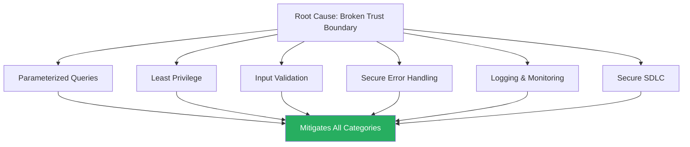

> **Tip**
> Notice that **no single defensive control on this list is category-specific.** This is intentional and mirrors the central lesson of the chapter: because every SQL Injection category shares the same root cause, a defense-in-depth strategy addressing that root cause protects against all categories at once, rather than requiring a different, bespoke defense for each observable behavior.

---

## SECTION 16 — Visual Summary

### In-Band Communication

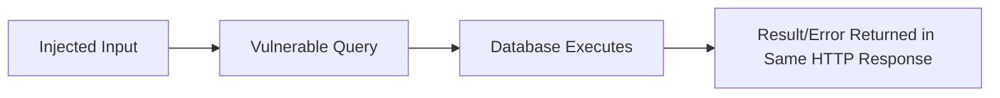

*In-Band communication uses a single request/response cycle for both injection and observation — the hallmark of Error-Based and UNION-Based techniques.*

### Blind Communication

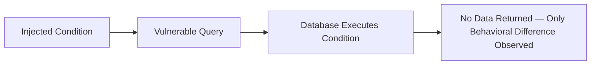

*Blind communication relies on indirect signals rather than direct data, since the application deliberately withholds errors and raw results.*

### Time-Based Responses

```mermaid
gantt
    dateFormat X
    axisFormat %s
    title Time-Based Blind: Response Duration as Signal
    section Condition TRUE
    Delay Triggered :active, 0, 5
    section Condition FALSE
    Immediate Response :done, 0, 1
```

*When condition is true, the response is deliberately delayed; when false, it returns quickly — the elapsed time itself is the signal.*

### Second-Order Workflow

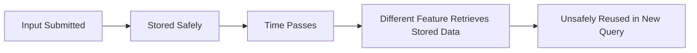

*The vulnerability surfaces at a different time and often in a different feature than where the data originated.*

### Out-of-Band Communication

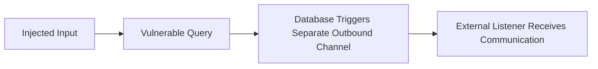

*A completely separate channel — outside the original HTTP request/response — carries the signal, used when neither In-Band nor Blind approaches are viable.*

---

## SECTION 17 — Hands-On Review

### Part A — Conceptual Exercises (15)

1. Explain, in your own words, why SQL Injection is not treated as a single technique in professional security practice.
2. What does the term "in-band" mean in the context of SQL Injection, and where does that terminology originate?
3. Why might an application be vulnerable to SQL Injection but never display a single database error?
4. Explain the conceptual difference between Boolean-Based and Time-Based Blind SQL Injection.
5. Why is UNION-Based SQL Injection dependent on the application reflecting query output into the page?
6. What is meant by "column compatibility" in relation to UNION-Based techniques, and why does it matter structurally?
7. Describe, without technical payload detail, how a database might trigger an outbound network connection as a side effect of a query.
8. Why is Out-of-Band SQL Injection considered less universally applicable than In-Band or Blind techniques?
9. Explain why Second-Order SQL Injection is often missed during routine testing of individual forms.
10. In the librarian analogy from Section 10, what does the "locked cabinet" represent, and what does the "public announcement system" represent?
11. Why does suppressing database error messages not fully solve a SQL Injection vulnerability?
12. Explain why REST APIs and GraphQL APIs still fall under the same classification system despite differing in output format.
13. Why might a MySQL-backed legacy application be more associated with Error-Based scenarios than a modern PostgreSQL-backed one?
14. What is the shared root cause underlying every category discussed in this chapter?
15. Why does parameterization defend against all categories simultaneously, rather than just one?

### Part B — Classification Exercises (10)

For each description, identify the SQL Injection category being described.

1. A tester submits input and immediately sees a database stack trace printed on the page.
2. A tester notices that a search page displays additional, unexpected rows of data mixed in with legitimate results.
3. A tester observes that the page content is identical regardless of input, but one particular input causes the response to take twelve seconds longer than usual.
4. A tester notices that submitting one crafted input produces a "no results found" message, while a nearly identical crafted input produces a "results found" message — with no visible errors in either case.
5. A tester exhausts all response-based and timing-based approaches and instead configures an external server to monitor for unexpected incoming DNS requests.
6. A vulnerability is discovered in a reporting dashboard, but the data that triggers it was originally submitted through an entirely unrelated registration form weeks earlier.
7. An application shows a generic "error occurred" message for every possible malformed input, with no distinguishable difference between them.
8. A tester finds that a support-ticket confirmation page reflects the exact SQL error text generated by a malformed ticket ID parameter.
9. A tester finds that combining two SELECT statements via a shared operator causes extra data to appear in a customer directory listing.
10. A tester determines that response timing differs by a consistent, deliberate delay only when a specific condition inside the injected input evaluates to true.

### Part C — Scenario-Based Questions (10)

For each scenario, identify the most likely SQL Injection category (or categories) and briefly justify your answer.

1. BrightCart's customer support chat feature stores a customer's typed message safely, but a separate internal analytics dashboard later builds a report by directly concatenating stored messages into a query.
2. BrightCart's product search page returns a "no products matched your search" message for every conceivable malformed input, and the response time is always under 100 milliseconds regardless of input.
3. BrightCart's order-tracking page, when given an invalid order ID, displays a full technical error including the underlying SQL statement.
4. BrightCart's login page returns a noticeably longer response time only for certain crafted usernames, with no visible difference in the returned HTML.
5. BrightCart's book-review submission page reflects submitted reviews directly into a "Recent Reviews" table visible to all site visitors, including any additional rows returned by a modified query.
6. A tester on an authorized engagement determines that a target database can trigger outbound DNS lookups, and no other feedback channel has proven useful so far.
7. BrightCart's password-reset confirmation page always displays the exact same HTML structure, but subtly changes a single CSS class name depending on whether the submitted email address exists in the system.
8. A developer notices that a report-generation feature, used only by internal staff, pulls previously stored customer feedback text into a query without parameterization.
9. BrightCart migrates to a GraphQL API, and a resolver function passes raw database exceptions directly into the GraphQL error array returned to the client.
10. A tester exhausts all attempts to observe timing differences or content differences, and the application appears to behave identically under every tested condition.

---

### Solutions

**Part A — Conceptual Exercises**

1. Because different applications expose feedback about injected queries in fundamentally different ways (visible errors, reflected data, behavioral differences, timing, or no visible channel at all), so a single technique cannot address every situation.
2. "In-band" refers to using the same communication channel for both sending the malicious input and observing the result — borrowed from telecommunications terminology describing control signals sent over the same channel as the primary data.
3. Because many applications intentionally suppress error messages as a security best practice, or never reflect raw query output into visible content, forcing reliance on Blind or Out-of-Band techniques instead.
4. Boolean-Based relies on observable differences in the response *content* (or behavior) between true and false conditions; Time-Based relies on differences in response *timing*, with no observable content difference at all.
5. Because without reflected output, there is no mechanism for combined query results (via UNION) to ever become visible to the tester in the first place.
6. It refers to the SQL requirement that both halves of a UNION query return the same number of columns with compatible data types — a structural requirement of the database engine itself, unrelated to application security controls.
7. Certain database functions can, as a side effect of query execution, initiate an outbound network request (such as a DNS lookup) to an address embedded in the query, independent of the HTTP response.
8. Because it depends on specific database engine capabilities and outbound network reachability, both of which vary significantly by environment and are frequently restricted in hardened deployments.
9. Because the vulnerable behavior does not appear where the input was originally submitted — the original submission point may be entirely safe, with the flaw only present in a separate feature that later reuses the stored data unsafely.
10. The locked cabinet represents safe, properly parameterized storage of the input; the public announcement system represents a later, separate, unsafely constructed query that reuses the stored input without appropriate handling.
11. Because suppressing errors only removes one feedback channel — the underlying broken trust boundary between code and data (from Chapter 4) remains unless the query itself is fixed, typically through parameterization.
12. Because the classification is based on *how feedback is obtained* (errors, reflected data, behavioral or timing differences, or a separate channel), which is a concept independent of whether that feedback is delivered as rendered HTML or structured JSON.
13. Historically, MySQL-backed applications in default/development configurations were more likely to display verbose error output, and legacy applications are more likely to have never been updated to suppress that behavior, compared to a modern, more security-conscious PostgreSQL deployment.
14. A failure to properly separate code (the SQL query structure) from data (untrusted user input) at a trust boundary, as introduced in Chapter 4.
15. Because parameterization prevents user input from ever being interpreted as executable SQL in the first place, addressing the root cause rather than merely closing off one particular observable feedback channel.

**Part B — Classification Exercises**

1. Error-Based (In-Band)
2. UNION-Based (In-Band)
3. Time-Based Blind
4. Boolean-Based Blind
5. Out-of-Band
6. Second-Order
7. This scenario, by itself, indicates strong error suppression but does not confirm a vulnerability at all — it demonstrates the *absence* of an Error-Based channel, consistent with an application that has been hardened toward requiring Blind techniques, if a vulnerability exists at all.
8. Error-Based (In-Band)
9. UNION-Based (In-Band)
10. Time-Based Blind

**Part C — Scenario-Based Questions**

1. **Second-Order.** The original storage is safe; the vulnerability only manifests later, in the unrelated analytics reporting feature.
2. Likely **not exploitable via any category demonstrated here** — or, if a flaw exists, it would need to be probed via Time-Based Blind or Out-of-Band techniques, since both content and timing appear consistent based on the information given; further authorized testing would be needed to confirm anything at all.
3. **Error-Based (In-Band).** The full SQL statement being displayed is a textbook verbose-error scenario.
4. **Time-Based Blind.** No content difference is described; only timing varies.
5. **UNION-Based (In-Band).** Reflected data (the "Recent Reviews" table) displaying additional rows is characteristic of this sub-type.
6. **Out-of-Band.** By the scenario's own description, other channels have already been exhausted, and outbound DNS capability is specifically being leveraged.
7. **Boolean-Based Blind.** Even a subtle CSS class change is a content-based behavioral signal, distinguishing true/false outcomes without any error text.
8. **Second-Order.** Previously stored, safely submitted feedback is later reused unsafely in a different feature (the internal reporting tool).
9. **Error-Based (In-Band).** Regardless of the transport format (GraphQL's JSON error array rather than an HTML page), raw database exceptions being passed to the client is functionally the same phenomenon as a traditional verbose error page.
10. This describes an application resistant to all feedback channels covered so far; a thorough, authorized assessment might still consider Out-of-Band approaches if applicable, or conclude that no exploitable channel is currently observable — an important reminder that "no visible bug" is not the same as "provably secure," but also that testers must work within what is actually observable and authorized.

---

## SECTION 18 — Chapter Summary

This chapter organized SQL Injection into a coherent classification system built around a single unifying idea: **the category of SQL Injection observed in any given application is determined by how — and whether — feedback about an injected query becomes visible.**

We examined:

- **In-Band SQL Injection**, where the same HTTP response used to deliver input also reveals the result, split into **Error-Based** (verbose database errors displayed directly) and **UNION-Based** (combined query results reflected into existing output).
- **Blind SQL Injection**, used when direct feedback is unavailable, split into **Boolean-Based** (relying on observable content or behavioral differences) and **Time-Based** (relying purely on response timing differences).
- **Out-of-Band SQL Injection**, a less common category relying on an entirely separate communication channel when neither response content nor timing provides usable signal.
- **Second-Order SQL Injection**, a distinct axis of classification concerned with *when* a vulnerable query executes rather than *how* feedback is observed — where safely stored input becomes dangerous only once unsafely reused elsewhere, potentially much later.

We also examined how application architecture (legacy systems, modern frameworks, REST APIs, GraphQL APIs), and to a lesser degree database engine choice, shape which categories are realistically encountered in a given environment — and closed with the critical defensive reminder that **every category shares the same root cause**, meaning that root-cause defenses like parameterized queries, least privilege, secure error handling, and a mature secure development lifecycle mitigate all categories simultaneously, rather than requiring a bespoke defense per category.

Future chapters will explore each category in much greater technical depth, always within a defensive, authorized-testing framing.

---

## SECTION 19 — Key Terms

| Term | Definition | Simple Example |
|---|---|---|
| In-Band SQL Injection | A category where injection and feedback observation occur through the same communication channel (the HTTP response). | A search page directly displaying a database error message. |
| Error-Based SQL Injection | An In-Band sub-type where verbose database error messages leak structural or data information. | A malformed input causing a page to display a raw SQL syntax error. |
| UNION-Based SQL Injection | An In-Band sub-type where the SQL `UNION` operator is used to combine additional query results into existing reflected output. | Extra, unexpected rows appearing in a search results table. |
| Blind SQL Injection | A category where no direct data or error is returned, requiring indirect behavioral observation. | A login form that behaves subtly differently for true versus false injected conditions, without showing any error. |
| Boolean-Based Blind SQL Injection | A Blind sub-type relying on observable content or behavior differences between true and false conditions. | A page displaying "results found" versus "no results found" depending on an injected condition. |
| Time-Based Blind SQL Injection | A Blind sub-type relying on measurable differences in response timing rather than content. | A response consistently taking several seconds longer when a specific condition is true. |
| Out-of-Band SQL Injection | A category relying on a separate communication channel (outside the original HTTP response) to observe results. | A database triggering an outbound DNS lookup to a monitored external server. |
| Second-Order SQL Injection | A vulnerability where safely stored input becomes dangerous only when unsafely reused later, often in a different feature. | Data submitted through a safe registration form later causing injection in an unrelated, unsafely built reporting query. |
| Trust Boundary | The conceptual line separating trusted application logic from untrusted external input (introduced in Chapter 4). | The line between a web form's raw input and the SQL query that eventually uses it. |
| Parameterized Query | A query structure where user input is passed as data, never concatenated into the query text, preventing it from being interpreted as executable SQL. | Using a placeholder (`?` or a named parameter) instead of directly inserting a variable into a SQL string. |
| Least Privilege | A security principle limiting an account's permissions to only what is strictly necessary for its function. | An application's database account being unable to drop tables, even if it is compromised. |
| Verbose Error Message | A detailed diagnostic message, typically intended for developers, that reveals internal system information when shown to end users. | A stack trace naming a specific database table displayed directly in a web page. |

---

## SECTION 20 — Knowledge Check

### Part A — Multiple Choice Questions (20)

1. What is the defining characteristic of In-Band SQL Injection?
   a) It requires a separate network channel
   b) Injection and result observation occur through the same response
   c) It only works against MySQL databases
   d) It always relies on timing differences

2. Error-Based SQL Injection primarily leaks information through:
   a) Response timing
   b) DNS requests
   c) Verbose database error messages
   d) Stored procedures

3. UNION-Based SQL Injection requires that combined queries:
   a) Use the same table name
   b) Return a compatible number and type of columns
   c) Be executed on separate database servers
   d) Contain identical WHERE clauses

4. Blind SQL Injection is typically used when:
   a) The application always crashes
   b) No direct error messages or reflected data are available
   c) The database has no tables
   d) UNION is disabled

5. Boolean-Based Blind SQL Injection relies on:
   a) Response timing differences only
   b) Observable content or behavioral differences between true/false conditions
   c) Outbound DNS requests
   d) Stored procedures

6. Time-Based Blind SQL Injection is most useful when:
   a) The application reflects all query results
   b) No content difference exists between true and false conditions
   c) Verbose errors are always shown
   d) The database has no query timeout

7. Out-of-Band SQL Injection relies on:
   a) The original HTTP response only
   b) A separate communication channel outside the original response
   c) Faster response times
   d) UNION compatibility

8. Second-Order SQL Injection is unique because:
   a) It only affects login pages
   b) The vulnerable query executes at a different time than the original input submission
   c) It cannot be defended against
   d) It only occurs in NoSQL databases

9. Which of the following is a shared root cause across all SQL Injection categories?
   a) Weak passwords
   b) A broken trust boundary between code and data
   c) Slow network connections
   d) Missing HTTPS

10. Which defensive control is most broadly effective against all SQL Injection categories?
    a) Disabling JavaScript
    b) Parameterized queries
    c) Increasing server RAM
    d) Enabling verbose error messages

11. A GraphQL resolver that passes raw database exceptions into its error response is functionally similar to which category?
    a) Out-of-Band
    b) Error-Based (In-Band)
    c) Second-Order
    d) Time-Based Blind

12. Why might a legacy application be more prone to Error-Based SQL Injection than a modern one?
    a) Legacy applications use faster databases
    b) Legacy applications often lack updated secure error-handling practices
    c) Legacy applications never use SQL
    d) Legacy applications only run offline

13. Which category depends most heavily on the specific database engine's built-in networking functions?
    a) Boolean-Based Blind
    b) Error-Based
    c) Out-of-Band
    d) UNION-Based

14. A tester noticing that a report always takes exactly 8 seconds longer under a specific condition is most likely observing:
    a) Error-Based SQL Injection
    b) Time-Based Blind SQL Injection
    c) UNION-Based SQL Injection
    d) Out-of-Band SQL Injection

15. Why is column compatibility conceptually significant in UNION-Based SQL Injection?
    a) It determines database licensing costs
    b) SQL requires matching column counts and compatible types for UNION operations
    c) It is unrelated to SQL Injection
    d) It only matters for INSERT statements

16. Which of the following best describes why Blind techniques generally require more requests than In-Band techniques?
    a) Blind techniques use a slower network protocol
    b) Each Blind request typically yields only a single bit of true/false information
    c) Blind techniques always fail on the first attempt
    d) In-Band techniques do not require any requests

17. Least privilege as a defensive control primarily helps by:
    a) Preventing all SQL Injection from occurring
    b) Limiting the impact if an injection flaw is exploited
    c) Making queries execute faster
    d) Disabling the need for parameterized queries

18. Which scenario best illustrates Second-Order SQL Injection?
    a) A login form immediately displaying a SQL error
    b) A safely stored review later used unsafely in an unrelated reporting feature
    c) A search page returning extra rows via UNION
    d) A page responding slower when a condition is true

19. Why does suppressing error messages not fully resolve a SQL Injection vulnerability?
    a) It does resolve it completely
    b) The underlying broken trust boundary remains; only the Error-Based feedback channel is removed
    c) Suppressing errors makes queries run faster
    d) It converts the vulnerability into a different type of bug entirely, unrelated to SQL

20. What is the primary purpose of this chapter, according to its stated learning objectives?
    a) To teach step-by-step exploitation techniques
    b) To help readers classify and conceptually understand SQL Injection categories
    c) To provide production-ready payload libraries
    d) To compare unrelated web vulnerabilities

### Part A — Answer Key

1-b, 2-c, 3-b, 4-b, 5-b, 6-b, 7-b, 8-b, 9-b, 10-b, 11-b, 12-b, 13-c, 14-b, 15-b, 16-b, 17-b, 18-b, 19-b, 20-b

### Part B — Short Answer Questions (10)

1. Define In-Band SQL Injection in one or two sentences.
2. What distinguishes Error-Based from UNION-Based SQL Injection?
3. Why is Blind SQL Injection generally slower to work with than In-Band SQL Injection?
4. What is the core difference between Boolean-Based and Time-Based Blind techniques?
5. Explain why Out-of-Band SQL Injection is considered environment-dependent.
6. What makes Second-Order SQL Injection difficult to detect during standard feature-by-feature testing?
7. Why does this book avoid providing exploitation payloads for each category?
8. Name two defensive controls that help mitigate multiple SQL Injection categories simultaneously.
9. Why can the same underlying vulnerability produce different "categories" of observable behavior in different applications?
10. Why is database engine choice relevant, but not solely determinative, of which SQL Injection category is observed?

### Part B — Suggested Answers

1. In-Band SQL Injection is a category where the attacker submits malicious input and observes the resulting data or error through the same communication channel used to deliver the input — typically the HTTP response.
2. Error-Based relies on verbose database error messages leaking information; UNION-Based relies on combining an additional query's results with existing reflected application output.
3. Because Blind techniques typically only yield a single bit of true/false information per request, compared to In-Band techniques, which can reveal substantially more information per response.
4. Boolean-Based relies on differences in visible content or application behavior; Time-Based relies purely on differences in response timing, with no visible content difference required.
5. Because it depends on the specific database engine supporting outbound-triggering functions and the network environment permitting that outbound traffic to reach an external listener — both of which vary significantly across deployments.
6. Because the vulnerable query is often located in a completely different feature than where the input was originally submitted, and the original submission point itself may be entirely safe.
7. Because the chapter's stated goal is conceptual understanding of classification, not exploitation methodology; detailed technique walkthroughs are deferred to later, dedicated chapters with proper authorized-lab framing.
8. Any two of: parameterized queries, least privilege, input validation, secure error handling, logging, monitoring, secure SDLC.
9. Because the category observed depends on the application's specific behavior around errors, output reflection, and timing — not on the underlying vulnerability itself, which is the same broken trust boundary in every case.
10. Because while certain database engines have functions or defaults that make particular categories more convenient to observe, application-level decisions (such as error handling and output reflection) generally have a greater influence on which category is realistically encountered.

### Part C — Scenario Questions (10)

1. A tester submits a crafted input and immediately receives a page containing the exact SQL statement that failed. Which category is this, and what developer mistake likely caused it?
2. An application shows no errors and no reflected data, but one specific input consistently causes an eleven-second delay. Which category is this?
3. A search feature displays unexpected extra rows of data that were not part of the original expected result set. Which category is this, and what structural SQL requirement made it possible?
4. A vulnerability is found in a report that uses customer feedback text submitted weeks earlier through a different, seemingly safe form. Which category is this?
5. A tester exhausts all response-based and timing-based approaches and instead sets up an external listener to monitor for unexpected incoming connections. Which category is being attempted?
6. Two nearly identical requests produce subtly different HTTP status codes, with no visible error text in either case. Which category is this?
7. An organization migrates from a monolithic legacy application to a modern framework with an ORM, and SQL Injection reports drop significantly, though a few remain tied to "raw query" escape hatches. What does this illustrate about modern frameworks?
8. A GraphQL API returns a structured JSON error object containing a full database exception. How does this compare, conceptually, to a traditional HTML-based error page?
9. An internal admin tool has no input validation and prints raw exceptions because "only trusted employees use it." Why is this reasoning risky from a defensive standpoint?
10. A security review finds that every query in an application is parameterized except one legacy reporting query added years later by a different team. What broader lesson does this illustrate?

### Part C — Suggested Answers

1. Error-Based (In-Band). Likely caused by verbose debug/error output being left enabled, or exceptions being printed directly to the user instead of being logged internally and replaced with a generic message.
2. Time-Based Blind, since the only observable signal is the timing difference, with no content-based signal present.
3. UNION-Based (In-Band). This is made possible by SQL's `UNION` operator, which requires matching column counts and compatible types between combined queries.
4. Second-Order, since the vulnerable behavior appears in a feature separate from — and later than — the original, safe submission point.
5. Out-of-Band, since a separate communication channel (rather than the original response or its timing) is being used to observe results.
6. Boolean-Based Blind, since a status-code difference is a content/behavior-based signal distinguishing outcomes without any visible error text.
7. It illustrates that modern frameworks with secure defaults substantially reduce (but do not eliminate) SQL Injection risk, and that remaining risk tends to concentrate in specific, identifiable code paths where developers bypass those safe defaults.
8. It is conceptually equivalent to Error-Based (In-Band) SQL Injection — the transport format differs (structured JSON versus rendered HTML), but the underlying issue (unfiltered diagnostic detail reaching an untrusted client) is the same.
9. Because "trusted employees only" is a weak boundary — insider threat, compromised employee credentials, or lateral movement from another compromised system can all still reach an internal tool, meaning the same secure error-handling discipline should apply regardless of the intended audience.
10. It illustrates that security consistency must be maintained across an application's entire lifecycle and across every team that touches it — a single unparameterized query, added at any point by any team, reintroduces the same fundamental risk regardless of how secure the rest of the codebase is.

---

## SECTION 21 — Revision Cheat Sheet

> **One-Page Summary — SQL Injection Classification**

**Core Principle:** The category of SQL Injection observed depends on *how feedback about an injected query becomes visible* — not on the underlying vulnerability itself, which is always a broken trust boundary between code and data.

| Category | Sub-Type | Feedback Channel | Key Signal |
|---|---|---|---|
| In-Band | Error-Based | Same HTTP response | Verbose database error text |
| In-Band | UNION-Based | Same HTTP response | Extra reflected data in existing output |
| Blind | Boolean-Based | Same HTTP response, indirect | Content/behavior differs by true/false |
| Blind | Time-Based | Same HTTP response, indirect | Response timing differs by true/false |
| Out-of-Band | — | Separate channel (e.g., DNS) | External listener receives communication |
| Second-Order | — | Any of the above, delayed | Vulnerable query executes later, elsewhere |

**Feedback Availability Drives Category:**
- Verbose errors shown → Error-Based likely observable
- Data reflected into page → UNION-Based likely observable
- No errors, but content varies → Boolean-Based Blind
- No errors, no content variation, but timing varies → Time-Based Blind
- Nothing observable via response → Out-of-Band may be considered (environment permitting)
- Vulnerability spans two different features/times → Second-Order

**Universal Defenses (Mitigate All Categories):**
- Parameterized queries / prepared statements *(most important — addresses root cause)*
- Least privilege database accounts
- Input validation
- Secure, generic error handling with internal logging
- Monitoring for anomalous query patterns and timing
- Secure SDLC applied consistently across all teams and features

**Remember:** Closing one feedback channel (e.g., suppressing errors) does not remove the vulnerability — it only shifts which category becomes observable.

---

## SECTION 22 — Mind Map

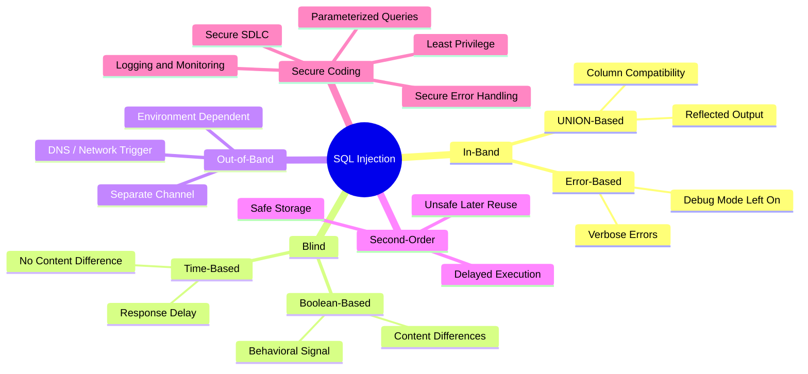

---

**End of Chapter 5**
